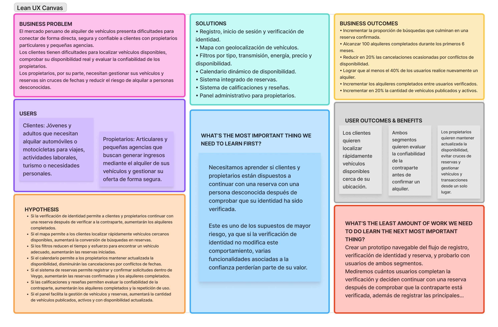

# Capítulo I: Introducción

---

## 1.1. Startup Profile
### 1.1.1. Descripción de la Startup
**Veygo** es una plataforma digital innovadora diseñada para simplificar y optimizar el proceso de alquiler vehicular (automóviles y motocicletas) entre arrendadores (propietarios particulares o agencias) y potenciales clientes. La solución integra un ecosistema digital seguro e intuitivo que facilita la verificación de identidad (login), la búsqueda geolocalizada mediante un mapa en tiempo real para ubicar vehículos cercanos al punto de entrega, la selección personalizada a través de filtros especializados (como tipo de energía: eléctrico, o transmisión: manual), un calendario dinámico de disponibilidad actualizado al instante y un panel administrativo completo con métricas clave como el total de vehículos activos y transacciones completadas.

**Misión:** Nuestra misión es proporcionar una plataforma segura y confiable donde ofrecer tus vehículos como alquiler o buscar un vehículo para alquilar.
**Visión:** Nuestra visión es la de convertirnos en la plataforma de alquiler de vehículos más confiable y segura del Perú, donde tanto los dueños como los clientes 
puedan interactuar de una manera rápida y sencilla con lo explicado.

### 1.1.2. Perfiles de integrantes del equipo

| Foto de Perfil | Información del Integrante |
| :---: | :--- |
|  | **Nombre:** Eddo Su Caletti  **Rol:** Team leader  **Descripción:** Me llamo Eddo Su Caletti estudió la carrera de ingeniería de software estoy en el 5 ciclo me considero una persona amable y graciosa me encanta salir con mis amigos a pasear en bicicleta o jugar videojuegos además espero poder ser de ayuda para mis compañeros con todos los problemas que ellos tengan.|
|  | **Nombre:** Ivonne Beatriz Ibañez Torres **Rol:** FullStack Developer **Descripción:** Sexto ciclo de la carrera de Ingeniería de software. Encargada del desarrollo de la interfaz responsive, integración de vistas de mapas, filtros de búsqueda por tipo de vehículo (autos/motos, eléctrico/manual) y calendarios interactivos. Con manejo en C++ y Python, conocimientos en diseño y patrones de software, PostgreSQL, MongoDB, Java ,Spring Boot y Node.js.|
|  | **Nombre:** [Josue Flores Apaico] **Rol:** Backend Developer **Descripción:**  Soy Josue Flores es una persona creativa, perseverante y empática, con interés en áreas como la Inteligencia Artificial, ciberseguridad y ciencia de datos. Busca aplicar sus conocimientos en C++, Python, C# y Java dentro de una startup tecnológica, impulsando la innovación y la mejora continua. Cuenta con experiencia práctica en proyectos y participación en conferencias de ciberseguridad. |
|  | **Nombre:** [Marlon Flores Siguas] **Rol:** Software Architect & Cloud Engineer **Descripción:** Me llamo Marlon Flores Siguas, estudio la carrera de Ingeniería de Software y actualmente estoy en el 5 ciclo. Me considero una persona responsable, perseverante y con disposición para aprender y trabajar en equipo. Me gusta desarrollar proyectos de software, aprender nuevas tecnologías y buscar soluciones a los problemas que se presentan durante el desarrollo. Espero poder aportar mis conocimientos y ayudar a mis compañeros para lograr los objetivos del proyecto. |
|  | **Nombre:** Fabrizio Hamet Cano Ortiz  **Rol:** QSoftware Architect & Cloud Engineer **Descripción:** Estudiante de Ingeniería de Software, actualmente cursando el sexto ciclo. Responsable de realizar pruebas y validaciones para verificar el correcto funcionamiento de las principales funcionalidades de la aplicación, así como identificar posibles errores durante el desarrollo. Cuenta con conocimientos en C++, Python, bases de datos, ingeniería de requisitos, diseño y patrones de software y desarrollo de aplicaciones. |

---
## 1.2. Solution Profile

### 1.2.1. Antecedentes y problemática
El mercado de alquiler de transporte personal (carros y motos) enfrenta serias ineficiencias en la coordinación entre arrendadores y clientes debido a procesos informales, falta de transparencia y lentitud en la comunicación.

**Problemáticas identificadas:**
* **Para los clientes:**
  * Dificultad para localizar vehículos (carros o motos) disponibles en su zona inmediata de entrega.
  * Falta de filtros claros para elegir preferencias específicas como transmisiones manuales o motorizaciones eléctricas.
  * Incertidumbre sobre la disponibilidad real del vehículo al coordinar.

* **Para los rentadores:**
  * Ausencia de herramientas para gestionar la disponibilidad de su flota en tiempo real sin cruce de fechas.
  * Carencia de paneles de control para medir el desempeño de su negocio (transacciones completadas y volumen de vehículos).
  * Inseguridad al entregar vehículos sin un proceso claro de autenticación y verificación de identidad.

Con el propósito de entender más a fondo las necesidades de nuestros usuarios, analizaremos sus antecedentes y la problemática utilizando la técnica **5W’s & 2H’s**. Según Progress Lean (2014), esta herramienta se basa en siete preguntas clave: What? (¿Cuál es el problema?), When? (¿Cuándo estamos viendo el problema?¿En qué momento del día y/o del progreso en cuestión?), Where? (¿Dónde estamos viendo este problema?¿En dónde estamos viendo el problema?), Who? (¿A quién le sucede? ¿A quienes afecta?), Why? (¿Porqué sucede el problema?), How? (¿Cómo ocurre el problema?) y How Much? (¿Cuántos problemas se dan en un día?¿Una semana?¿En un mes?¿Cuánto dinero está implicado?).

 **What**
_¿Cuál es el problema?_
La escasez de opciones tanto web como móviles para el alquiler de vehículos en Perú, 
que ofrezcan una plataforma segura y confiable para ambas partes involucradas en el alquiler.
**When**
_¿Cuándo sucede el problema?_
El problema sucede a la hora de buscar plataformas que ofrezcan alquileres de vehículos a dueños directos, ya que la mayoría de plataformas existentes son de empresas grandes que no ofrecen una atención personalizada.
Del mismo modo los dueños no cuentan con una plataforma que ofrezca seguridad para el alquiler de sus vehículos

 **Where**
_¿Dónde surge el problema?_
Este problema surge en Perú, donde la mayoría de plataformas de alquiler de vehículos son de empresas grandes que no ofrecen una atención personalizada.

 **Who**
_¿Quiénes se ven perjudicados por esta situación?_
Se ven perjudicados jóvenes y adultos peruanos que, por un lado, no encuentran una plataforma confiable donde poder ofrecer sus vehículos y, por otro
lado, los clientes que buscan alquilar un vehículo y no encuentran una plataforma que ofrezca una atención directa con el dueño.

 **Why**
_¿Cuáles son las causas del problema?_
La enorme presencia de empresas grandes ya establecidas, las cuales cuentan con una flota determinada, estás al ser un referente del arrendamiento
de vehículos opacan a los dueños particulares que buscan ofrecer sus vehículos de manera directa

 **How**
_¿En qué condiciones los clientes usan nuestro producto?_
Implementando una plataforma segura que garantice tanto al cliente como al dueño una experiencia segura y confiable 
incorporando un sistema de evaluación y reseñas, donde ambos puedan calificar su experiencia de alquiler, así como exigiendo documentos
importantes tales como DNI, Brevete, etc.

 **How much**
_¿Cuánto impacto tiene el problema?_
El problema afecta tanto a propietarios que buscan generar ingresos con sus vehículos como a usuarios que necesitan alquilar un auto de manera segura. En Lima, el precio promedio de alquiler de un vehículo es de aproximadamente S/120 por día, por lo que cada alquiler representa una oportunidad económica para los propietarios. Además, el crecimiento del turismo nacional e internacional incrementa la cantidad de potenciales usuarios que requieren alternativas de transporte.

### 1.2.2 Lean UX Process
Lean UX es un enfoque de diseño de experiencia de usuario adaptado a entornos de trabajo ágiles, que combina tres bases conceptuales: los principios de design thinking centrados en las necesidades reales del usuario, las prácticas del desarrollo ágil orientadas al trabajo iterativo e incremental en equipos multidisciplinarios, y los principios de Lean Startup, enfocados en validar hipótesis de negocio con el menor desperdicio de recursos posible (Gothelf & Seiden, 2021). Su propósito central es reducir el riesgo de construir soluciones que no generen valor, promoviendo la colaboración constante entre el equipo y los usuarios finales antes de invertir en el desarrollo.

Siguiendo la tercera edición de Lean UX y la estructura del Lean UX Canvas propuesta por Jeff Gothelf, el equipo organizó el proceso de descubrimiento de Veygo partiendo del problema de negocio y de los resultados de negocio esperados. Posteriormente, se identificaron los principales usuarios, los resultados y beneficios que estos esperan obtener, y las posibles soluciones o funcionalidades capaces de producir dichos cambios de comportamiento.

A partir de estas relaciones se formularon hipótesis comprobables siguiendo la estructura: Business Outcome -> User -> User Outcome/Benefit -> Feature. De esta manera, cada funcionalidad propuesta para Veygo se considera una hipótesis y no una solución definitiva, y su valor dependerá de que genere un cambio observable en el comportamiento del usuario que contribuya directamente a un resultado de negocio.

Finalmente, las hipótesis permiten identificar los supuestos de mayor riesgo y definir qué debe aprender primero el equipo mediante experimentos de validación antes de realizar una inversión significativa en desarrollo.

#### 1.2.2.1. Lean UX Problem Statements

El estado actual del mercado de alquiler de vehículos en Perú se ha enfocado principalmente en clientes que buscan alquilar automóviles o motocicletas mediante empresas de alquiler establecidas, así como en propietarios y agencias que ofrecen sus vehículos mediante canales tradicionales o plataformas con opciones limitadas de gestión.

Lo que los productos y servicios existentes no logran abordar completamente es la necesidad de contar con un espacio digital que conecte de manera directa, segura y confiable a propietarios y clientes, permitiendo localizar vehículos disponibles, conocer su disponibilidad real, seleccionar características específicas y establecer una relación transparente entre ambas partes.

Nuestro producto, Veygo, abordará esta brecha mediante una plataforma digital que centraliza la búsqueda, publicación y gestión de alquileres de automóviles y motocicletas, incorporando geolocalización, filtros de búsqueda, calendario de disponibilidad, autenticación y verificación de identidad, además de un sistema de calificaciones y reseñas que contribuya a generar confianza entre los usuarios.

Nuestro enfoque inicial estará dirigido a jóvenes y adultos en Perú que necesitan alquilar un vehículo para sus actividades personales, laborales o turísticas, y a propietarios particulares o pequeñas agencias que desean generar ingresos mediante el alquiler de sus automóviles o motocicletas de manera segura.

Sabremos que estamos resolviendo el problema cuando observemos un incremento en la proporción de búsquedas que culminan en reservas confirmadas y alquileres completados, una mayor cantidad de vehículos con disponibilidad actualizada, un incremento de transacciones entre usuarios verificados y una reducción de cancelaciones ocasionadas por conflictos de disponibilidad.

#### 1.2.2.2. Lean UX Assumptions

**Business Assumptions**
- Creemos que existe una oportunidad de negocio en el mercado peruano de alquiler de automóviles y motocicletas debido a la necesidad de conectar propietarios y clientes mediante canales digitales.
- Creemos que Veygo puede diferenciarse de las empresas tradicionales de alquiler ofreciendo una plataforma que permita a propietarios particulares publicar y gestionar sus vehículos directamente.
- Creemos que la confianza y la seguridad serán factores determinantes para que los usuarios decidan utilizar una plataforma de alquiler entre particulares.
- Creemos que Veygo podrá generar ingresos mediante un modelo basado en comisiones por las transacciones de alquiler realizadas dentro de la plataforma.
- Creemos que inicialmente Lima será un mercado adecuado para validar el modelo de negocio debido a la concentración de usuarios, vehículos y actividades comerciales y turísticas.

**Business Outcome Assumptions**
- Creemos que incrementar la proporción de búsquedas que culminan en una reserva confirmada será un indicador de mayor adopción de Veygo.
- Creemos que incrementar la cantidad de alquileres completados dentro de la plataforma será uno de los principales indicadores de generación de valor para Veygo.
- Creemos que reducir la proporción de cancelaciones ocasionadas por conflictos de disponibilidad permitirá incrementar la cantidad de reservas que culminan exitosamente.
- Creemos que incrementar la proporción de usuarios que realizan nuevamente una reserva demostrará que la plataforma genera suficiente valor para fomentar la retención.
- Creemos que incrementar la proporción de alquileres completados entre usuarios con identidad verificada evidenciará que los mecanismos de confianza favorecen las transacciones.
- Creemos que incrementar la proporción de propietarios que mantienen vehículos activos y con disponibilidad actualizada contribuirá a mantener una oferta suficiente dentro de la plataforma.
- Creemos que incrementar la proporción de propietarios que gestionan sus reservas y vehículos directamente desde Veygo permitirá reducir la dependencia de medios informales de administración.

**User Assumptions**
- Creemos que los principales usuarios de Veygo serán jóvenes y adultos que necesitan alquilar automóviles o motocicletas por periodos determinados.
- Creemos que los clientes utilizarán la plataforma para viajes, actividades laborales, necesidades personales y turismo.
- Creemos que los propietarios particulares utilizarán Veygo para ofrecer sus vehículos y generar ingresos adicionales.
- Creemos que pequeñas agencias de alquiler podrán utilizar Veygo para ampliar la visibilidad y gestionar su oferta de vehículos.
- Creemos que tanto clientes como propietarios necesitarán registrarse y proporcionar información que permita verificar su identidad antes de realizar transacciones.

**User Outcome and Benefit Assumptions**
- Creemos que los clientes necesitan localizar rápidamente vehículos disponibles cerca de su ubicación.
- Creemos que los clientes necesitan reducir el tiempo y esfuerzo necesarios para identificar vehículos que cumplan con sus preferencias.
- Creemos que los clientes necesitan comprobar la disponibilidad real de un vehículo antes de iniciar una reserva.
- Creemos que los clientes necesitan evaluar la confiabilidad de un propietario antes de confirmar un alquiler.
- Creemos que los clientes necesitan registrar y confirmar una solicitud de alquiler sin depender de llamadas o mensajes externos.
- Creemos que los propietarios necesitan mantener actualizada la disponibilidad de sus vehículos sin generar cruces entre reservas.
- Creemos que los propietarios necesitan evaluar la confiabilidad de los clientes antes de aceptar una solicitud.
- Creemos que los propietarios necesitan consultar el desempeño de sus vehículos, reservas y transacciones desde un mismo lugar.

**Feature Assumptions**
- Creemos que un sistema de registro, inicio de sesión y verificación de identidad permitirá aumentar la seguridad y confianza entre clientes y propietarios.
- Creemos que un mapa con geolocalización de vehículos permitirá a los clientes encontrar vehículos disponibles cerca de su ubicación de manera más rápida.
- Creemos que un sistema de filtros de búsqueda permitirá a los clientes encontrar vehículos que se ajusten a sus necesidades y preferencias.
- Creemos que un calendario dinámico de disponibilidad permitirá a los propietarios gestionar las fechas de sus vehículos y reducir conflictos entre reservas.
- Creemos que un sistema de reservas permitirá a los clientes seleccionar y solicitar un vehículo de manera organizada, reduciendo la dependencia de procesos informales de comunicación.
- Creemos que un sistema de calificaciones y reseñas para clientes y propietarios permitirá generar mayor confianza y transparencia dentro de la plataforma.
- Creemos que un panel administrativo para propietarios permitirá visualizar métricas como vehículos activos, reservas y transacciones completadas, facilitando la gestión de su actividad de alquiler.

#### 1.2.2.3 Lean UX Hypothesis Statements
**Hypothesis Statement 1 — Registro y verificación**

**Creemos que** aumentaremos la cantidad de alquileres completados si clientes y propietarios deciden continuar con una reserva después de verificar la identidad de la contraparte mediante un sistema de registro, inicio de sesión y verificación de identidad.

**Sabremos que nuestra hipótesis es válida** si aumenta la proporción de usuarios verificados que participan en reservas confirmadas y alquileres completados.

**Hypothesis Statement 2 — Geolocalización**

**Creemos que** aumentaremos la cantidad de reservas y alquileres completados si los clientes logran localizar rápidamente vehículos disponibles cerca de su ubicación mediante un mapa con geolocalización.

**Sabremos que nuestra hipótesis es válida** si aumenta la proporción de usuarios que, después de utilizar el mapa, seleccionan un vehículo e inician una reserva.

**Hypothesis Statement 3 — Filtros de búsqueda**

**Creemos que** aumentaremos la cantidad de reservas si los clientes logran reducir el tiempo y esfuerzo necesarios para encontrar un vehículo compatible con sus necesidades mediante filtros por tipo de vehículo, transmisión, energía, precio y disponibilidad.

**Sabremos que nuestra hipótesis es válida** si disminuye el tiempo promedio de búsqueda y aumenta la proporción de búsquedas filtradas que culminan en el inicio de una reserva.

**Hypothesis Statement 4 — Calendario de disponibilidad**

**Creemos que** reduciremos las cancelaciones ocasionadas por conflictos de disponibilidad si los propietarios logran mantener actualizadas las fechas disponibles de sus vehículos mediante un calendario dinámico.

**Sabremos que nuestra hipótesis es válida** si disminuye la proporción de reservas canceladas por cruces de fechas y aumenta la cantidad de vehículos con disponibilidad actualizada.

**Hypothesis Statement 5 — Sistema de reservas**

**Creemos que** aumentaremos la cantidad de reservas confirmadas y alquileres completados si los clientes logran registrar y confirmar una solicitud sin depender de llamadas o mensajes externos mediante un sistema de reservas integrado.

**Sabremos que nuestra hipótesis es válida** si aumenta la proporción de solicitudes realizadas dentro de Veygo que culminan en una reserva confirmada.

**Hypothesis Statement 6 — Calificaciones y reseñas**

**Creemos que** aumentaremos la cantidad de alquileres completados y la repetición de uso de Veygo si clientes y propietarios logran evaluar la confiabilidad de la contraparte antes de realizar una transacción mediante un sistema de calificaciones y reseñas.

**Sabremos que nuestra hipótesis es válida** si aumenta la proporción de usuarios que consultan reseñas antes de reservar y la cantidad de usuarios que realizan nuevamente un alquiler.

**Hypothesis Statement 7 — Panel administrativo**

**Creemos que** aumentaremos la cantidad de vehículos publicados y activos si los propietarios logran gestionar con mayor facilidad sus vehículos, reservas y transacciones mediante un panel administrativo con métricas de gestión.

**Sabremos que nuestra hipótesis es válida** si aumenta la proporción de propietarios que mantienen vehículos activos, disponibilidad actualizada y utilizan regularmente el panel.

#### 1.2.2.4. Lean UX Canvas

---

## 1.3. Segmentos Objetivo
Veygo identifica dos segmentos objetivo complementarios dentro del dominio del alquiler de vehículos entre particulares: clientes que necesitan alquilar un vehículo y propietarios (particulares o pequeñas agencias) que buscan generar ingresos alquilando sus vehículos

**Segmento 1: Clientes (arrendatarios)**

_Características demográficas:_
Jóvenes y adultos, principalmente entre 25 y 44 años, residentes en Lima Metropolitana.
Perfil urbano, con acceso a smartphone y medios de pago digitales.
Motivaciones de uso: viajes por turismo interno, actividades laborales y necesidades personales de movilidad.

_Información de sustento:_
- Durante el primer semestre de 2024 se movilizaron más de 19 millones de turistas nacionales en el país, un incremento de 22% respecto al mismo periodo de 2023, según Mincetur, lo que evidencia una demanda creciente de movilidad para fines turísticos que Veygo puede capturar. 
- Un estudio de Kantar IBOPE Media identificó a los adultos jóvenes de 25 a 34 años y de 35 a 44 años como los grupos con mayor afinidad para viajar dentro del país
- El 68% de los peruanos encuestados planea realizar un viaje de tipo nacional, reforzando el tamaño de mercado potencial para servicios de movilidad y alquiler vehicular en el país.

Fuente: https://gestion.pe/economia/empresas/mas-peruanos-viajaran-en-2025-los-planes-de-la-generacion-z-turismo-viaje-promperu-kantar-tecnologia-noticia/

**Segmento 2: Propietarios particulares (arrendadores)**

_Caracteristicas demográficas:_
Adultos propietarios de automóviles o motocicletas en Lima, con interés en generar ingresos adicionales mediante el alquiler de sus vehículos.

_Información de sustento:_
- Según la Encuesta Nacional de Hogares del INEI, en 2024 apenas el 11.73% de los hogares peruanos contaba con un automóvil o camioneta, mientras que la tenencia de motocicletas alcanzó el 16.73%, consolidándose la motocicleta como el vehículo más presente en los hogares del país.
- El parque de motocicletas en Perú supera los 4 millones de unidades, de las cuales aproximadamente 1.2 millones se concentran en Lima, siendo esta concentración un argumento clave para priorizar Lima como mercado inicial de validación (coherente con el Business Assumption que prioriza Lima como mercado inicial). 

Fuente: https://m.panamericana.pe/eldominical/locales/470867-crece-venta-motos-41-6-supera-160-mil-unidades-vendidas
