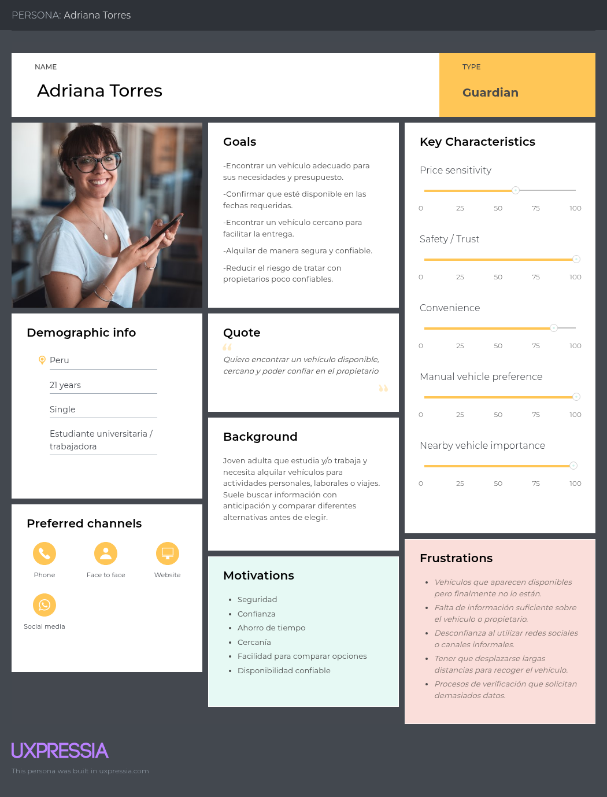
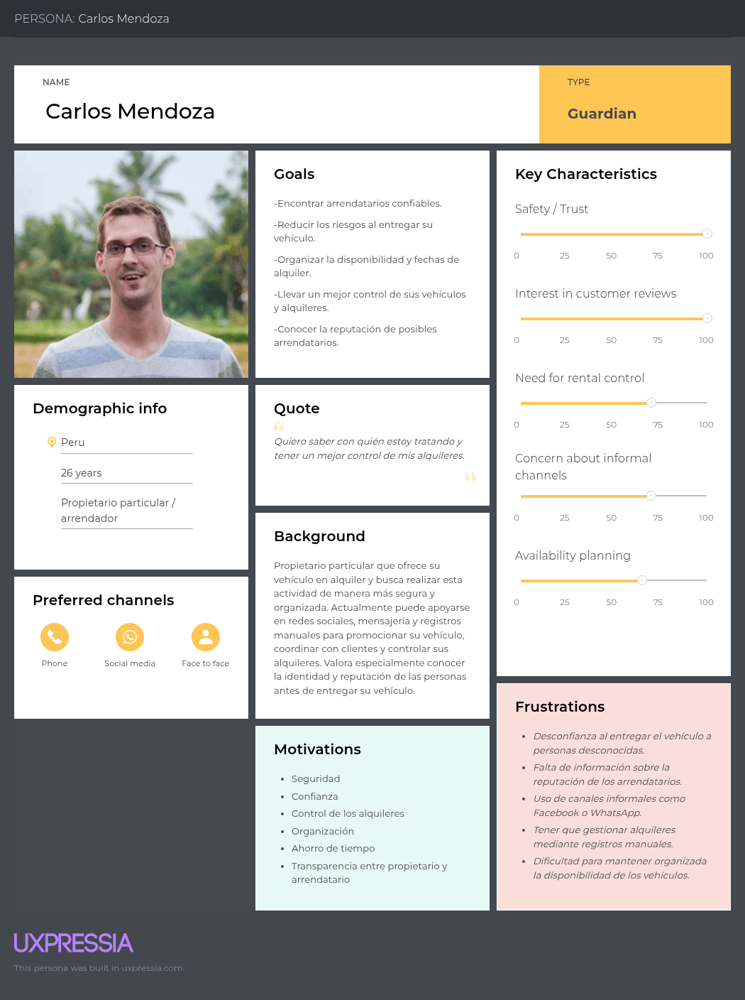
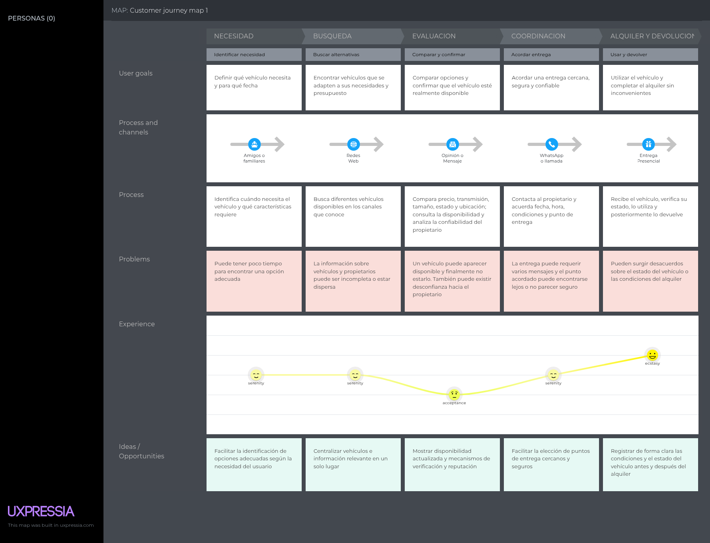
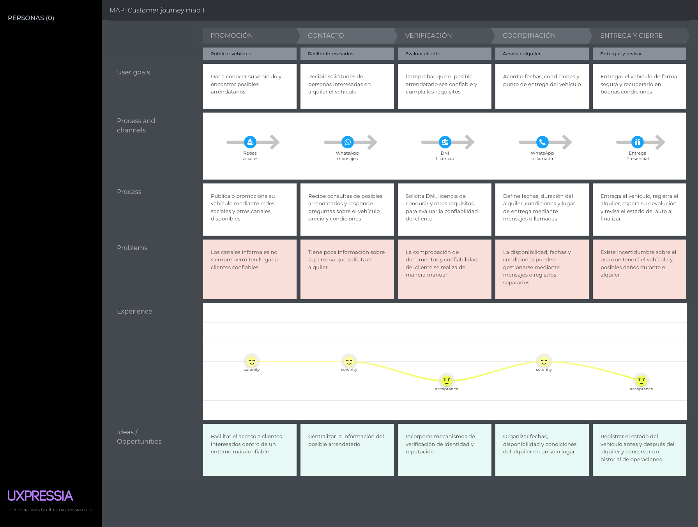
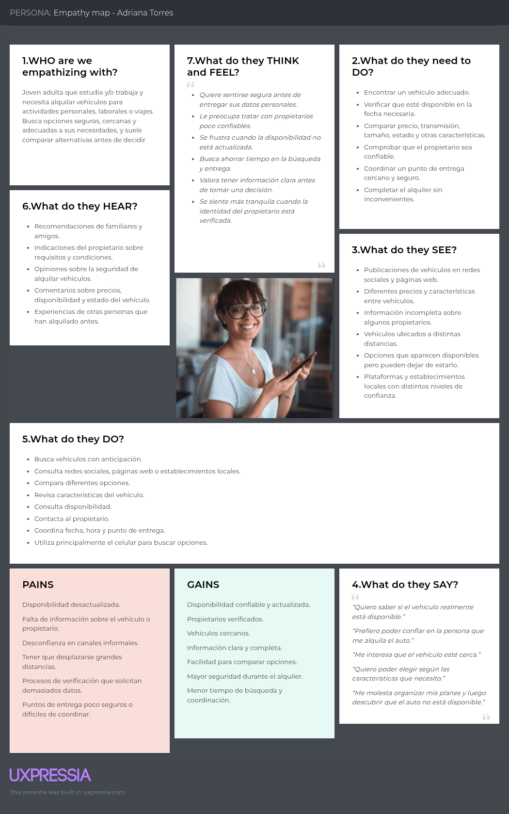
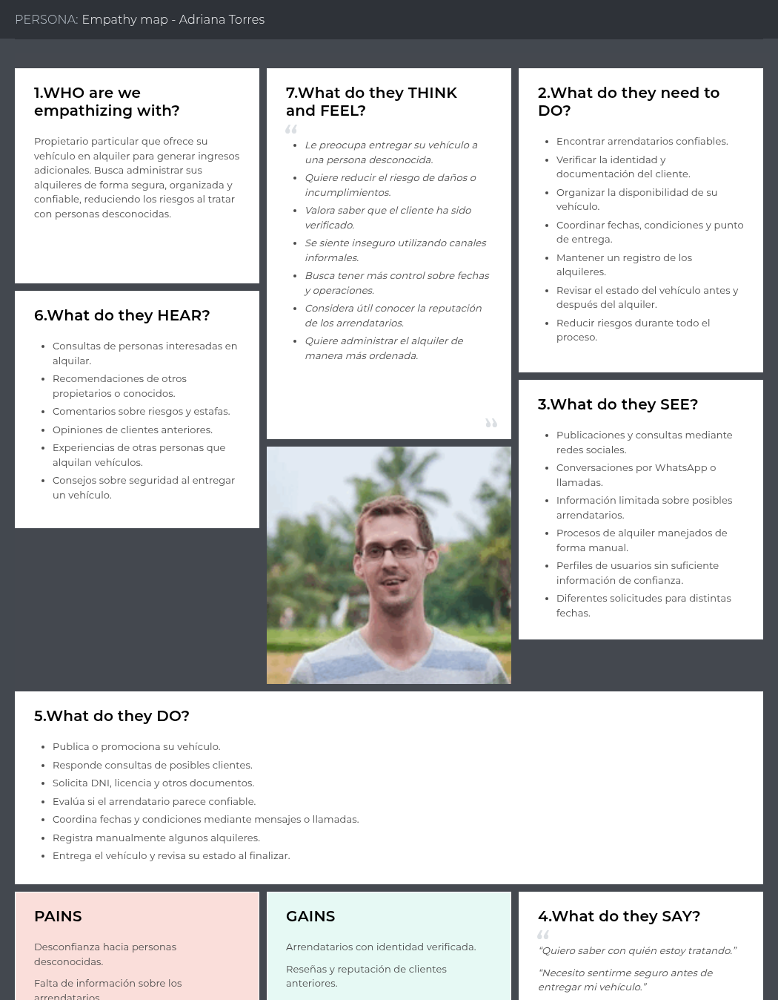

## Capítulo 2: Requirements Elicitation & Analysis
### 2.1. Competidores.

Previo al desarrollo de Veygo, nuestra aplicación de alquiler de autos, realizamos una búsqueda de las opciones que ya existen en el mercado, tanto locales como internacionales, con el fin de identificar qué funcionalidades ofrecen. Esta búsqueda nos permite entender el estado actual del sector y detectar los vacíos que nuestra propuesta puede cubrir.

- **Turo:** Plataforma internacional de alquiler de autos entre particulares (peer-to-peer). Permite a los propietarios publicar sus vehículos indicando disponibilidad mediante un calendario, mientras que los arrendatarios pueden filtrar por características del vehículo (tipo de transmisión, combustible, marca) y reservar directamente desde la app. Exige verificación de identidad y licencia de conducir antes de completar una reserva.

- **Getaround:** Servicio de carsharing que destaca por permitir a los usuarios ubicar vehículos disponibles cerca de su posición mediante un mapa interactivo, además de ofrecer acceso sin llaves físicas (keyless) mediante la app. Su verificación de identidad es un paso obligatorio antes del primer alquiler.

- **Peru Rent A Car:** Esta plataforma se especializa en el alquiler de autos en Perú. Ofrece una amplia gama de vehículos y opciones de alquiler, así como información sobre destinos turísticos en Perú. La plataforma permite a los usuarios comparar precios y reservar coches en línea, aunque carece de un mapa de proximidad o de un panel de métricas visible para los propietarios.

#### 2.1.1. Análisis competitivo.
|  | Competitive Analysis Landscape |
|---|---|
| ¿Por qué llevar a cabo este análisis? | Entender cómo Turo, Getaround y Peru Rent A Car resuelven hoy la verificación de identidad, la disponibilidad de vehículos, el filtrado por tipo de auto, el control administrativo del propietario y la coordinación del punto de entrega, para confirmar en qué puntos Veygo puede diferenciarse. |

| | | Veygo | Turo | Getaround | Peru Rent A Car |
| --- | --- | --- | --- | --- | --- |
| Perfil | Resumen | Aplicación que busca ofrecer una plataforma rápida y ágil para el alquiler de autos, con verificación de identidad, calendario en tiempo real, filtros por tipo de vehículo, panel administrativo con métricas y mapa de vehículos cercanos. | Plataforma líder en alquiler de autos entre particulares, con calendario de disponibilidad y filtros de búsqueda. | Servicio de carsharing enfocado en la localización de vehículos cercanos mediante mapa y acceso keyless. | Plataforma local que presenta un catálogo de vehículos para alquilar, con atención mediante WhatsApp. |
|  | Ventaja competitiva | Integra en una sola plataforma la verificación de identidad, el calendario actualizado, el filtrado por tipo de vehículo, el panel de métricas para el propietario y el mapa de cercanía para la entrega. | Amplia base de usuarios y flota disponible en varios países. | Fuerte enfoque en la geolocalización y la experiencia sin contacto. | Conocimiento del mercado local y trato directo con el cliente. |
| Perfil de Marketing | Mercado objetivo | Jóvenes y adultos desde los 20 a los 50 años, tanto propietarios como arrendatarios de vehículos en Perú. | Viajeros y particulares que buscan alquilar o rentar su propio vehículo. | Usuarios urbanos que necesitan un vehículo por periodos cortos. | Adultos peruanos que buscan alquilar un vehículo. |
|  | Estrategias de marketing | Marketing digital en redes sociales y colaboraciones con influencers. | Marketing digital y alianzas con aerolíneas/hoteles. | Publicidad digital enfocada en ciudades con alta congestión vehicular. | Patrocinio mediante búsquedas de Chrome. |
| Perfil de Producto | Productos y Servicios | Login con verificación de identidad, calendario de disponibilidad actualizado en tiempo real, filtro por tipo de carro (eléctrico, manual), panel administrativo con métricas (transacciones completadas, carros totales) y mapa de vehículos cercanos para la entrega. | Publicación de vehículos con calendario, mensajería entre usuarios, filtros de búsqueda por características. | Localización de vehículos en mapa, apertura remota del vehículo, tarificación por minuto/hora. | Catálogo de vehículos disponibles, atención directa por WhatsApp. |
|  | Precios y Costos | Comisión por transacción completada entre propietario y cliente. | Comisión variable según protección elegida por el propietario. | Tarifa por tiempo de uso más comisión de plataforma. | Ingreso directo mediante el alquiler. |
|  | Canales de distribución | Disponible en línea a través de la aplicación web y móvil. | Aplicación móvil y plataforma web. | Aplicación móvil. | Disponible en línea a través de la aplicación web. |
| Análisis FODA | Fortalezas | Verificación de identidad integrada, calendario en tiempo real, filtros específicos, panel de métricas y mapa de cercanía en una sola solución. | Gran cantidad de usuarios y flota, sistema de reputación consolidado. | Experiencia de geolocalización madura y acceso keyless. | Plataforma local, atención directa. |
|  | Debilidades | Nuevo competidor en un sector con jugadores ya establecidos. | Proceso de verificación puede resultar largo para nuevos usuarios. | Cobertura limitada a ciudades con alta densidad de vehículos. | No cuenta con calendario visible ni mapa de proximidad. |
|  | Oportunidades | Sin competidores locales que integren simultáneamente estos cinco flujos. | Expansión a nuevos mercados. | Alianzas con municipalidades para zonas de estacionamiento. | Digitalizar procesos hoy manuales (WhatsApp, Excel). |
|  | Amenazas | Sector competitivo con jugadores internacionales de gran escala. | Regulaciones locales sobre alquiler entre particulares. | Altos costos de mantenimiento de flota propia. | Ingreso de competidores con mejor tecnología. |

#### 2.1.2 Estrategias y tácticas frente a competidores.

A partir del Análisis FODA, se plantean las siguientes estrategias y tácticas preliminares que Veygo aplicará para afrontar las fortalezas de sus competidores, aprovechar sus debilidades, y actuar en el contexto de oportunidades y amenazas identificado:
 
**Frente a las fortalezas de los competidores:**
 
- Frente a la amplia base de usuarios y flota de **Turo**, Veygo se enfocará inicialmente en el mercado local peruano, ofreciendo una propuesta de valor integral (identidad, calendario, filtros, panel y mapa) que ningún competidor local replica hoy, en lugar de competir directamente por volumen de usuarios internacionales.
- Frente a la experiencia de geolocalización madura de **Getaround**, Veygo incorporará desde el inicio el mapa de vehículos cercanos como un flujo central del producto, y no como una función adicional, para no quedar rezagada en este aspecto.
- Frente al conocimiento del mercado local y el trato directo de **Peru Rent A Car**, Veygo mantendrá canales de soporte cercanos al usuario (chat dentro de la app) mientras digitaliza los procesos que hoy esa competencia resuelve manualmente.

**Para aprovechar las debilidades de los competidores:**
 
- El proceso de verificación largo que reportan usuarios de **Turo** se aprovechará ofreciendo un login de verificación de identidad más ágil, como diferenciador de experiencia de usuario.
- La cobertura limitada de **Getaround** a zonas de alta densidad vehicular se aprovechará priorizando el despliegue de Veygo en distritos donde la oferta de plataformas de carsharing es escasa.
- La falta de calendario visible y de mapa de proximidad en **Peru Rent A Car** se aprovechará comunicando activamente estos dos flujos como ventajas clave en la promoción de Veygo frente a este tipo de competidores locales.

**En el contexto de oportunidades:**
 
- Se aprovechará la ausencia de competidores locales que integren los cinco flujos priorizados para posicionar a Veygo como la primera plataforma peruana de alquiler de autos con verificación de identidad, calendario en tiempo real, filtros por tipo de vehículo, panel administrativo y mapa de cercanía en un solo producto.
- Se aprovechará la necesidad de digitalizar procesos hoy manuales (WhatsApp, Excel) entre propietarios locales, ofreciendo una migración simple desde estas herramientas hacia el panel administrativo de Veygo.

**En el contexto de amenazas:**
 
- Frente al riesgo de que jugadores internacionales (Turo, Getaround) ingresen agresivamente al mercado peruano, Veygo buscará consolidar una base de propietarios y clientes locales fieles antes de que estos competidores prioricen la región.
- Frente a posibles regulaciones locales sobre el alquiler de vehículos entre particulares, Veygo incorporará la verificación de identidad y el registro documentario como parte de su cumplimiento normativo desde el diseño del producto

### 2.2. Entrevistas.

#### 2.2.1 Diseño de entrevistas.

**Segmento 1 (Clientes/Arrendatarios):**

**Preguntas de información general:**

- ¿Cuál es tu nombre?
- ¿Cuántos años tienes?
- ¿En qué distrito vives?
- ¿A qué te dedicas actualmente?

**Preguntas sobre el alquiler de vehículos:**

- ¿Qué tipo de documento te suelen exigir para proceder con el alquiler?
- ¿Qué tipo de vehículo prefieres alquilar (manual, automático, eléctrico)? ¿Por qué?
- ¿Qué restricciones se te imponen habitualmente antes del alquiler?

**Preguntas sobre verificación de identidad:**

- ¿Qué tan cómodo te sientes verificando tu identidad para acceder a un servicio de alquiler?
- ¿Confiarías más en un arrendador si supieras que su identidad también fue verificada por la plataforma?

**Preguntas sobre calendario de disponibilidad:**

- ¿Sueles consultar con anticipación si un vehículo está disponible en las fechas que necesitas?
- ¿Qué tan frustrante te resulta cuando un auto que parecía disponible finalmente no lo está?

**Preguntas sobre filtrado por tipo de vehículo:**

- ¿Con qué criterios sueles filtrar tu búsqueda de vehículos (transmisión, tipo de combustible, tamaño)?
- ¿Te interesaría poder filtrar específicamente por autos eléctricos o de transmisión manual?

**Preguntas sobre mapa y ubicación:**

- ¿Qué tan importante es para ti que el vehículo esté cerca de tu ubicación al momento de la entrega?
- ¿Te gustaría ver en un mapa los vehículos disponibles más cercanos a tu zona?

**Preguntas sobre la plataforma:**

- ¿Qué tipo de plataforma usas actualmente para buscar vehículos?
- ¿En qué dispositivos accedes a dichas plataformas?
- ¿Consideras que las aplicaciones actuales te dan facilidades para identificar vehículos o arrendadores confiables?
- ¿Estarías dispuesto a usar Veygo, una nueva plataforma que integre verificación de identidad, calendario en tiempo real, filtros por tipo de vehículo y mapa de cercanía?

**Segmento 2 (Propietarios particulares/Arrendadores):**  
**Preguntas de información general:**

- ¿Cuál es tu nombre?
- ¿Cuántos años tienes?
- ¿En qué distrito vives?
- ¿A qué te dedicas actualmente?

**Preguntas sobre el alquiler de sus vehículos:**

- ¿Qué tipo de documento exige para proceder con el alquiler?
- ¿Qué tipo de vehículo ofrece para el alquiler (transmisión manual, automática, eléctrico)?
- ¿Cuál es la cantidad mínima y máxima de tiempo que permite alquilar tu vehículo?
- ¿Cómo llevas el control de la disponibilidad de tus vehículos (alquilados vs. libres)?

**Preguntas sobre verificación de identidad:**

- ¿Verificas la identidad del cliente antes de entregar el vehículo? ¿Cómo lo haces actualmente?
- ¿Confiarías en un sistema de login con verificación de identidad integrada para filtrar clientes antes del primer contacto?

**Preguntas sobre calendario de disponibilidad:**

- ¿Usas algún calendario o registro para saber cuándo tu auto está ocupado?
- ¿Qué tan importante sería para ti que ese calendario se actualice automáticamente cuando se confirma un alquiler?

**Preguntas sobre panel administrativo y métricas:**

- ¿Te gustaría contar con un panel donde puedas ver cuántas transacciones has completado y cuántos vehículos tienes registrados?
- ¿Qué otra información te gustaría visualizar en un panel de control como propietario?

**Preguntas sobre mapa y ubicación:**

- ¿Actualmente cómo coordinas el punto de entrega del vehículo con tus clientes?
- ¿Te resultaría útil que tu vehículo aparezca en un mapa para que los clientes cercanos a la zona de entrega lo encuentren más fácilmente?

**Preguntas sobre la plataforma:**

- ¿Qué tipo de plataforma usas actualmente para ofrecer tu vehículo?
- ¿En qué dispositivos accedes a dichas plataformas?
- ¿Consideras que las aplicaciones actuales te dan facilidades para identificar clientes confiables?
- ¿Estarías dispuesto a migrar a **Veygo**, una nueva plataforma que integre verificación de identidad, calendario, panel de métricas y mapa de entrega?

#### 2.2.2 Registro de entrevistas.

**Segmento Objetivo 1: Clientes (Arrendatarios)**

**Entrevista 1**

Nombre completo: Andre Perez

Edad: 20 años

Papel desempeñado: Arrendatario

Distrito: Comas

Ocupación: Estudiante universitario (UPC)
 
**Detalles de la entrevista:**

  
[[URL de la entrevista](https://youtu.be/C-CCBMB-hx8?si=CsbbWmsPkPQl6bDD)] — Duración de la entrevista: [7:37]
 
**Transcripción resumen de entrevista:**
Andre suele alquilar vehículos de transmisión manual, ya que prefiere evitar autos automáticos o eléctricos por considerar que tienden a malograrse con mayor frecuencia. Indica que las plataformas que usa habitualmente le exigen DNI, licencia de conducir vigente y datos personales, además de ser mayor de edad y cumplir con las condiciones que impone cada propietario.
 
Respecto a la **verificación de identidad**, se siente cómodo compartiendo sus datos siempre que se le explique para qué serán usados, y señala que confiaría más en un arrendador si supiera que su identidad también fue verificada por la plataforma, ya que esto le daría mayor seguridad antes de alquilar un vehículo.
 
Sobre el **calendario de disponibilidad**, comenta que normalmente verifica con anticipación si un vehículo está disponible para la fecha que necesita (ya sea por una reunión o una emergencia), y que le resulta muy frustrante cuando un auto que parecía disponible finalmente no lo está, porque le desorganiza sus planes.
 
En cuanto al **filtrado por tipo de vehículo**, suele filtrar por precio, tipo de transmisión y consumo de combustible según la ocasión de uso, y le interesaría poder filtrar específicamente por autos eléctricos o de transmisión manual para adaptarse mejor a cada situación.
 
Sobre el **mapa de cercanía**, considera muy importante que el vehículo esté cerca de su ubicación al momento de la entrega, ya que de lo contrario tendría que invertir más tiempo en llegar hasta él; le parecería muy útil poder ver en un mapa los vehículos disponibles más cercanos a su zona.
 
Actualmente usa sobre todo páginas web y redes sociales para buscar vehículos, y siente que estas plataformas no siempre brindan suficiente información sobre el vehículo o sobre la persona que alquila, lo que genera desconfianza. Ante esto, se mostró dispuesto a usar Veygo, señalando que integra funcionalidades útiles que facilitarían el proceso de alquiler de un vehículo.

**Entrevista 2**

Nombre completo: Summy Callaca

Edad: 22 años

Papel desempeñado: Arrendataria

Distrito: Oxapampa

Ocupación: Estudia y trabaja

**Detalles de la entrevista:**

  
[[URL de la entrevista](https://www.youtube.com/watch?v=uFiH1nisYHM)] — Duración de la entrevista: [6:26]

**Transcripción resumen de entrevista:**

Summy prefiere alquilar vehículos de transmisión manual porque considera que le permiten tener mayor control sobre el vehículo, para realizar un alquiler, indica que normalmente le solicitan DNI, licencia de conducir vigente y un documento que permita acreditar su domicilio, como un recibo de luz. Asimismo, menciona que debe cumplir con los requisitos establecidos para utilizar el vehículo.

Respecto a la **verificación de identidad**, se muestra cómoda con este proceso mientras la documentación se encuentre en regla, también considera que confiaría más en un arrendador si su identidad hubiera sido verificada por la plataforma, ya que esto le generaría mayor credibilidad y seguridad para entregar su documentación.

En relación con la **disponibilidad de los vehículos**, señala que suele consultar con anticipación dependiendo de la actividad que realizará, también considera que el tamaño del vehículo debe adaptarse a la cantidad de personas que viajarán. Manifiesta que le resulta muy frustrante que un vehículo que aparentemente estaba disponible finalmente no lo esté, debido a que organiza sus planes en función de haber conseguido dicho vehículo.

En cuanto al **filtrado de vehículos**, toma en cuenta principalmente el estado del vehículo y la cantidad de asientos. Además, considera que contar con filtros específicos para características como el tipo de transmisión facilitaría la búsqueda.

Sobre la **ubicación y entrega**, considera conveniente que el punto de entrega se encuentre cerca de su ubicación, sin embargo, señala que también es importante que el lugar sea seguro y verificable. Prefiere que la entrega se realice en un establecimiento o punto identificable, ya que esto le genera mayor credibilidad que una entrega en un lugar sin referencias claras, asimismo, considera útil poder visualizar los vehículos disponibles más cercanos mediante un mapa.

Actualmente no suele utilizar plataformas especializadas para buscar vehículos, principalmente recurre a establecimientos locales y redes sociales, también manifiesta preocupación por la seguridad y por la falta de verificación de los requisitos de las personas que ofrecen vehículos mediante estos medios.

Finalmente, se muestra dispuesta a utilizar **Veygo** si la plataforma integra verificación de identidad, calendario en tiempo real, filtros por tipo de vehículo y mapa de cercanía. Como condición adicional, señala que le generaría mayor confianza contar con un punto de atención presencial cercano a su lugar de residencia.

**Entrevista 3**

Nombre completo: Diego León

Edad: 21 años

Papel desempeñado: Arrendatario

Distrito: Salamanca, Lima

Ocupación: Trabaja en un negocio familiar

**Detalles de la entrevista:**

  
[[URL de la entrevista](https://drive.google.com/file/d/1qEhT1fvgC09HdDXzRPTrgDkUVPTtdTVm/view?usp=drive_link)] — Duración de la entrevista: [9:25]

**Transcripción resumen de entrevista:**

Diego señala que, para alquilar un vehículo, normalmente le solicitan su licencia de conducir, asimismo, menciona que existen restricciones relacionadas con la edad, la licencia de conducir, el seguro y dependiendo del caso el depósito o el uso de una tarjeta.

Respecto al **tipo de vehículo**, prefiere los autos de transmisión manual porque considera que suelen ser más económicos y le permiten tener mayor control sobre la conducción. También menciona que la disponibilidad de lugares para cargar vehículos eléctricos en Perú puede ser una limitación, por lo que actualmente prefiere los vehículos manuales.

En relación con la **verificación de identidad**, manifiesta cierta incomodidad cuando se solicitan demasiados datos o documentos, ya que considera que este proceso puede dificultar el alquiler. Sin embargo, señala que confiaría más en un propietario si la plataforma hubiera verificado previamente su identidad, porque esto reduciría el riesgo de posibles estafas.

Sobre el **calendario de disponibilidad**, indica que suele consultar con anticipación si el vehículo se encuentra disponible para las fechas que necesita, ya que esto le permite organizar mejor sus actividades, cuando un vehículo aparece como disponible y posteriormente no lo está, considera que la situación resulta frustrante, aunque menciona que en algunos casos puede optar por otro vehículo.

En cuanto al **filtrado de vehículos**, toma en cuenta principalmente la transmisión, el tipo de combustible, el tamaño y el modelo. Prefiere vehículos mecánicos y de tamaño moderado debido a las condiciones de Lima, especialmente por la dificultad para estacionar, también considera importante que el vehículo tenga aire acondicionado y un consumo reducido de combustible. Además, considera útil contar con filtros específicos para vehículos eléctricos y de transmisión manual.

Respecto a la **ubicación**, considera muy importante que el vehículo se encuentre cerca de su posición, ya que no le resulta conveniente tener que desplazarse durante varias horas para recogerlo, también valora la posibilidad de recibir el vehículo mediante entrega a domicilio, en este sentido, considera que un mapa que permita visualizar los vehículos disponibles cercanos sería una funcionalidad útil.

Actualmente utiliza principalmente su **teléfono celular** para acceder a plataformas digitales y, en algunas ocasiones, una computadora cuando se encuentra acompañado de familiares o amigos, también menciona haber utilizado plataformas como Kayak para buscar vehículos y considera que estas permiten consultar información como el año, modelo, propietario y precio, además de aplicar filtros de búsqueda.

Finalmente, señala que estaría dispuesto a utilizar **Veygo**, principalmente porque la verificación de identidad podría reducir el riesgo de interactuar con personas poco confiables, también considera útil contar con un calendario que permita conocer las fechas disponibles y un sistema de ubicación que facilite encontrar vehículos cercanos.

**Segmento Objetivo 2: Propietarios particulares (arrendadores)**

**Entrevista 1**

Nombre completo: Jordan Cruz

Edad: 27 años

Papel desempeñado: Arrendador de un auto

Distrito: Los Olivos
 
**Detalles de la entrevista:**
 
[[URL de la entrevista]()] — Duración de la entrevista: [4:51]
 
**Transcripción resumen de entrevista:**
Jordan mostró interés en la plataforma, ya que considera que le brindaría un control más claro sobre el alquiler de sus vehículos. Valoró especialmente las medidas de seguridad que podrían proteger tanto a arrendadores como a arrendatarios, y destacó que contar con un **sistema de reseñas de clientes anteriores** sería una herramienta valiosa para identificar inquilinos confiables y evitar problemas.
 
Respecto al **panel administrativo**, mencionó que sería útil tener una plataforma que le permita registrar el estado de sus vehículos y gestionar el tiempo de alquiler de manera más eficiente. Sobre el **calendario de disponibilidad**, apreció especialmente la idea de una reserva anticipada que le permita asegurar la disponibilidad de sus vehículos en fechas específicas. En general, mostró interés en un sistema que mejore la confianza y la transparencia entre arrendadores y arrendatarios.
 
**Entrevista 2**

Nombre completo: Jose Marchena

Edad: 23 años

Papel desempeñado: Arrendador de un auto

Distrito: San Juan de Lurigancho
 
**Detalles de la entrevista:**
 
[[URL de la entrevista]()] — Duración de la entrevista: [5:33]
 
**Transcripción resumen de entrevista:**
Jose se mostró gratamente impresionado con el producto presentado, ya que incorpora las **medidas de seguridad** que, según indica, siempre se buscan al momento de arrendar un vehículo a un tercero. Señaló que le gustaría que la plataforma también contara con funciones para ver opiniones o comentarios de otros usuarios que ya la hayan utilizado, lo cual aumentaría aún más la confianza.
 
Comentó que anteriormente ofrecía su vehículo en alquiler a través de Facebook, pero siempre le quedaba una sensación de duda e inseguridad al momento de la entrega. Con los métodos de seguridad mostrados (verificación de identidad), afirma sentirse mucho más tranquilo y confiado en el servicio.
 
**Entrevista 3**

Nombre completo: Juan Diaz Banda

Edad: 28 años

Papel desempeñado: Propietario/arrendador (profesor de colegio)

Distrito: Bellavista, Callao
 
**Detalles de la entrevista:**
 
[[URL de la entrevista]()] — Duración de la entrevista: [3:54]
 
**Transcripción resumen de entrevista:**
Juan combina su trabajo en un colegio con el alquiler de su Toyota Yaris para generar ingresos adicionales. Es una persona práctica y organizada que gestiona su negocio **manualmente mediante un registro en Excel**, operando principalmente en zonas cercanas a su domicilio.
 
Para alquilar su vehículo exige DNI y licencia de conducir vigente, con un mínimo de un día y un máximo de una semana de alquiler. Promociona su servicio por Instagram y coordina los tratos por WhatsApp, pero reconoce que estos canales son **inseguros para manejar datos personales**. Muestra interés en migrar a una aplicación especializada que le permita ver reseñas de clientes, gestionar sus alquileres mediante un **panel de control** y reducir riesgos. Su perfil refleja la necesidad de una solución tecnológica más confiable y eficiente para su negocio.

#### 2.2.3 Análisis de entrevistas.
A continuación se identifican, por cada segmento objetivo, las características objetivas y subjetivas más comunes, con su sustento estadístico y la referencia a las entrevistas de donde se extrae cada una. Estas características son la base para la construcción de los arquetipos de usuario.
 
**Segmento 1: Clientes (Arrendatarios)** — muestra: Andre Perez (E1), Summy Callaca (E2), Diego León (E3)
 
*Características objetivas*
 
| Característica | % | Entrevistas donde se identifica |
| --- | --- | --- |
| Edad entre 20 y 22 años (promedio ≈20.7 años) | 100% (3/3) | E1, E2, E3 |
| Exige/presenta DNI y licencia de conducir vigente para alquilar | 100% (3/3) | E1, E2, E3 |
| Prefiere vehículos de transmisión manual | 100% (3/3) | E1, E2, E3 |
| Combina estudios con alguna actividad económica (estudia, o estudia y trabaja) | 66.7% (2/3) | E1, E2 |
| Reside en un distrito distinto entre sí (sin coincidencia de distrito) | 100% (3/3) | E1 (Comas), E2 (Oxapampa), E3 (Salamanca, Lima) |
| Ha usado alguna vez una plataforma especializada de alquiler (ej. Kayak) | 33.3% (1/3) | E3 |
 
*Características subjetivas*
 
| Característica | % | Entrevistas donde se identifica |
| --- | --- | --- |
| Confiaría más en un arrendador si su identidad fue verificada por la plataforma | 100% (3/3) | E1, E2, E3 |
| Le resulta frustrante que un vehículo anunciado como disponible finalmente no lo esté | 100% (3/3) | E1, E2, E3 |
| Le interesaría filtrar específicamente por tipo de vehículo (eléctrico/manual) | 100% (3/3) | E1, E2, E3 |
| Considera importante que el vehículo esté cerca de su ubicación al momento de la entrega | 100% (3/3) | E1, E2, E3 |
| Percibe que las plataformas/canales actuales no brindan información suficiente o generan desconfianza | 100% (3/3) | E1, E2, E3 |
| Se muestra dispuesto(a) a usar Veygo | 100% (3/3) | E1, E2, E3 |
| Exige que el punto de entrega sea, además de cercano, seguro/verificable | 33.3% (1/3) | E2 |
| Manifiesta incomodidad cuando se solicitan demasiados datos/documentos | 33.3% (1/3) | E3 |
| Pide que se le explique para qué se usarán sus datos personales | 33.3% (1/3) | E1 |
 
**Segmento 2: Propietarios particulares (Arrendadores)** — muestra: Jordan Cruz (E1), Jose Marchena (E2), Juan Diaz Banda (E3)

*Características objetivas*
 
| Característica | % | Entrevistas donde se identifica |
| --- | --- | --- |
| Edad entre 23 y 28 años (promedio 26 años) | 100% (3/3) | E1, E2, E3 |
| Reside en un distrito distinto entre sí (sin coincidencia de distrito) | 100% (3/3) | E1 (Los Olivos), E2 (San Juan de Lurigancho), E3 (Bellavista, Callao) |
| Utiliza redes sociales (Facebook/Instagram) o WhatsApp para promocionar o coordinar el alquiler de su vehículo | 66.7% (2/3) | E2, E3 |
| Alquila su vehículo como actividad complementaria a otra ocupación | 33.3% (1/3) | E3 (profesor de colegio) |
| Gestiona su(s) alquiler(es) mediante un registro manual (Excel) | 33.3% (1/3) | E3 |

*Características subjetivas*
 
| Característica | % | Entrevistas donde se identifica |
| --- | --- | --- |
| Valora positivamente contar con medidas/verificación de seguridad para identificar arrendatarios confiables | 100% (3/3) | E1, E2, E3 |
| Le interesaría un sistema de reseñas o comentarios de arrendatarios anteriores | 100% (3/3) | E1, E2, E3 |
| Se muestra dispuesto a migrar/usar Veygo | 100% (3/3) | E1, E2, E3 |
| Le interesaría un panel administrativo para registrar el estado de sus vehículos y gestionar su alquiler | 66.7% (2/3) | E1, E3 |
| Desconfía de canales informales (Facebook, WhatsApp) para manejar datos personales del alquiler | 66.7% (2/3) | E2, E3 |
| Valora una reserva anticipada / calendario para asegurar la disponibilidad de su vehículo en fechas específicas | 33.3% (1/3) | E1 |
 
La verificación de identidad y la disposición a usar Veygo son las únicas características subjetivas presentes en el 100% de ambos segmentos, lo que las convierte en el punto de partida más sólido para los arquetipos. El panel administrativo aparece con fuerza (66.7%) solo en el segmento de propietarios, mientras que el filtrado por tipo de vehículo y el mapa de cercanía aparecen con fuerza (100%) solo en el segmento de clientes; esta diferencia debe reflejarse en arquetipos distintos para cada segmento, en lugar de un arquetipo único para "el usuario de Veygo". El interés en un sistema de reseñas, presente en el 100% de los propietarios entrevistados, se identifica como una característica subjetiva transversal no contemplada en los cinco flujos originales, relevante para la construcción del arquetipo de propietario.

### 2.3. Needfinding.

A partir del análisis de las entrevistas realizadas a los dos segmentos objetivo y de los hallazgos obtenidos en el análisis competitivo, se elaboraron los principales artefactos de Needfinding de Veygo, los cuales permiten representar las características, objetivos, necesidades, tareas, experiencias, frustraciones y expectativas de los clientes arrendatarios y de los propietarios particulares que ofrecen sus vehículos en alquiler.

Los resultados obtenidos evidencian diferencias claras entre ambos segmentos, mientras los clientes priorizan la disponibilidad del vehículo, la cercanía, la facilidad para comparar alternativas y la confianza en el propietario, los arrendadores muestran mayor preocupación por la seguridad, la confiabilidad de los clientes, las reseñas y el control de sus operaciones de alquiler.

#### 2.3.1. User Personas.

A partir de las características objetivas y subjetivas identificadas en las entrevistas se construyó un User Persona para cada segmento objetivo, estos perfiles no representan directamente a un entrevistado particular, sino que sintetizan los patrones más relevantes encontrados durante la investigación.
Para el segmento de clientes se consideraron principalmente la preferencia por vehículos de transmisión manual, la consulta anticipada de disponibilidad, la importancia de la cercanía y la necesidad de interactuar con propietarios confiables.
Para el segmento de propietarios se priorizaron la seguridad durante el alquiler, la necesidad de identificar arrendatarios confiables, el interés en contar con reseñas y la búsqueda de un mayor control sobre sus operaciones.

##### Segmento 1: Clientes / Arrendatarios

El User Persona Adriana Torres representa al cliente que busca alquilar un vehículo de manera segura y organizada, sus principales objetivos se relacionan con encontrar una alternativa adecuada a sus necesidades, confirmar su disponibilidad, reducir el tiempo empleado en la búsqueda y contar con información suficiente para confiar en el propietario antes de realizar el alquiler.

##### Segmento 2: Propietarios particulares / Arrendadores

El User Persona Carlos Mendoza representa al propietario particular que ofrece su vehículo en alquiler y busca realizar esta actividad reduciendo los riesgos asociados a tratar con personas desconocidas, sus principales necesidades se relacionan con la verificación de los arrendatarios, el conocimiento de su reputación, la organización de la disponibilidad y un mayor control sobre sus alquileres.

#### 2.3.2. User Task Matrix.

El User Task Matrix permite comparar las principales tareas que realizan actualmente los User Personas para alcanzar sus objetivos dentro del proceso de alquiler de vehículos, las tareas consideradas corresponden a actividades propias de cada segmento y pueden realizarse independientemente de la existencia de Veygo.

Para la evaluación se utilizan los niveles de frecuencia Always, Sometimes y Rarely, mientras que la importancia se clasifica como High, Medium o Low.

| **Tareas** | **Adriana Torres - Cliente/Arrendataria** |  | **Carlos Mendoza - Propietario/Arrendador** |  |
|---|---|---|---|---|
|  | **Frecuencia** | **Importancia** | **Frecuencia** | **Importancia** |
| Identificar la necesidad y fechas del alquiler | Always | High | — | — |
| Buscar vehículos disponibles | Always | High | — | — |
| Comparar características, precio y condiciones de los vehículos | Always | High | — | — |
| Consultar la disponibilidad para las fechas requeridas | Always | High | Always | High |
| Revisar los requisitos y documentación necesarios | Always | High | — | — |
| Evaluar la confiabilidad de la otra parte | Always | High | Always | High |
| Promocionar u ofrecer el vehículo en alquiler | — | — | Always | High |
| Atender consultas de posibles arrendatarios | — | — | Always | High |
| Verificar la identidad y documentación del arrendatario | — | — | Always | High |
| Organizar las fechas y condiciones del alquiler | — | — | Always | High |
| Coordinar el lugar y horario de entrega | Always | High | Always | High |
| Revisar el estado del vehículo antes de la entrega | Sometimes | High | Always | High |
| Llevar un registro de los alquileres realizados | — | — | Sometimes | High |
| Devolver o recibir nuevamente el vehículo | Always | High | Always | High |
| Revisar el estado del vehículo al finalizar el alquiler | Sometimes | High | Always | High |

A partir de la matriz se observa que ambos segmentos coinciden en tareas de alta importancia relacionadas con la disponibilidad, la evaluación de la confiabilidad de la otra parte y la coordinación de la entrega, esto refleja que la confianza y la correcta organización del alquiler constituyen necesidades transversales dentro del dominio.

Las principales diferencias se encuentran en las actividades previas y posteriores al alquiler. Adriana dedica mayor atención a la búsqueda, comparación y selección de alternativas, mientras que Carlos realiza tareas relacionadas con la promoción del vehículo, verificación del cliente, organización de fechas y control de la operación. Asimismo, el propietario tiene una participación más activa en la revisión del estado del vehículo y en el registro de los alquileres realizados.

#### 2.3.3. User Journey Mapping.

Los User Journey Maps representan el recorrido completo que siguen actualmente los usuarios de cada segmento durante el proceso de alquiler de un vehículo. Se desarrollaron en versión As-Is, por lo que muestran la experiencia actual de los usuarios sin considerar todavía la existencia de Veygo.

El recorrido del cliente comprende desde el momento en que surge la necesidad de alquilar un vehículo hasta su utilización y devolución, por su parte, el recorrido del propietario comienza con la promoción de su vehículo y continúa con el contacto con posibles clientes, su verificación, la coordinación de las condiciones y finalmente la entrega y recuperación del vehículo.

##### User Journey Map - Adriana Torres

Para el segmento de clientes se identificaron cinco etapas principales: necesidad, búsqueda, evaluación, coordinación y alquiler/devolución, el punto de mayor fricción se encuentra durante la evaluación, debido principalmente a la incertidumbre respecto a la disponibilidad real del vehículo y la confiabilidad del propietario.
Durante la coordinación también pueden presentarse dificultades relacionadas con la distancia, la seguridad del punto de entrega y la necesidad de utilizar múltiples mensajes o llamadas para concretar el alquiler.

Las oportunidades identificadas se relacionan principalmente con la centralización de información, una disponibilidad más confiable, mecanismos de verificación y reputación, así como una mejor coordinación de lugares de entrega cercanos y seguros.

##### User Journey Map - Carlos Mendoza

Para el segmento de propietarios se identificaron las etapas de promoción, contacto, verificación, coordinación y entrega/cierre. Los momentos de mayor preocupación se presentan durante la verificación del posible arrendatario y al momento de entregar el vehículo, debido a la incertidumbre sobre la confiabilidad del cliente y el estado en el que será devuelto el automóvil.

Entre las oportunidades encontradas destacan la posibilidad de centralizar la información de los posibles clientes, contar con mecanismos de identidad y reputación, organizar la disponibilidad y conservar un registro más claro de los alquileres y del estado de los vehículos.

#### 2.3.4. Empathy Mapping.

Con la finalidad de comprender con mayor profundidad la perspectiva de ambos segmentos, se elaboró un Empathy Map para cada User Persona, para su construcción se consideraron los comportamientos, opiniones, necesidades y frustraciones encontrados durante las entrevistas, organizándolos según lo que cada usuario ve, escucha, dice, hace, piensa y siente, finalmente se identificaron sus principales Pains y Gains.

##### Empathy Map - Adriana Torres

El Empathy Map de Adriana evidencia que el cliente busca principalmente seguridad, información confiable, disponibilidad actualizada y facilidad para encontrar un vehículo adecuado y cercano. Entre sus principales preocupaciones se encuentran la desconfianza hacia canales informales, la falta de información sobre los propietarios, los cambios inesperados de disponibilidad y los desplazamientos innecesarios para recoger un vehículo.
Como principales ganancias esperadas se identifican una mayor confianza en los propietarios, información clara, alternativas cercanas, facilidad para comparar vehículos y una reducción del tiempo empleado durante la búsqueda y coordinación.

##### Empathy Map - Carlos Mendoza

El Empathy Map de Carlos muestra una preocupación constante por la seguridad de su vehículo y la confiabilidad de los arrendatarios, el propietario necesita conocer con quién está realizando el trato, comprobar la identidad y documentación del cliente y tener mayor control sobre las condiciones del alquiler.
Sus principales Pains están relacionados con la falta de información sobre los clientes, el uso de canales informales, la gestión manual de algunas operaciones y el riesgo asociado a entregar el vehículo a una persona desconocida, entre sus Gains destacan contar con arrendatarios verificados, conocer opiniones o reseñas de clientes anteriores, organizar mejor sus alquileres y disponer de información centralizada.

### 2.4. Big Picture EventStorming.

Con el objetivo de comprender de manera general el dominio de negocio de Veygo, el equipo realizó un Big Picture EventStorming enfocado en el proceso de alquiler de vehículos, durante esta actividad se identificaron los principales eventos del dominio, los problemas que pueden presentarse durante el proceso y las oportunidades de mejora asociadas.

#### Identificación y organización de eventos del dominio

En una primera etapa se identificaron y organizaron cronológicamente los eventos más relevantes del negocio. Para ello, se consideraron los principales procesos involucrados en el alquiler de vehículos: el registro de propietarios y arrendatarios, la gestión y disponibilidad de vehículos, la búsqueda y selección de vehículos, la gestión de reservas, la ejecución del alquiler y la finalización de la transacción.

Los eventos identificados fueron organizados de acuerdo con el flujo general del negocio, permitiendo visualizar cómo se relacionan las acciones realizadas por propietarios y arrendatarios durante el proceso de alquiler.

#### Identificación de hotspots y oportunidades

En una segunda etapa se analizaron los eventos previamente identificados con la finalidad de reconocer posibles problemas o *hotspots* dentro del dominio.

Entre los principales problemas encontrados se identificaron la posible desactualización de la disponibilidad de los vehículos, retrasos durante la verificación de identidad, solicitudes simultáneas de un mismo vehículo, dificultades en la coordinación del punto de entrega y posibles diferencias en el estado del vehículo después de finalizar un alquiler.

A partir de estos hotspots se identificaron oportunidades de mejora, entre las que se encuentran una verificación de identidad más ágil, la sincronización de disponibilidad en tiempo real, la búsqueda de vehículos cercanos, la prevención automática de conflictos de reserva, la coordinación centralizada de la entrega y la verificación del estado del vehículo.

El resultado del Big Picture EventStorming permite visualizar de manera integral los principales procesos que forman parte del dominio de alquiler de vehículos de Veygo, así como la relación entre sus eventos, problemas y oportunidades, esta representación proporciona una visión general del negocio y servirá como referencia para las siguientes etapas de análisis y modelado del proyecto.

### 2.5. Ubiquitous Language.

A continuación, se presenta el glosario de términos centrales correspondientes al dominio de la plataforma Veygo. Este vocabulario busca establecer definiciones claras y consistentes para los conceptos utilizados por propietarios, arrendatarios, stakeholders y miembros del equipo durante el desarrollo del proyecto, evitando ambigüedades en la comunicación.

| Término (Inglés) | Término (Español) | Definición clara y compartida |
|---|---|---|
| **Owner** | Propietario | Persona que posee uno o más vehículos y los ofrece en alquiler a través del modelo de negocio de Veygo. |
| **Renter** | Arrendatario | Persona que busca alquilar un vehículo por un periodo determinado para satisfacer una necesidad de transporte. |
| **Vehicle** | Vehículo | Automóvil perteneciente a un propietario que puede ser ofrecido para alquiler cuando se encuentra disponible. |
| **Vehicle Listing** | Publicación de vehículo | Información mediante la cual un propietario ofrece un vehículo para alquiler, incluyendo sus características, condiciones, ubicación y disponibilidad. |
| **Rental** | Alquiler | Acuerdo mediante el cual un arrendatario obtiene temporalmente el uso de un vehículo perteneciente a un propietario bajo determinadas condiciones. |
| **Booking** | Reserva | Solicitud mediante la cual un arrendatario aparta un vehículo disponible para un periodo determinado. |
| **Availability** | Disponibilidad | Estado que indica si un vehículo puede ser alquilado durante una fecha o periodo específico. |
| **Rental Period** | Periodo de alquiler | Intervalo comprendido entre la fecha y hora acordadas para el inicio del alquiler y la fecha y hora establecidas para su finalización. |
| **Pickup** | Entrega / Recojo | Momento en el que el arrendatario recibe el vehículo del propietario para iniciar el periodo de alquiler. |
| **Return** | Devolución | Momento en el que el arrendatario entrega nuevamente el vehículo al propietario al finalizar el periodo acordado. |
| **Pickup Location** | Punto de entrega / recojo | Lugar acordado entre propietario y arrendatario donde se realiza la entrega inicial del vehículo. |
| **Vehicle Location** | Ubicación del vehículo | Zona o posición asociada a un vehículo y utilizada para determinar su proximidad respecto al arrendatario o al punto de entrega. |
| **Identity Verification** | Verificación de identidad | Proceso mediante el cual se comprueba la identidad de una persona antes de participar en una operación de alquiler. |
| **Driver's License** | Licencia de conducir | Documento que acredita que una persona se encuentra autorizada para conducir un vehículo según las condiciones correspondientes. |
| **Rental Rate** | Tarifa de alquiler | Importe establecido para alquilar un vehículo durante un periodo determinado. |
| **Transaction** | Transacción | Operación económica originada como consecuencia de un alquiler acordado entre un propietario y un arrendatario. |
| **Payment** | Pago | Entrega del importe correspondiente al alquiler de un vehículo según las condiciones acordadas. |
| **Cancellation** | Cancelación | Finalización de una reserva antes del inicio del periodo de alquiler por decisión de alguna de las partes o por una condición establecida. |
| **Booking Status** | Estado de reserva | Situación en la que se encuentra una reserva durante su ciclo de vida, por ejemplo: pendiente, confirmada, cancelada o completada. |
| **Vehicle Status** | Estado del vehículo | Condición operativa de un vehículo respecto al proceso de alquiler, como disponible, reservado, alquilado o no disponible. |
| **Vehicle Category** | Categoría de vehículo | Clasificación utilizada para distinguir vehículos según características relevantes para el alquiler. |
| **Transmission Type** | Tipo de transmisión | Característica que identifica el sistema de transmisión del vehículo, como manual o automático. |
| **Electric Vehicle** | Vehículo eléctrico | Vehículo cuyo sistema de propulsión utiliza principalmente energía eléctrica almacenada en baterías. |
