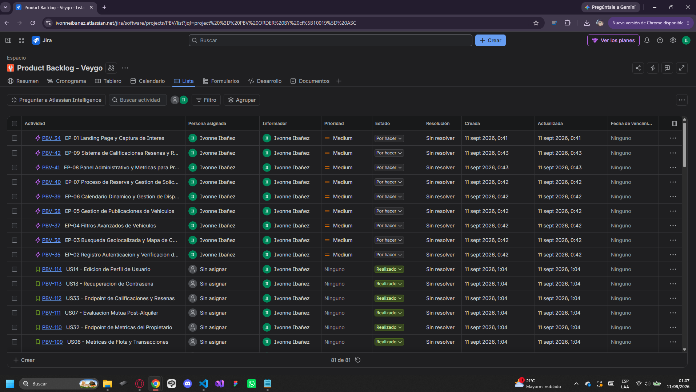

# Capítulo III: Requirements Specification

---

## 3.1 User Stories

En esta sección se definen las Historias de Usuario (User Stories) y las Historias Técnicas (Technical Stories) de Veygo, estructuradas a partir de los Épicos identificados. Se consideran tres tipos de rol para la redacción: **Cliente** y **Propietario** (usuarios autenticados de la plataforma), **Visitante** (rol base para las historias del sitio web estático o Landing Page) y **Developer** (rol utilizado en las Historias Técnicas orientadas al API RESTful). Cada historia sigue el formato estándar (Como [Rol] Quiero [Acción] Para [Beneficio]), Escenarios y sus Criterios de Aceptación se redactan en tiempo presente, tercera persona, sin referencias a interfaz de usuario, siguiendo la estructura Gherkin (Given–When–Then / Dado que–Cuando–Entonces).

**Epics**

Las Epics representan agrupaciones de alto nivel que organizan las funcionalidades principales de Veygo. Cada épica reúne un conjunto de historias de usuario relacionadas, permitiendo estructurar el sistema en bloques funcionales y facilitar la planificación del desarrollo de manera clara y escalable. En la gestión ágil, mantener una jerarquía clara donde las Épicas grandes se desglosan en Historias de Usuario específicas es fundamental para organizar el flujo de trabajo del equipo de desarrollo.

| Epic ID | Title | Description | Acceptance Criteria | Related to (Epic ID) |
| :--- | :--- | :--- | :--- | :--- |
| **EP-01** | Landing Page y Captura de Interés | **Como visitante**, **quiero** conocer la propuesta de valor de Veygo y explorar sus categorías de vehículos, **para** decidir si registrarme como cliente o como propietario. | No aplicable | No aplicable |
| **EP-02** | Registro, Autenticación y Verificación de Identidad | **Como usuario**, **quiero** registrarme, iniciar sesión y verificar mi identidad, **para** acceder a la plataforma de forma segura y generar confianza en mis transacciones. | No aplicable | No aplicable |
| **EP-03** | Búsqueda Geolocalizada y Mapa de Cercanía | **Como cliente**, **quiero** visualizar los vehículos disponibles cercanos a mi ubicación, **para** elegir el punto de entrega más conveniente. | No aplicable | No aplicable |
| **EP-04** | Filtros Avanzados de Vehículos | **Como cliente**, **quiero** filtrar los vehículos por tipo, transmisión, motorización y precio, **para** encontrar rápidamente opciones que se ajusten a mis necesidades. | No aplicable | No aplicable |
| **EP-05** | Gestión de Publicaciones de Vehículos | **Como propietario**, **quiero** registrar, editar y administrar mis vehículos publicados, **para** mantener actualizada mi oferta de alquiler. | No aplicable | No aplicable |
| **EP-06** | Calendario Dinámico y Gestión de Disponibilidad | **Como propietario**, **quiero** gestionar la disponibilidad de mis vehículos en tiempo real, **para** evitar solapamientos y conflictos entre reservas. | No aplicable | No aplicable |
| **EP-07** | Proceso de Reserva y Gestión de Solicitudes | **Como cliente**, **quiero** solicitar y confirmar el alquiler de un vehículo directamente en la plataforma, **para** evitar la coordinación por canales informales. | No aplicable | No aplicable |
| **EP-08** | Panel Administrativo y Métricas para Propietarios | **Como propietario**, **quiero** visualizar métricas de mis vehículos activos, reservas e ingresos, **para** monitorear el desempeño de mi actividad de alquiler. | No aplicable | No aplicable |
| **EP-09** | Sistema de Calificaciones, Reseñas y Reputación | **Como cliente** o propietario, **quiero** calificar y leer reseñas de otros usuarios, **para** tomar decisiones de alquiler con mayor confianza. | No aplicable | No aplicable |

_(Tabla 1. Epics del proyecto - Elaboración propia)_

Las Historias de Usuario describen de manera detallada las funcionalidades del sistema desde la perspectiva de los distintos actores de Veygo. Cada historia especifica el objetivo del usuario, sus criterios de aceptación y escenarios de uso, lo que permite validar el comportamiento esperado del sistema. Esto facilita una comprensión clara de los requerimientos y guía el desarrollo incremental del producto  dado.

| Story ID | Título | Descripción | Criterios de aceptación | EpicID |
| :--- | :--- | :--- | :--- | :--- |
| **US-01** | Registro de usuario | **Como nuevo usuario, quiero** registrarme con mi correo y contraseña **para** acceder a la plataforma. | **Scenario 1 - Registro exitoso:** **Given** que el usuario no tiene una cuenta registrada **When** ingresa datos válidos y contraseña segura **Then** el sistema crea la cuenta y envía el correo de activación | EP-01 |
| **US-02** | Inicio de sesión | **Como usuario registrado, quiero** iniciar sesión con mis credenciales **para** ver mi cuenta. | **Scenario 1 - Autenticación exitosa:** **Given** una cuenta registrada **When** ingresa credenciales válidas **Then** otorga acceso y presenta el panel según su rol | EP-01 |
| **US-03** | Recuperación de contraseña | **Como usuario que olvidó su clave, quiero** restablecerla mediante mi correo electrónico. | **Scenario 1 - Solicitud de restablecimiento:** **Given** un usuario que olvidó su contraseña **When** ingresa su correo electrónico registrado **Then** el sistema envía un enlace de recuperación con token de seguridad | EP-01 |
| **US-04** | Cierre de sesión | **Como usuario activo, quiero** cerrar sesión de forma segura **para** proteger mis datos. | **Scenario 1 - Cierre exitoso:** **Given** un usuario con sesión activa **When** hace clic en el botón de cerrar sesión **Then** el sistema invalida el token y redirige al login | EP-01 |
| **US-05** | Ver perfil de usuario | **Como usuario, quiero** ver mi información personal y de contacto. | **Scenario 1 - Visualización:** **Given** un usuario autenticado **When** accede a la sección de perfil **Then** visualiza sus datos personales y de contacto en diseño responsive | EP-02 |
| **US-06** | Editar perfil | **Como usuario, quiero** actualizar mis datos personales **para** mantenerlos al día. | **Scenario 1 - Actualización:** **Given** el usuario en su pantalla de perfil **When** modifica sus datos y guarda los cambios **Then** el sistema valida y actualiza la información con mensaje de éxito | EP-02 |
| **US-07** | Cambio de contraseña | **Como usuario, quiero** cambiar mi clave actual **para** mayor seguridad. | **Scenario 1 - Cambio exitoso:** **Given** un usuario con sesión activa **When** ingresa su clave actual y una nueva clave coincidente **Then** el sistema actualiza la contraseña de forma segura | EP-02 |
| **US-08** | Subir foto de perfil | **Como usuario, quiero** personalizar mi cuenta con una imagen propia. | **Scenario 1 - Carga de imagen:** **Given** el usuario en la sección de perfil **When** selecciona una imagen válida (JPG/PNG menor a 5MB) **Then** el sistema guarda y muestra la nueva foto de perfil | EP-02 |
| **US-09** | Listado de productos | **Como cliente, quiero** ver el catálogo de productos disponibles. | **Scenario 1 - Visualización de catálogo:** **Given** el usuario en la tienda **When** accede a la sección de productos **Then** visualiza el catálogo paginado con imágenes, títulos y precios | EP-03 |
| **US-10** | Filtro de productos | **Como cliente, quiero** filtrar los productos por categoría y rango de precio. | **Scenario 1 - Aplicación de filtros:** **Given** el catálogo de productos abierto **When** selecciona una categoría y rango de precio **Then** el sistema actualiza la lista mostrando solo los resultados coincidentes | EP-03 |
| **US-11** | Búsqueda de productos | **Como cliente, quiero** buscar productos por nombre o palabra clave. | **Scenario 1 - Búsqueda exitosa:** **Given** el usuario en la barra de búsqueda **When** ingresa una palabra clave **Then** el sistema muestra los productos relacionados o un mensaje si no hay resultados | EP-03 |
| **US-12** | Detalle de producto | **Como cliente, quiero** ver la información completa de un producto. | **Scenario 1 - Ver detalle:** **Given** el catálogo de productos **When** selecciona un producto específico **Then** visualiza la galería, descripción detallada y el botón de compra | EP-03 |
| **US-13** | Añadir al carrito | **Como cliente, quiero** agregar productos al carrito de compras. | **Scenario 1 - Agregar ítem:** **Given** un producto seleccionado en su detalle **When** hace clic en "Añadir al carrito" **Then** el contador del carrito se actualiza y muestra una notificación visual | EP-04 |
| **US-14** | Ver carrito de compras | **Como cliente, quiero** revisar los productos seleccionados y su costo total. | **Scenario 1 - Revisión de carrito:** **Given** productos agregados previamente **When** ingresa al carrito de compras **Then** visualiza el listado, subtotales, impuestos y el costo total general | EP-04 |
| **US-15** | Vaciar carrito | **Como cliente, quiero** eliminar todos los productos del carrito de una vez. | **Scenario 1 - Vaciar completo:** **Given** productos en el carrito de compras **When** hace clic en "Vaciar carrito" y confirma la acción **Then** el carrito queda sin ítems | EP-04 |
| **US-16** | Checkout - Datos de envío | **Como cliente, quiero** ingresar mi dirección de entrega **para** recibir el pedido. | **Scenario 1 - Registro de dirección:** **Given** productos en el carrito procediendo al pago **When** llena el formulario con su dirección de entrega **Then** el sistema guarda los datos para el envío | EP-05 |
| **US-17** | Checkout - Método de pago | **Como cliente, quiero** seleccionar cómo pagar mi orden. | **Scenario 1 - Selección de pago:** **Given** la dirección de envío ingresada **When** selecciona un método de pago disponible **Then** el sistema valida los datos requeridos según el medio elegido | EP-05 |
| **US-18** | Confirmación de pedido | **Como cliente, quiero** ver el resumen final **para** procesar el pago. | **Scenario 1 - Confirmación final:** **Given** los pasos de envío y pago completados **When** hace clic en "Confirmar y pagar" **Then** se procesa la orden y se muestra la pantalla de éxito con el número de pedido | EP-05 |
| **US-19** | Historial de pedidos | **Como cliente, quiero** ver mis compras anteriores y su estado actual. | **Scenario 1 - Ver historial:** **Given** un cliente con compras previas **When** accede a su historial de pedidos **Then** visualiza la lista de órdenes con su fecha, total y estado actual | EP-06 |
| **US-20** | Detalle de pedido histórico | **Como cliente, quiero** ver el desglose de una compra pasada. | **Scenario 1 - Desglose de orden:** **Given** el historial de pedidos abierto **When** selecciona una orden específica **Then** visualiza el detalle de productos comprados, envío y pago | EP-06 |
| **US-21** | Seguimiento de envío | **Como cliente, quiero** conocer el estado de entrega de mi pedido en curso. | **Scenario 1 - Timeline de envío:** **Given** un pedido en estado de envío **When** consulta el seguimiento de la orden **Then** visualiza la línea de tiempo logística y número de guía | EP-06 |
| **US-22** | Panel de administración (Dashboard) | **Como administrador, quiero** ver métricas clave del negocio **para** tener una vista general. | **Scenario 1 - Carga de dashboard:** **Given** un administrador autenticado **When** accede al panel principal **Then** visualiza los gráficos de ventas, usuarios y pedidos recientes | EP-07 |
| **US-23** | Gestión de productos (Admin) | **Como administrador, quiero** crear, editar y eliminar productos del catálogo. | **Scenario 1 - Operación de catálogo:** **Given** el panel de administración de productos **When** crea o edita un producto con datos válidos **Then** el sistema actualiza el catálogo global | EP-07 |
| **US-24** | Gestión de stock (Admin) | **Como administrador, quiero** actualizar el inventario disponible de los productos. | **Scenario 1 - Modificación de inventario:** **Given** el listado de productos en administración **When** modifica directamente el stock y guarda **Then** el sistema actualiza las unidades disponibles y muestra alertas si aplica | EP-07 |
| **US-25** | Gestión de usuarios (Admin) | **Como administrador, quiero** ver la lista de usuarios y cambiar sus roles. | **Scenario 1 - Cambio de rol:** **Given** el panel de gestión de usuarios **When** selecciona un usuario y cambia su rol o estado **Then** el sistema aplica los cambios de privilegios | EP-08 |
| **US-26** | Gestión de pedidos (Admin) | **Como administrador, quiero** ver y actualizar el estado de los pedidos de los clientes. | **Scenario 1 - Actualizar estado de orden:** **Given** el listado global de pedidos **When** cambia el estado logístico de un pedido **Then** el sistema guarda el nuevo estado visible para el cliente | EP-08 |
| **US-27** | Configuración general (Admin) | **Como administrador, quiero** ajustar parámetros globales **para** configurar la tienda. | **Scenario 1 - Ajustes globales:** **Given** la sección de configuración del sistema **When** modifica parámetros como impuestos o moneda y guarda **Then** se aplican los cambios en toda la tienda | EP-08 |
| **US-28** | Sistema de valoraciones y reseñas | **Como cliente, quiero** dejar una calificación y comentario en los productos comprados. | **Scenario 1 - Enviar reseña:** **Given** un producto con compra verificada previa **When** asigna estrellas y escribe un comentario **Then** el sistema publica la valoración del usuario | EP-09 |
| **US-29** | Ver reseñas de productos | **Como cliente, quiero** leer las opiniones de otros compradores **para** elegir mejor. | **Scenario 1 - Consultar opiniones:** **Given** la vista de detalle de un producto **When** baja a la sección de reseñas **Then** visualiza el promedio de estrellas y los comentarios de otros compradores | EP-09 |
| **US-30** | Lista de deseos (Wishlist) | **Como cliente, quiero** guardar productos **para** comprarlos más tarde. | **Scenario 1 - Agregar a deseos:** **Given** un producto en el catálogo **When** hace clic en el icono de corazón **Then** el producto se añade a su sección personal de lista de deseos | EP-09 |
| **US-31** | Notificaciones por correo (Emails transaccionales) | **Como usuario, quiero** recibir correos automáticos ante acciones clave. | **Scenario 1 - Envío automático:** **Given** un evento clave completado (ej. registro o compra) **When** el sistema procesa la acción **Then** envía de forma asíncrona la plantilla HTML correspondiente | EP-01 |
| **US-32** | Cupones de descuento | **Como cliente, quiero** aplicar un código promocional en el carrito **para** obtener rebajas. | **Scenario 1 - Aplicar cupón válido:** **Given** productos en el carrito de compras **When** ingresa un código promocional vigente **Then** el sistema valida y descuenta el monto correspondiente del total | EP-04 |
| **US-33** | Descarga de factura en PDF | **Como cliente, quiero** descargar el comprobante fiscal de mi compra finalizada. | **Scenario 1 - Descarga de comprobante:** **Given** un pedido histórico finalizado **When** hace clic en "Descargar Factura" **Then** el sistema genera y descarga el documento PDF formateado | EP-06 |
| **US-34** | Chat de soporte básico | **Como cliente, quiero** contactar a atención al cliente **para** resolver dudas. | **Scenario 1 - Enviar consulta:** **Given** el widget flotante de ayuda abierto **When** ingresa su mensaje de consulta y envía **Then** el sistema registra el ticket o mensaje de soporte | EP-09 |
| **US-35** | Moderación de reseñas (Admin) | **Como administrador, quiero** revisar y eliminar reseñas inapropiadas o spam. | **Scenario 1 - Moderar opinión:** **Given** el listado de reseñas de la tienda **When** selecciona una reseña y presiona eliminar o aprobar **Then** el sistema aplica la moderación sobre el contenido | EP-08 |
| **US-36** | Reportes de ventas (Admin) | **Como administrador, quiero** exportar reportes de ventas **para** analizarlas. | **Scenario 1 - Exportación de datos:** **Given** el panel de reportes con un rango de fechas seleccionado **When** hace clic en "Exportar reporte" **Then** el sistema descarga el archivo en formato CSV o Excel | EP-07 |
| **US-37** | Dashboard del Arrendatario | **Como cliente, quiero** visualizar un resumen de mis reservas y vehículos recomendados, **para** acceder rápidamente a las funciones principales de Veygo. | **Scenario 1 - Visualización del dashboard:** **Given** un cliente autenticado **When** accede al panel principal **Then** visualiza sus próximas reservas, vehículos recomendados y accesos a las principales funcionalidades | EP-08 |
| **US-38** | Detalle de Reserva | **Como cliente o propietario, quiero** consultar el detalle de una reserva específica, **para** revisar la información completa del alquiler antes de realizar una acción. | **Scenario 1 - Consulta del detalle:** **Given** un usuario autenticado con una reserva registrada **When** selecciona una reserva **Then** visualiza el vehículo, fechas, ubicación, estado y demás información asociada | EP-07 |
| **US-39** | Mensajería entre Usuarios | **Como cliente o propietario, quiero** comunicarme mediante mensajes con la otra parte, **para** coordinar aspectos relacionados con el alquiler. | **Scenario 1 - Envío de mensaje:** **Given** un usuario autenticado con una reserva o solicitud relacionada **When** envía un mensaje al otro participante **Then** el sistema registra y muestra el mensaje dentro de la conversación | EP-07 |
| **US-40** | Vehículos Recomendados | **Como cliente, quiero** visualizar vehículos recomendados según mi ubicación y preferencias, **para** encontrar alternativas adecuadas para mi alquiler. | **Scenario 1 - Visualización de recomendaciones:** **Given** un cliente autenticado con información de búsqueda disponible **When** accede al panel principal **Then** visualiza vehículos recomendados con información básica como modelo, ubicación, calificación y precio | EP-03 |
| **US-41** | Estado de Mis Vehículos | **Como propietario, quiero** visualizar el estado actual de mis vehículos, **para** identificar cuáles se encuentran disponibles o no disponibles para alquiler. | **Scenario 1 - Consulta del estado:** **Given** un propietario autenticado con vehículos registrados **When** consulta sus vehículos **Then** visualiza el estado de cada vehículo y su disponibilidad actual | EP-05 |
| **US-42** | Próximas Reservas | **Como cliente o propietario, quiero** visualizar mis próximas reservas, **para** conocer los alquileres programados y sus respectivos estados. | **Scenario 1 - Consulta de próximas reservas:** **Given** un usuario autenticado con reservas programadas **When** accede a su panel principal **Then** visualiza las próximas reservas con sus fechas, vehículo y estado | EP-07 |
| **US-43** | Guardar vehículos favoritos | **Como cliente, quiero** guardar vehículos como favoritos, **para** poder revisarlos posteriormente antes de decidir alquilar. | **Scenario 1 - Guardar vehículo como favorito:** **Given** un cliente autenticado que visualiza un vehículo **When** selecciona la opción de favoritos **Then** el vehículo se agrega a su lista de favoritos | EP-05 | 2 SP |
| **US-44** | Consultar vehículos favoritos | **Como cliente, quiero** consultar mi lista de vehículos favoritos, **para** comparar nuevamente las opciones que me interesan. | **Scenario 1 - Consulta de favoritos:** **Given** un cliente autenticado con vehículos guardados **When** accede a la sección "Favorites" **Then** visualiza los vehículos que ha guardado como favoritos | EP-05 | 2 SP |
| **US-45** | Consultar perfil del propietario | **Como cliente, quiero** consultar la información y reputación del propietario, **para** conocer su experiencia antes de realizar una reserva. | **Scenario 1 - Consulta del perfil:** **Given** un cliente que visualiza el detalle de un vehículo **When** selecciona el perfil del propietario **Then** visualiza su información, calificaciones y reseñas | EP-05 | 3 SP |
| **US-46** | Gestionar información del vehículo | **Como propietario, quiero** consultar la información de mis vehículos publicados, **para** verificar y administrar correctamente mis publicaciones. | **Scenario 1 - Consulta de información:** **Given** un propietario autenticado con vehículos publicados **When** accede a la sección "My Vehicles" **Then** visualiza la información de sus vehículos publicados | EP-06 | 2 SP |
| **US-47** | Consultar historial de transacciones | **Como propietario, quiero** consultar el historial de transacciones de mis reservas, **para** revisar los pagos, ingresos y estados de mis alquileres. | **Scenario 1 - Consulta del historial de transacciones:** **Given** un propietario autenticado con transacciones registradas **When** accede a la sección "Transacciones" **Then** visualiza el historial de pagos con la fecha, código, cliente, vehículo, periodo de alquiler, monto y estado | EP-07 |
| **US-48** | Filtrar transacciones por periodo | **Como propietario, quiero** filtrar mis transacciones por un periodo determinado, **para** consultar los ingresos y movimientos realizados durante una fecha específica. | **Scenario 1 - Filtrado por periodo:** **Given** un propietario con transacciones registradas **When** selecciona un periodo de fechas **Then** el sistema muestra las transacciones correspondientes al periodo seleccionado | EP-07 |
| **US-49** | Buscar transacciones | **Como propietario, quiero** buscar transacciones por cliente, vehículo o código, **para** encontrar rápidamente un registro específico. | **Scenario 1 - Búsqueda de transacción:** **Given** un propietario con transacciones registradas **When** ingresa un cliente, vehículo o código en el buscador **Then** el sistema muestra las transacciones relacionadas con el criterio ingresado | EP-07 |
| **US-50** | Filtrar transacciones por estado | **Como propietario, quiero** filtrar mis transacciones según su estado, **para** identificar rápidamente los pagos completados, pendientes u otros estados disponibles. | **Scenario 1 - Filtrado por estado:** **Given** un propietario con diferentes transacciones registradas **When** selecciona un estado **Then** el sistema muestra únicamente las transacciones que corresponden al estado seleccionado | EP-07 |
| **US-51** | Descargar reporte de transacciones | **Como propietario, quiero** descargar un reporte de mis transacciones, **para** conservar un registro de mis ingresos y movimientos financieros. | **Scenario 1 - Descarga del reporte:** **Given** un propietario que consulta sus transacciones **When** selecciona la opción "Descargar reporte" **Then** el sistema genera y descarga un reporte con la información de las transacciones | EP-07 |
| **US-52** | Consultar ingresos por vehículo | **Como propietario, quiero** consultar los ingresos generados por cada vehículo, **para** conocer el rendimiento económico de mis vehículos alquilados. | **Scenario 1 - Consulta de ingresos por vehículo:** **Given** un propietario con varios vehículos y transacciones registradas **When** consulta el resumen de ingresos por vehículo **Then** visualiza la distribución de ingresos generados por cada vehículo | EP-07 |

_(Tabla 2. User Stories del proyecto - Elaboración propia)_

---

## 3.2. Impact Mapping 

En esta sección se expone el Impact Mapping del proyecto, una tecnica que conecta los objetivos de negocio con las funcionalidades a desarrollar. El proceso inicio con la definición de los Business Goals bajo criterios SMART, seguido de la identificación de los Actores (User Personas) que influyen en su cumplimiento. Para cada actor se establecieron los Impacts esperados en su comportamiento y, a partir de ellos, se listaron los Deliverables que podrían generarlos. Finalmente, cada deliverable se vinculó con User Stories concretas que lo hacen tangible.

_Figura 1. Impact Mapping-Elaboración propia. Nota:BG1 y BG2 son especificos, medibles, alcanzables para una etapa de validación en Lima y relevante. Definidos en plazo de 6 meses._

_Figura 2. Impact Mapping-Elaboración propia. Nota: BG3 mide la adopción real de la plataforma, coherente con Hypotehsis Statement 5._

_Figura 3. Impact Mapping-Elaboración propia. Nota: BG4 ataca el problema identificado en las 5w's y 2 h's, medible como tasa porcentual con plazo definido._

---

## 3.3. Product Backlog

_Figura 4. Product Backlog - Elaboración propia. Nota: Esta figura muestra la tabla lista realizada por el grupo para ordenar el product backlog del proyecto en Jira_

**Link:** https://ivonneibanez.atlassian.net/jira/software/projects/PBV/list?jql=project%20%3D%20PBV%20ORDER%20BY%20cf%5B10019%5D%20ASC

| # Orden | User Story Id | Título | Descripción | Story Points |
| :--- | :--- | :--- | :--- | :--- |
| 1 | US09 | Buscador Rápido de Vehículos | Como visitante, deseo ingresar ubicación, fechas y categoría, para iniciar de inmediato la búsqueda de vehículos. | 3 |
| 2 | US11 | Visualización de Vehículos Destacados | Como visitante, deseo conocer vehículos destacados con su información principal, para evaluar opciones atractivas. | 2 |
| 3 | US10 | Exploración por Categorías de Propósito | Como visitante, deseo conocer categorías de uso, para filtrar el catálogo según el tipo de experiencia que busco. | 2 |
| 4 | US08 | Navegación Principal y Selector de Idioma | Como visitante, deseo navegar entre secciones y cambiar el idioma, para orientarme y consultar la información en mi idioma. | 3 |
| 5 | US12 | Redirección a Registro según Rol | Como visitante, deseo acceder al registro correspondiente a mi intención, para iniciar el proceso adecuado directamente. | 2 |
| 6 | US22 | Sección de Confianza y Seguridad | Como visitante, deseo conocer las medidas de seguridad de la plataforma, para decidir con confianza si registrarme. | 1 |
| 7 | US23 | Sección de Preguntas Frecuentes | Como visitante, deseo consultar preguntas frecuentes, para resolver dudas antes de registrarme. | 1 |
| 8 | US24 | Suscripción a Novedades | Como visitante, deseo registrar mi correo para recibir novedades, para mantenerme informado antes de registrarme. | 2 |
| 9 | US34 | Endpoint de Contenido Optimizado para Landing Page | Como developer, deseo exponer un endpoint con soporte de cache HTTP para el contenido de la landing, para reducir la cantidad de datos transferidos por petición. | 3 |
| 10 | US35 | Endpoint de Recursos de Internacionalización (i18n) | Como developer, deseo exponer un endpoint que retorne textos traducidos según el idioma solicitado, para soportar el cambio de idioma en el cliente. | 3 |
| 11 | US36 | Endpoint de Registro de Eventos de Conversión | Como developer, deseo exponer un endpoint que reciba eventos de interacción, para alimentar la analítica de conversión de la landing. | 2 |
| 12 | US02 | Inicio de Sesión Seguro | Como usuario registrado, deseo iniciar sesión con mis credenciales, para acceder de forma segura a mi perfil y reservas. | 3 |
| 13 | US25 | Endpoint de Registro y Autenticación | Como developer, deseo exponer endpoints de registro, login y renovación de sesión, para que los clientes gestionen la autenticación de forma segura. | 5 |
| 14 | US01 | Verificación de Identidad de Usuarios | Como usuario registrado, deseo subir mi DNI y Brevete, para validar mi identidad antes de realizar transacciones. | 5 |
| 15 | US26 | Endpoint de Verificación de Identidad | Como developer, deseo exponer un endpoint que reciba documentos y actualice el estado de verificación, para automatizar la validación documental. | 5 |
| 16 | US15 | Publicación de Nuevo Vehículo | Como propietario, deseo registrar un vehículo con sus características y tarifa, para ofrecerlo en alquiler. | 5 |
| 17 | US29 | Endpoints CRUD de Publicación de Vehículos | Como developer, deseo exponer endpoints CRUD para vehículos, para soportar la gestión de flota de los propietarios. | 8 |
| 18 | US16 | Edición o Retiro de Publicación | Como propietario, deseo editar o retirar un vehículo publicado, para mantener actualizada mi oferta. | 3 |
| 19 | US03 | Búsqueda de Vehículos Cercanos | Como cliente, deseo ubicar vehículos disponibles cerca de mi posición, para elegir el punto de entrega más conveniente. | 5 |
| 20 | US27 | Endpoint de Búsqueda Geolocalizada | Como developer, deseo exponer un endpoint que retorne vehículos por coordenadas y radio, para soportar la búsqueda por cercanía. | 5 |
| 21 | US04 | Filtrado por Transmisión y Energía | Como cliente, deseo filtrar vehículos por transmisión y motorización, para encontrar opciones acordes a mis necesidades. | 3 |
| 22 | US28 | Endpoint de Filtros de Catálogo | Como developer, deseo exponer un endpoint que combine parámetros de filtro, para acotar resultados a las preferencias del cliente. | 3 |
| 23 | US05 | Sincronización Automática de Disponibilidad | Como propietario, deseo que el calendario bloquee fechas confirmadas, para evitar cruces de reservas. | 5 |
| 24 | US30 | Endpoint de Calendario de Disponibilidad | Como developer, deseo exponer un endpoint que retorne y actualice el calendario de un vehículo, para evitar solapamiento de reservas. | 5 |
| 25 | US17 | Solicitud de Reserva | Como cliente, deseo enviar una solicitud de alquiler, para iniciar el proceso sin canales informales. | 5 |
| 26 | US31 | Endpoints de Solicitud y Confirmación de Reserva | Como developer, deseo exponer endpoints para crear y actualizar el estado de una reserva, para soportar el flujo completo entre cliente y propietario. | 8 |
| 27 | US18 | Confirmación o Rechazo de Solicitud | Como propietario, deseo aceptar o rechazar solicitudes recibidas, para controlar el acceso a mi vehículo. | 3 |
| 28 | US19 | Cancelación de Reserva | Como cliente o propietario, deseo cancelar una reserva confirmada, para liberar el vehículo ante cambios de planes. | 3 |
| 29 | US20 | Historial de Reservas | Como cliente o propietario, deseo consultar mi historial de reservas, para dar seguimiento a mi actividad. | 2 |
| 30 | US21 | Notificaciones de Actividad | Como usuario registrado, deseo recibir notificaciones de cambios en mis solicitudes y reservas, para estar informado. | 3 |
| 31 | US06 | Métricas de Flota y Transacciones | Como propietario, deseo visualizar el resumen de mis vehículos y transacciones, para monitorear mi desempeño. | 3 |
| 32 | US32 | Endpoint de Métricas del Propietario | Como developer, deseo exponer un endpoint que agregue métricas de vehículos, reservas e ingresos, para alimentar el panel administrativo. | 5 |
| 33 | US07 | Evaluación Mutua Post-Alquiler | Como cliente o propietario, deseo calificar y reseñar tras un alquiler, para fomentar transparencia y reputación. | 3 |
| 34 | US33 | Endpoint de Calificaciones y Reseñas | Como developer, deseo exponer un endpoint para registrar y consultar calificaciones, para soportar el sistema de reputación. | 5 |
| 35 | US13 | Recuperación de Contraseña | Como usuario registrado, deseo restablecer mi contraseña vía correo, para recuperar el acceso si la olvido. | 2 |
| 36 | US14 | Edición de Perfil de Usuario | Como usuario registrado, deseo actualizar mis datos personales, para mantener mi información vigente. | 2 |

_Tabla 3. Product Backlog-Veygo. Nota: Se prioriza según el orden de implementación_
