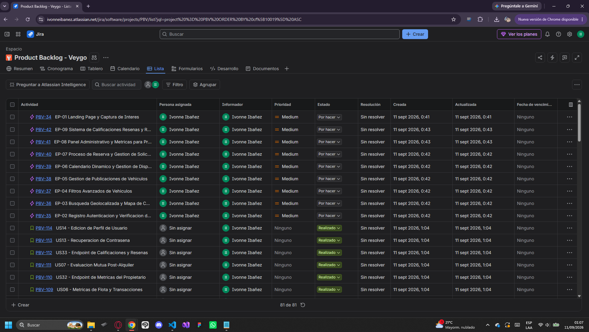

# Capítulo III: Requirements Specification

---

## 3.1 User Stories

En esta sección se definen las Historias de Usuario (User Stories) y las Historias Técnicas (Technical Stories) de Veygo, estructuradas a partir de los Épicos identificados. Se consideran tres tipos de rol para la redacción: **Cliente** y **Propietario** (usuarios autenticados de la plataforma), **Visitante** (rol base para las historias del sitio web estático o Landing Page) y **Developer** (rol utilizado en las Historias Técnicas orientadas al API RESTful). Cada historia sigue el formato estándar (Como [Rol] Quiero [Acción] Para [Beneficio]), Escenarios y sus Criterios de Aceptación se redactan en tiempo presente, tercera persona, sin referencias a interfaz de usuario, siguiendo la estructura Gherkin (Given–When–Then / Dado que–Cuando–Entonces).

**Epics**

Las Epics representan agrupaciones de alto nivel que organizan las funcionalidades principales de Veygo. Cada épica reúne un conjunto de historias de usuario relacionadas, permitiendo estructurar el sistema en bloques funcionales y facilitar la planificación del desarrollo de manera clara y escalable. En la gestión ágil, mantener una jerarquía clara donde las Épicas grandes se desglosan en Historias de Usuario específicas es fundamental para organizar el flujo de trabajo del equipo de desarrollo.

| Epic ID | Title | Description | Acceptance Criteria | Related to (Epic ID) |
| :--- | :--- | :--- | :--- | :--- |
| **EP-01** | Landing Page y Captura de Interés | **Como visitante**, **quiero** conocer la propuesta de valor de Veygo y explorar sus categorías de vehículos, **para** decidir si registrarme como cliente o como propietario. | No aplicable | No aplicable |
| **EP-02** | Registro, Autenticación y Verificación de Identidad | **Como usuario**, **quiero** registrarme, iniciar sesión y verificar mi identidad, **para** acceder a la plataforma de forma segura y generar confianza en mis transacciones. | No aplicable | No aplicable |
| **EP-03** | Búsqueda Geolocalizada y Mapa de Cercanía | **Como cliente**, **quiero** visualizar los vehículos disponibles cercanos a mi ubicación, **para** elegir el punto de entrega más conveniente. | No aplicable | No aplicable |
| **EP-04** | Filtros Avanzados de Vehículos | **Como cliente**, **quiero** filtrar los vehículos por tipo, transmisión, motorización y precio, **para** encontrar rápidamente opciones que se ajusten a mis necesidades. | No aplicable | No aplicable |
| **EP-05** | Gestión de Publicaciones de Vehículos | **Como propietario**, **quiero** registrar, editar y administrar mis vehículos publicados, **para** mantener actualizada mi oferta de alquiler. | No aplicable | No aplicable |
| **EP-06** | Calendario Dinámico y Gestión de Disponibilidad | **Como propietario**, **quiero** gestionar la disponibilidad de mis vehículos en tiempo real, **para** evitar solapamientos y conflictos entre reservas. | No aplicable | No aplicable |
| **EP-07** | Proceso de Reserva y Gestión de Solicitudes | **Como cliente**, **quiero** solicitar y confirmar el alquiler de un vehículo directamente en la plataforma, **para** evitar la coordinación por canales informales. | No aplicable | No aplicable |
| **EP-08** | Panel Administrativo y Métricas para Propietarios | **Como propietario**, **quiero** visualizar métricas de mis vehículos activos, reservas e ingresos, **para** monitorear el desempeño de mi actividad de alquiler. | No aplicable | No aplicable |
| **EP-09** | Sistema de Calificaciones, Reseñas y Reputación | **Como cliente** o propietario, **quiero** calificar y leer reseñas de otros usuarios, **para** tomar decisiones de alquiler con mayor confianza. | No aplicable | No aplicable |

_(Tabla 1. Epics del proyecto - Elaboración propia)_

Las Historias de Usuario describen de manera detallada las funcionalidades del sistema desde la perspectiva de los distintos actores de Veygo. Cada historia especifica el objetivo del usuario, sus criterios de aceptación y escenarios de uso, lo que permite validar el comportamiento esperado del sistema. Esto facilita una comprensión clara de los requerimientos y guía el desarrollo incremental del producto  dado.

| Orden | Story ID | Tipo | Título / Ítem | Dependencia | Esfuerzo (SP) | Sprint | EpicID |
| :-: | :---: | :---: | :--- | :---: | :-: | :-: | :---: |
| **1** | **TS-01** | Technical Story | Configuración de Auth Server y JWT (OAuth2) | Ninguna | 5 | Sprint 1 | EP-01 |
| **2** | **US-01** | User Story | Registro de usuario | TS-01 | 3 | Sprint 1 | EP-01 |
| **3** | **US-02** | User Story | Inicio de sesión | TS-01 | 2 | Sprint 1 | EP-01 |
| **4** | **US-03** | User Story | Recuperación de contraseña | TS-01 | 3 | Sprint 1 | EP-01 |
| **5** | **US-04** | User Story | Cierre de sesión seguro | TS-01 | 1 | Sprint 1 | EP-01 |
| **6** | **TS-05** | Technical Story | Integración con Bucket S3 y Cifrado AES-256 | TS-01 | 5 | Sprint 1 | EP-01 |
| **7** | **US-05** | User Story | Verificación documental (DNI / Brevete) | TS-05 | 5 | Sprint 1 | EP-01 |
| **8** | **US-06** | User Story | Ver perfil de usuario | TS-01 | 2 | Sprint 1 | EP-02 |
| **9** | **US-07** | User Story | Editar perfil de usuario | US-06 | 2 | Sprint 1 | EP-02 |
| **10** | **TS-08** | Technical Story | Configuración de BD Relacional con PostGIS | Ninguna | 5 | Sprint 2 | EP-02 |
| **11** | **TS-09** | Technical Story | API de Geolocalización de Alta Velocidad (`ST_DWithin`) | TS-08 | 5 | Sprint 2 | EP-02 |
| **12** | **US-08** | User Story | Búsqueda de vehículos en mapa de cercanía | TS-09 | 8 | Sprint 2 | EP-02 |
| **13** | **TS-10** | Technical Story | Indexación Multi-Criterio en Catálogo | TS-08 | 3 | Sprint 2 | EP-03 |
| **14** | **US-09** | User Story | Filtro por tipo de transmisión y motorización | TS-10 | 3 | Sprint 2 | EP-03 |
| **15** | **US-10** | User Story | Búsqueda por marca y modelo | TS-10 | 2 | Sprint 2 | EP-03 |
| **16** | **US-11** | User Story | Ver detalle del vehículo | TS-08 | 3 | Sprint 2 | EP-03 |
| **17** | **TS-12** | Technical Story | Bloqueo de Concurrencia (*Pessimistic Locking*) | TS-08 | 8 | Sprint 3 | EP-04 |
| **18** | **US-12** | User Story | Selección de fechas en calendario dinámico | TS-12 | 3 | Sprint 3 | EP-04 |
| **19** | **US-13** | User Story | Bloqueo automático de calendario para propietarios | TS-12 | 5 | Sprint 3 | EP-04 |
| **20** | **TS-14** | Technical Story | Notificaciones en Tiempo Real con WebSockets/SSE | TS-12 | 5 | Sprint 3 | EP-04 |
| **21** | **US-15** | User Story | Solicitud de reserva de vehículo | TS-12 | 5 | Sprint 3 | EP-05 |
| **22** | **US-16** | User Story | Aprobación o rechazo de solicitud (Propietario) | US-15 | 3 | Sprint 3 | EP-05 |
| **23** | **TS-17** | Technical Story | Integración con Pasarela de Pagos (Escrow / Culqi) | US-16 | 8 | Sprint 3 | EP-05 |
| **24** | **US-18** | User Story | Confirmación de entrega y recojo del vehículo (QR) | TS-17 | 5 | Sprint 3 | EP-05 |
| **25** | **US-19** | User Story | Historial de alquileres (Cliente) | TS-01 | 3 | Sprint 4 | EP-06 |
| **26** | **US-20** | User Story | Detalle de alquiler histórico | US-19 | 2 | Sprint 4 | EP-06 |
| **27** | **TS-21** | Technical Story | Generación Asíncrona de Comprobantes PDF | US-20 | 5 | Sprint 4 | EP-06 |
| **28** | **US-22** | User Story | Descarga de contrato de alquiler en PDF | TS-21 | 3 | Sprint 4 | EP-06 |
| **29** | **TS-23** | Technical Story | Pipeline de Agregación de KPIs de Negocio | TS-08 | 5 | Sprint 4 | EP-07 |
| **30** | **US-24** | User Story | Dashboard de métricas para propietarios | TS-23 | 5 | Sprint 4 | EP-07 |
| **31** | **US-25** | User Story | Registro y gestión de publicaciones de vehículos | TS-08 | 5 | Sprint 4 | EP-07 |
| **32** | **US-26** | User Story | Gestión de flota (Editar/Pausar vehículo) | US-25 | 3 | Sprint 4 | EP-07 |
| **33** | **US-27** | User Story | Sistema de calificaciones y reseñas bidireccional | US-19 | 5 | Sprint 4 | EP-08 |
| **34** | **US-28** | User Story | Ver reseñas de un vehículo o usuario | US-27 | 2 | Sprint 4 | EP-08 |
| **35** | **TS-29** | Technical Story | Moderación Automatizada de Reseñas por IA | US-27 | 5 | Sprint 4 | EP-08 |
| **36** | **TS-30** | Technical Story | Exportación de Reportes de Ventas en Excel / CSV | TS-23 | 3 | Sprint 4 | EP-07 |

_(Tabla 2. User Stories del proyecto - Elaboración propia)_

---

## 3.2. Impact Mapping 

En esta sección se expone el Impact Mapping del proyecto, una tecnica que conecta los objetivos de negocio con las funcionalidades a desarrollar. El proceso inicio con la definición de los Business Goals bajo criterios SMART, seguido de la identificación de los Actores (User Personas) que influyen en su cumplimiento. Para cada actor se establecieron los Impacts esperados en su comportamiento y, a partir de ellos, se listaron los Deliverables que podrían generarlos. Finalmente, cada deliverable se vinculó con User Stories concretas que lo hacen tangible.

_Figura 1. Impact Mapping-Elaboración propia. Nota:BG1 y BG2 son especificos, medibles, alcanzables para una etapa de validación en Lima y relevante. Definidos en plazo de 6 meses._

_Figura 2. Impact Mapping-Elaboración propia. Nota: BG3 mide la adopción real de la plataforma, coherente con Hypotehsis Statement 5._

_Figura 3. Impact Mapping-Elaboración propia. Nota: BG4 ataca el problema identificado en las 5w's y 2 h's, medible como tasa porcentual con plazo definido._

---

## 3.3. Product Backlog

_Figura 4. Product Backlog - Elaboración propia. Nota: Esta figura muestra la tabla lista realizada por el grupo para ordenar el product backlog del proyecto en Jira_

**Link:** https://ivonneibanez.atlassian.net/jira/software/projects/PBV/list?jql=project%20%3D%20PBV%20ORDER%20BY%20cf%5B10019%5D%20ASC

| # Orden | User Story Id | Título | Descripción | Story Points |
| :--- | :--- | :--- | :--- | :--- |
| 1 | US09 | Buscador Rápido de Vehículos | Como visitante, deseo ingresar ubicación, fechas y categoría, para iniciar de inmediato la búsqueda de vehículos. | 3 |
| 2 | US11 | Visualización de Vehículos Destacados | Como visitante, deseo conocer vehículos destacados con su información principal, para evaluar opciones atractivas. | 2 |
| 3 | US10 | Exploración por Categorías de Propósito | Como visitante, deseo conocer categorías de uso, para filtrar el catálogo según el tipo de experiencia que busco. | 2 |
| 4 | US08 | Navegación Principal y Selector de Idioma | Como visitante, deseo navegar entre secciones y cambiar el idioma, para orientarme y consultar la información en mi idioma. | 3 |
| 5 | US12 | Redirección a Registro según Rol | Como visitante, deseo acceder al registro correspondiente a mi intención, para iniciar el proceso adecuado directamente. | 2 |
| 6 | US22 | Sección de Confianza y Seguridad | Como visitante, deseo conocer las medidas de seguridad de la plataforma, para decidir con confianza si registrarme. | 1 |
| 7 | US23 | Sección de Preguntas Frecuentes | Como visitante, deseo consultar preguntas frecuentes, para resolver dudas antes de registrarme. | 1 |
| 8 | US24 | Suscripción a Novedades | Como visitante, deseo registrar mi correo para recibir novedades, para mantenerme informado antes de registrarme. | 2 |
| 9 | US34 | Endpoint de Contenido Optimizado para Landing Page | Como developer, deseo exponer un endpoint con soporte de cache HTTP para el contenido de la landing, para reducir la cantidad de datos transferidos por petición. | 3 |
| 10 | US35 | Endpoint de Recursos de Internacionalización (i18n) | Como developer, deseo exponer un endpoint que retorne textos traducidos según el idioma solicitado, para soportar el cambio de idioma en el cliente. | 3 |
| 11 | US36 | Endpoint de Registro de Eventos de Conversión | Como developer, deseo exponer un endpoint que reciba eventos de interacción, para alimentar la analítica de conversión de la landing. | 2 |
| 12 | US02 | Inicio de Sesión Seguro | Como usuario registrado, deseo iniciar sesión con mis credenciales, para acceder de forma segura a mi perfil y reservas. | 3 |
| 13 | US25 | Endpoint de Registro y Autenticación | Como developer, deseo exponer endpoints de registro, login y renovación de sesión, para que los clientes gestionen la autenticación de forma segura. | 5 |
| 14 | US01 | Verificación de Identidad de Usuarios | Como usuario registrado, deseo subir mi DNI y Brevete, para validar mi identidad antes de realizar transacciones. | 5 |
| 15 | US26 | Endpoint de Verificación de Identidad | Como developer, deseo exponer un endpoint que reciba documentos y actualice el estado de verificación, para automatizar la validación documental. | 5 |
| 16 | US15 | Publicación de Nuevo Vehículo | Como propietario, deseo registrar un vehículo con sus características y tarifa, para ofrecerlo en alquiler. | 5 |
| 17 | US29 | Endpoints CRUD de Publicación de Vehículos | Como developer, deseo exponer endpoints CRUD para vehículos, para soportar la gestión de flota de los propietarios. | 8 |
| 18 | US16 | Edición o Retiro de Publicación | Como propietario, deseo editar o retirar un vehículo publicado, para mantener actualizada mi oferta. | 3 |
| 19 | US03 | Búsqueda de Vehículos Cercanos | Como cliente, deseo ubicar vehículos disponibles cerca de mi posición, para elegir el punto de entrega más conveniente. | 5 |
| 20 | US27 | Endpoint de Búsqueda Geolocalizada | Como developer, deseo exponer un endpoint que retorne vehículos por coordenadas y radio, para soportar la búsqueda por cercanía. | 5 |
| 21 | US04 | Filtrado por Transmisión y Energía | Como cliente, deseo filtrar vehículos por transmisión y motorización, para encontrar opciones acordes a mis necesidades. | 3 |
| 22 | US28 | Endpoint de Filtros de Catálogo | Como developer, deseo exponer un endpoint que combine parámetros de filtro, para acotar resultados a las preferencias del cliente. | 3 |
| 23 | US05 | Sincronización Automática de Disponibilidad | Como propietario, deseo que el calendario bloquee fechas confirmadas, para evitar cruces de reservas. | 5 |
| 24 | US30 | Endpoint de Calendario de Disponibilidad | Como developer, deseo exponer un endpoint que retorne y actualice el calendario de un vehículo, para evitar solapamiento de reservas. | 5 |
| 25 | US17 | Solicitud de Reserva | Como cliente, deseo enviar una solicitud de alquiler, para iniciar el proceso sin canales informales. | 5 |
| 26 | US31 | Endpoints de Solicitud y Confirmación de Reserva | Como developer, deseo exponer endpoints para crear y actualizar el estado de una reserva, para soportar el flujo completo entre cliente y propietario. | 8 |
| 27 | US18 | Confirmación o Rechazo de Solicitud | Como propietario, deseo aceptar o rechazar solicitudes recibidas, para controlar el acceso a mi vehículo. | 3 |
| 28 | US19 | Cancelación de Reserva | Como cliente o propietario, deseo cancelar una reserva confirmada, para liberar el vehículo ante cambios de planes. | 3 |
| 29 | US20 | Historial de Reservas | Como cliente o propietario, deseo consultar mi historial de reservas, para dar seguimiento a mi actividad. | 2 |
| 30 | US21 | Notificaciones de Actividad | Como usuario registrado, deseo recibir notificaciones de cambios en mis solicitudes y reservas, para estar informado. | 3 |
| 31 | US06 | Métricas de Flota y Transacciones | Como propietario, deseo visualizar el resumen de mis vehículos y transacciones, para monitorear mi desempeño. | 3 |
| 32 | US32 | Endpoint de Métricas del Propietario | Como developer, deseo exponer un endpoint que agregue métricas de vehículos, reservas e ingresos, para alimentar el panel administrativo. | 5 |
| 33 | US07 | Evaluación Mutua Post-Alquiler | Como cliente o propietario, deseo calificar y reseñar tras un alquiler, para fomentar transparencia y reputación. | 3 |
| 34 | US33 | Endpoint de Calificaciones y Reseñas | Como developer, deseo exponer un endpoint para registrar y consultar calificaciones, para soportar el sistema de reputación. | 5 |
| 35 | US13 | Recuperación de Contraseña | Como usuario registrado, deseo restablecer mi contraseña vía correo, para recuperar el acceso si la olvido. | 2 |
| 36 | US14 | Edición de Perfil de Usuario | Como usuario registrado, deseo actualizar mis datos personales, para mantener mi información vigente. | 2 |

_Tabla 3. Product Backlog-Veygo. Nota: Se prioriza según el orden de implementación_
