## Capítulo IV: Product Design

### 4.1. Style Guidelines

#### 4.1.1. General Style Guidelines


### Branding

Veygo busca transmitir **confianza, seguridad, cercanía y modernidad**, utilizando la tecnología para facilitar el alquiler de vehículos. Su identidad visual se basa en el uso del **azul, blanco y tonos claros**, junto con una tipografía moderna e íconos simples relacionados con movilidad y seguridad.

La identidad de marca se fundamenta en:

- **Misión:** Facilitar un alquiler de vehículos seguro y confiable para propietarios y clientes.
- **Visión:** Ser la plataforma de alquiler de vehículos más confiable y segura del Perú, conectando a propietarios y clientes de manera sencilla y transparente.

#### Logo

Buscamos transmitir una imagen **moderna y actual** mediante un diseño minimalista y un logotipo en **tonos azules** que refuerza la identidad tecnológica de Veygo.

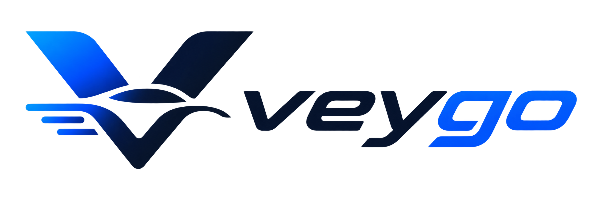

#### Typography

Se ha seleccionado **Geist** como tipografía principal de la aplicación, debido a su estilo moderno y buena legibilidad. Su diseño permite ofrecer una experiencia visual clara y cómoda para los usuarios.

El tamaño de la fuente se adapta según el dispositivo, garantizando una correcta visualización tanto en **móviles como en computadoras**.

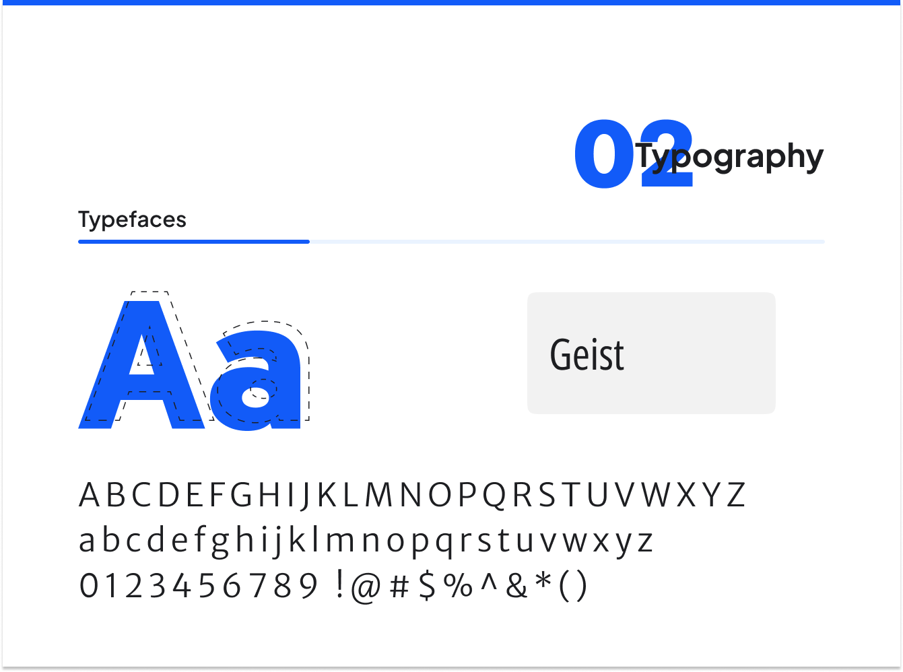

#### Colors

La paleta de colores está compuesta por **seis tonos principales**, seleccionados para transmitir una apariencia **moderna, profesional y limpia** en las diferentes secciones de la aplicación.

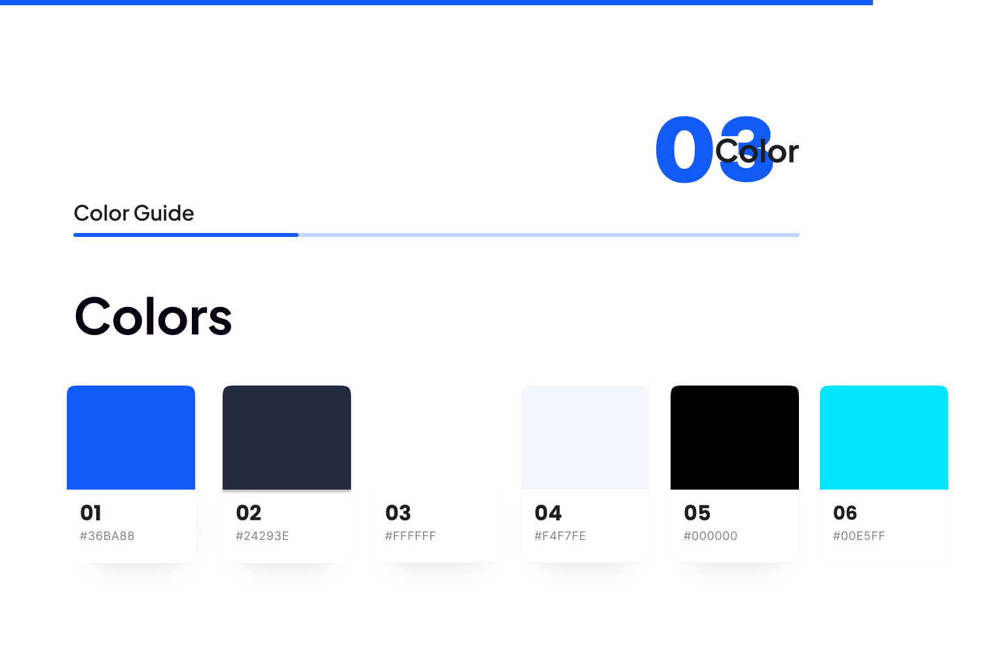<btn>

**Color Primario:**

- **Azul (#2563EB):** Es el color principal de Veygo y se utiliza en el logotipo, botones, títulos destacados e íconos. Representa confianza, seguridad y tecnología.

**Colores Secundarios:**

- **Azul oscuro (#172554):** Utilizado en títulos y elementos de mayor jerarquía para generar contraste y reforzar la identidad profesional de la marca.
- **Blanco (#FFFFFF):** Empleado como color principal de fondo para mantener una interfaz limpia, clara y fácil de visualizar.
- **Azul muy claro (#F4F7FE):** Utilizado en fondos de secciones y tarjetas para generar separación visual y mantener una apariencia ligera.
- **Negro (#000000):** Utilizado principalmente en textos y elementos que requieren mayor contraste y legibilidad.
- **Verde (#22C55E):** Empleado en elementos relacionados con seguridad, disponibilidad o confirmación, permitiendo destacar información positiva dentro de la interfaz.

### Texto

Los títulos principales utilizan un tono azul como color destacado para reforzar la identidad de Veygo, mientras que los textos de contenido emplean tonos oscuros para facilitar la lectura. La tipografía principal es *Geist*, debido a su estilo moderno y buena legibilidad.

### Botones

Los botones utilizan principalmente el azul de Veygo para destacar las acciones importantes dentro de la Landing Page.

- **Botones principales (CTA):**
  - Fondo: Azul (#2563EB)
  - Texto: Blanco (#FFFFFF)
  - Hover: Se utiliza un tono azul ligeramente más oscuro para indicar la interacción.
  
- **Botones secundarios:**
  - Fondo: Blanco (#FFFFFF)
  - Borde: Azul
  - Texto: Azul
  - Hover: Se aplica el color azul como fondo y blanco en el texto.

### Formularios

Los campos de búsqueda utilizan un diseño limpio y sencillo, con fondos claros y bordes suaves para mantener la estética minimalista de Veygo. Los textos de los campos utilizan tonos grises para diferenciar etiquetas, información de ayuda y datos ingresados.

- **Campos:** Fondo blanco y borde gris claro.
- **Placeholder:** Gris claro.
- **Etiquetas:** Gris oscuro.
- **Iconos:** Azul o gris según su función.
- **Botón de búsqueda:** Azul con texto blanco.

### Íconos y Sistema Visual

- Los íconos utilizan un estilo simple y moderno, principalmente en tonos azules y grises, manteniendo una apariencia uniforme en toda la interfaz.
- Se emplean íconos relacionados con movilidad, búsqueda, seguridad y reservas para facilitar la comprensión de las diferentes funcionalidades.

### Estados de Hover y Feedback

Los elementos interactivos presentan cambios visuales sutiles para indicar al usuario que una acción está disponible o ha sido seleccionada.

- **Botones principales:** El azul se intensifica ligeramente al pasar el cursor.
- **Botones secundarios:** Se puede aplicar un cambio de fondo o borde para indicar la interacción.
- Se utilizan transiciones suaves para mantener una experiencia fluida sin distraer al usuario.

### Accesibilidad

La interfaz utiliza colores con suficiente contraste para facilitar la lectura y comprensión del contenido.

- Los textos oscuros se utilizan principalmente sobre fondos blancos o claros.
- Los botones azules utilizan texto blanco para mantener una adecuada visibilidad.
- Los elementos importantes se diferencian mediante color, tamaño y posición.

### Espaciado y Distribución

El diseño mantiene una distribución ordenada y consistente, utilizando espacios amplios entre secciones, tarjetas y elementos de contenido.

- **Espaciado base:** 8px.
- **Padding de tarjetas:** 24px.
- **Altura de botones:** 40px–48px.
- **Separación entre elementos:** 16px–32px.
- **Bordes:** Redondeados para mantener una apariencia moderna y amigable.

#### 4.1.2. Web Style Guidelines

- **Responsive Design:** La interfaz de Veygo debe adaptarse correctamente a computadoras, tablets y dispositivos móviles, manteniendo una navegación clara y accesible.

- **Consistencia Visual:** Se mantienen los colores, tipografía Geist, estilos de botones, tarjetas e íconos definidos en las guías generales para conservar una identidad visual uniforme.

- **Accesibilidad:** Los colores y tamaños de texto se seleccionan buscando un contraste adecuado y una lectura clara para los usuarios.

- **Estados de Interacción:** Los botones, enlaces e íconos presentan cambios visuales al interactuar con ellos, permitiendo identificar fácilmente los elementos activos.

- **Navegación e Interactividad:** La navegación se mantiene sencilla e intuitiva, facilitando el acceso a las principales secciones y funcionalidades de Veygo.

- **Uso Consistente de Componentes:** Se reutilizan componentes como botones, tarjetas, campos de búsqueda y elementos de navegación para mantener una experiencia uniforme en toda la plataforma.

### 4.2. Information Architecture

#### 4.2.1. Organization Systems

El sistema de organización de **Veygo** busca ofrecer una navegación sencilla y ordenada, permitiendo que los usuarios encuentren rápidamente las funciones relacionadas con el alquiler y la publicación de vehículos. La plataforma está organizada considerando sus dos principales tipos de usuarios: **clientes** y **propietarios**.

Los clientes tienen acceso a funciones orientadas a la búsqueda y alquiler de vehículos, mientras que los propietarios cuentan con herramientas para publicar sus vehículos, administrar su disponibilidad y gestionar las reservas recibidas.

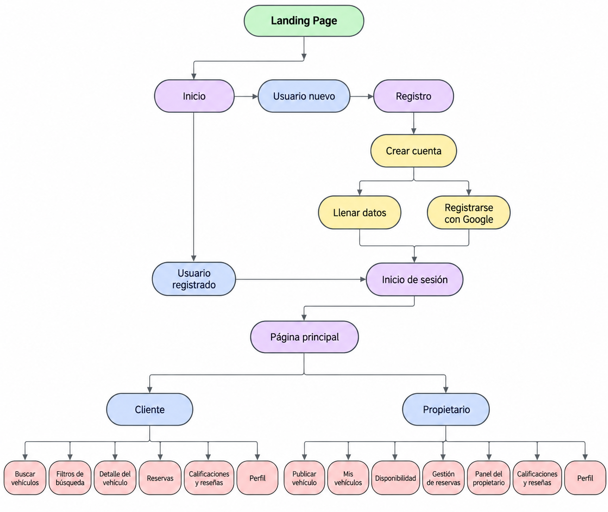<btn>

El flujo general de la plataforma se organiza de la siguiente manera:

1. **Landing Page:** Presenta Veygo, sus principales beneficios, vehículos disponibles y opciones para registrarse o iniciar sesión.

2. **Registro e Inicio de Sesión:** Permite crear una cuenta o acceder a la plataforma mediante credenciales registradas.

3. **Página Principal:** Punto de acceso a las principales funcionalidades de Veygo según el tipo de usuario.

4. **Búsqueda de Vehículos:** Permite buscar vehículos mediante ubicación, fechas de alquiler y diferentes filtros.

5. **Detalle del Vehículo:** Muestra información del vehículo, características, disponibilidad y datos necesarios antes de realizar una reserva.

6. **Reservas:** Permite al cliente solicitar un vehículo y consultar el estado de sus reservas.

7. **Publicación de Vehículos:** Permite a los propietarios registrar y ofrecer sus automóviles o motocicletas dentro de la plataforma.

8. **Gestión de Disponibilidad:** Permite al propietario administrar mediante un calendario las fechas disponibles de sus vehículos.

9. **Panel del Propietario:** Presenta información relacionada con vehículos activos, reservas y transacciones realizadas.

10. **Calificaciones y Reseñas:** Permite a clientes y propietarios compartir su experiencia después de completar un alquiler.

11. **Perfil:** Permite gestionar la información de la cuenta y los datos relacionados con la verificación del usuario.

#### 4.2.2. Labeling Systems

El sistema de etiquetado de Veygo utiliza nombres simples y directos para facilitar la identificación de cada sección. Los términos empleados mantienen una relación clara con las funciones de la plataforma y permiten una navegación intuitiva para clientes y propietarios.

##### Secciones y contenido de la Landing Page

| **Sección** | **Contenido** |
|-------------|---------------|
| **Inicio** | Presenta Veygo y sus principales beneficios, permitiendo acceder rápidamente a las funciones de la plataforma. |
| **Cómo funciona** | Explica de manera sencilla los pasos para buscar, reservar y alquilar un vehículo. |
| **Vehículos** | Muestra los vehículos disponibles y permite conocer sus principales características. |
| **Confianza** | Presenta las medidas de seguridad, verificación de identidad y mecanismos de reputación de Veygo. |
| **Testimonios** | Muestra las experiencias y opiniones de usuarios de la plataforma. |
| **Iniciar Sesión** | Permite acceder a una cuenta existente. |
| **Registrarme** | Permite crear una nueva cuenta en Veygo. |

##### Secciones y contenido de Veygo

| **Sección** | **Contenido** |
|-------------|---------------|
| **Página Principal** | Punto de acceso a las principales funciones de la plataforma según el tipo de usuario. |
| **Buscar Vehículos** | Permite encontrar vehículos disponibles según ubicación, fechas y preferencias. |
| **Detalle del Vehículo** | Muestra información, características, precio y disponibilidad del vehículo seleccionado. |
| **Reservas** | Permite gestionar las solicitudes y reservas realizadas dentro de la plataforma. |
| **Mis Vehículos** | Permite a los propietarios visualizar y administrar los vehículos que tienen publicados. |
| **Disponibilidad** | Permite gestionar las fechas disponibles de los vehículos mediante un calendario. |
| **Panel del Propietario** | Presenta información sobre vehículos, reservas y transacciones para facilitar la gestión. |
| **Calificaciones y Reseñas** | Permite consultar y realizar valoraciones sobre las experiencias de alquiler. |
| **Perfil** | Permite consultar y administrar la información de la cuenta del usuario. |

#### 4.2.3. SEO Tags and Meta Tags

La **Landing Page** de Veygo busca atraer nuevos usuarios, generar confianza y mejorar su posicionamiento en búsquedas relacionadas con el alquiler de vehículos. Las etiquetas SEO y meta describen la plataforma y sus principales servicios, facilitando que los usuarios encuentren Veygo mediante términos relacionados con alquiler de autos, motos y movilidad.

**Título de la página (Title)**

```html
<title>Veygo – Alquiler de vehículos seguro y confiable</title>

<meta name="description" content="Veygo conecta a propietarios y clientes para alquilar vehículos de forma segura, rápida y confiable en Lima. Encuentra autos y motos disponibles según tus necesidades.">

<meta name="keywords" content="Veygo, alquiler de vehículos, alquiler de autos, alquiler de motos, rentar auto, vehículos en Lima, alquiler seguro, movilidad en Lima">

<meta name="author" content="Equipo Veygo">

```

#### 4.2.4. Searching Systems

Para facilitar la búsqueda de vehículos, **Veygo** incorpora un sistema de búsqueda sencillo que permite a los usuarios encontrar opciones según sus necesidades y preferencias.

- **Búsqueda por ubicación**: Permite encontrar vehículos disponibles en una ciudad o zona determinada.
- **Búsqueda por fechas**: Permite seleccionar la fecha de inicio y devolución para mostrar vehículos disponibles durante el periodo elegido.
- **Filtros de búsqueda**: Permite filtrar los vehículos según características como tipo de vehículo, transmisión, tipo de energía, precio y disponibilidad.
- **Búsqueda por categorías**: Permite explorar vehículos según diferentes necesidades, como trabajo diario, viajes familiares, carga, aventura o vehículos eléctricos.
- **Resultados de búsqueda**: Muestra los vehículos que coinciden con los criterios seleccionados, facilitando la comparación de sus características y precios.

Este sistema permite reducir el tiempo de búsqueda y ayuda a los usuarios a encontrar un vehículo que se adapte mejor a sus necesidades.

#### 4.2.5. Navigation Systems

La navegación en **Veygo** está diseñada para que los usuarios puedan desplazarse de manera sencilla entre las principales secciones de la plataforma. Se utiliza una barra de navegación principal, accesos directos y una estructura organizada según las funciones disponibles para clientes y propietarios.

##### **Estructura de Navegación en la Landing Page**

| **Sección** | **Descripción** |
|-------------|-----------------|
| **Inicio** | Presenta Veygo y su propuesta de valor, destacando sus principales beneficios. |
| **Cómo funciona** | Explica los pasos necesarios para buscar y alquilar un vehículo. |
| **Vehículos** | Permite explorar los vehículos disponibles y conocer sus características. |
| **Confianza** | Presenta las medidas de seguridad, verificación y reputación de la plataforma. |
| **Testimonios** | Muestra las experiencias de usuarios que han utilizado Veygo. |
| **Iniciar Sesión** | Permite acceder a una cuenta existente. |
| **Registrarme** | Permite crear una nueva cuenta en la plataforma. |

##### **Estructura de Navegación en Veygo**

| **Sección** | **Descripción** |
|-------------|-----------------|
| **Página Principal** | Punto de acceso a las principales funcionalidades según el tipo de usuario. |
| **Buscar Vehículos** | Permite encontrar vehículos mediante ubicación, fechas y filtros. |
| **Detalle del Vehículo** | Presenta las características, precio y disponibilidad del vehículo seleccionado. |
| **Reservas** | Permite consultar y gestionar las reservas realizadas. |
| **Mis Vehículos** | Permite a los propietarios administrar los vehículos publicados. |
| **Disponibilidad** | Permite gestionar las fechas disponibles de cada vehículo. |
| **Panel del Propietario** | Muestra información sobre vehículos, reservas y transacciones. |
| **Calificaciones y Reseñas** | Permite consultar y registrar valoraciones sobre las experiencias de alquiler. |
| **Perfil** | Permite gestionar la información de la cuenta del usuario. |

---

#### **Accesibilidad y navegación intuitiva**

**Veygo** utiliza una navegación sencilla y organizada, con accesos directos a las funciones principales para reducir el número de pasos necesarios. La estructura y los nombres de las secciones permiten que clientes y propietarios identifiquen fácilmente las opciones disponibles según sus necesidades.

### 4.3. Landing Page UI Design

#### 4.3.1. Landing Page Wireframe

Estos wireframes permiten visualizar de manera detallada la estructura propuesta para la página de aterrizaje. A través de ellos, se pueden identificar sus principales elementos, funcionalidades y la forma en que los usuarios interactuarán y navegarán por el sitio.

 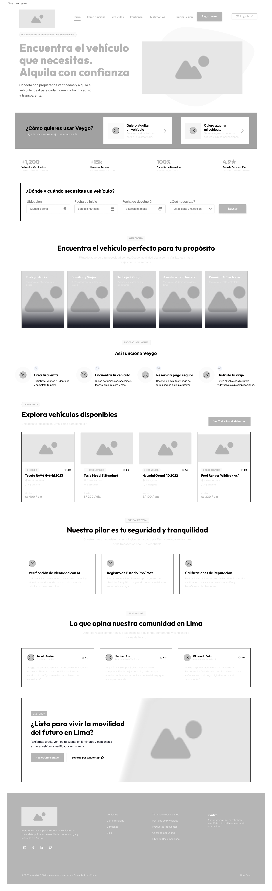

#### 4.3.2. Landing Page Mock-up

Los siguientes mockups representan una visión más cercana a la landing Page de Veygo:

 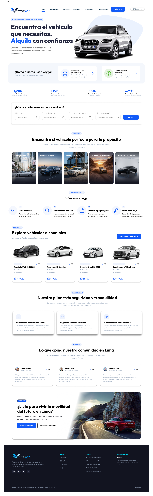

### 4.4. Web Applications UX/UI Design

#### 4.4.1. Web Applications Wireframes

Los wireframes que se presentan a continuación representan la estructura visual y las principales funcionalidades de **Veygo**, una plataforma digital orientada a facilitar el alquiler y la gestión de vehículos, conectando de manera eficiente a arrendatarios y arrendadores. Las interfaces han sido diseñadas buscando proporcionar una experiencia de usuario intuitiva, clara y accesible para ambos tipos de usuarios.

Cada pantalla ha sido planteada para facilitar tareas como la búsqueda y reserva de vehículos, la gestión de publicaciones y disponibilidad, el seguimiento de reservas, la administración de vehículos y la comunicación entre los usuarios. Asimismo, los wireframes permiten visualizar cómo se organiza la información y cómo los usuarios interactuarán con las diferentes funcionalidades de la plataforma.

A través de estas representaciones, se puede comprender la distribución de los elementos en cada sección, las herramientas disponibles y los principales recorridos de navegación dentro de **Veygo**. De esta manera, el diseño busca contribuir a una experiencia de alquiler de vehículos más organizada, sencilla y eficiente para todos los usuarios de la plataforma.


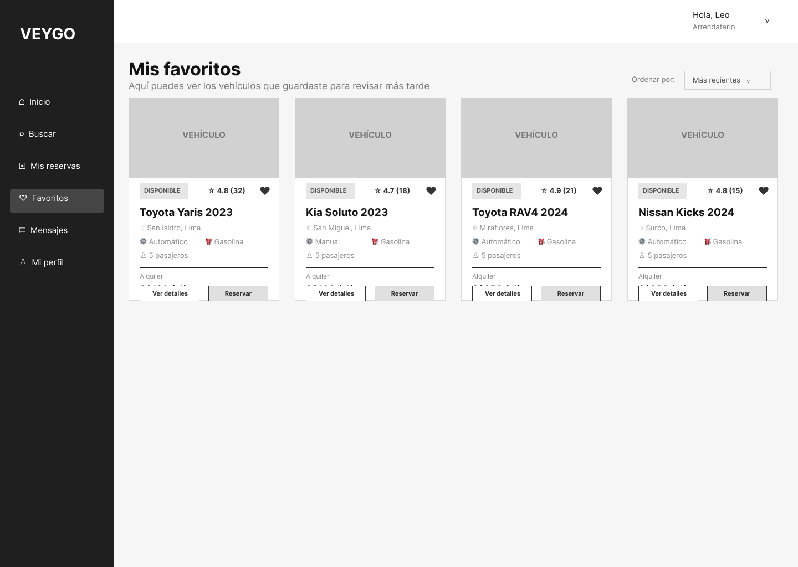

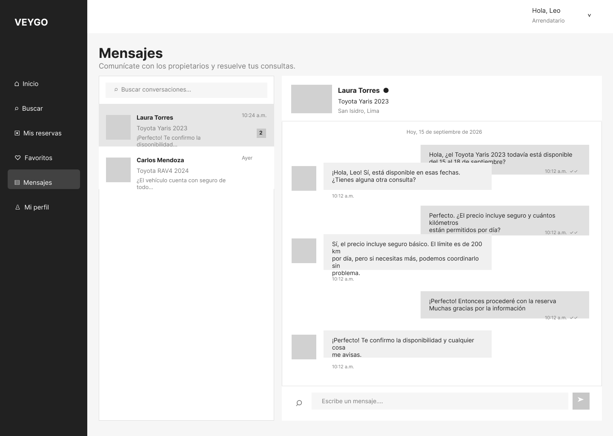


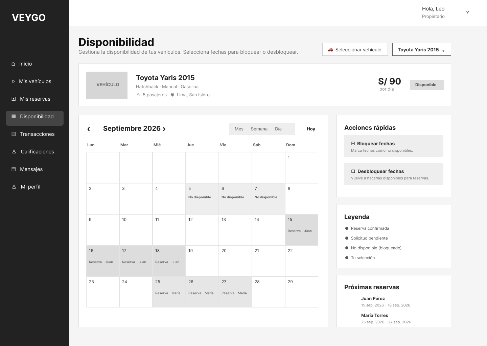


#### 4.4.2. Web Applications Wireflow Diagrams


#### 4.4.2. Web Applications Mock-ups

Los mockups que se presentan a continuación muestran una representación detallada de la apariencia visual final de Veygo, nuestra plataforma digital orientada a facilitar el alquiler de vehículos y conectar de manera eficiente a arrendatarios y arrendadores. Cada interfaz ha sido diseñada cuidadosamente para ofrecer una experiencia moderna, intuitiva y fácil de utilizar, considerando las necesidades específicas de ambos tipos de usuarios.

Estas propuestas visuales reflejan cómo será la experiencia final dentro de la plataforma, mostrando la distribución de los contenidos, los elementos de interacción y las principales funcionalidades disponibles. Asimismo, permiten visualizar de manera más precisa la navegación y el funcionamiento de Veygo, desde la búsqueda y reserva de vehículos por parte de los arrendatarios hasta la publicación, gestión de vehículos y administración de reservas por parte de los arrendadores.

En conjunto, los mockups permiten apreciar la propuesta visual de Veygo y cómo el diseño planteado busca brindar una experiencia de alquiler de vehículos clara, organizada y eficiente para los distintos usuarios de la plataforma.


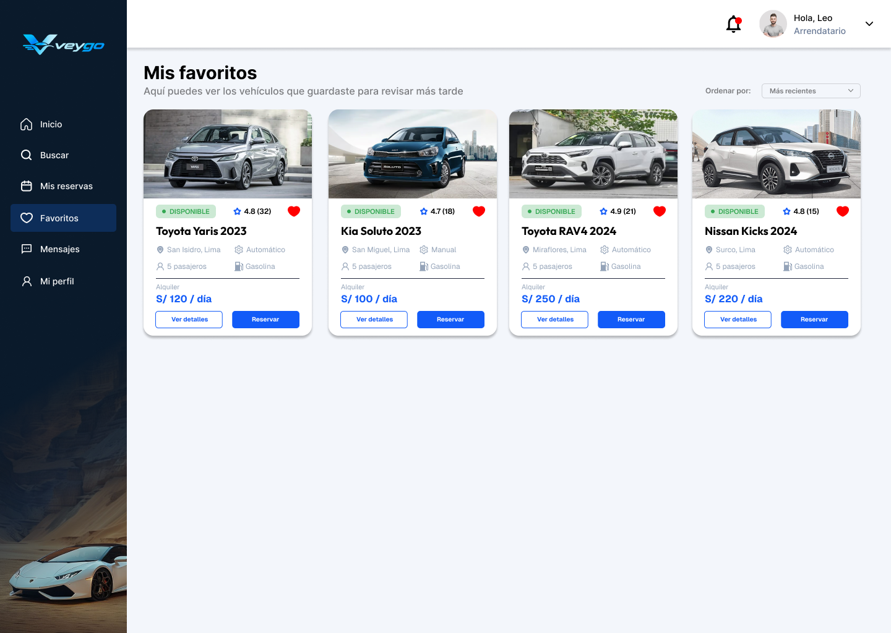

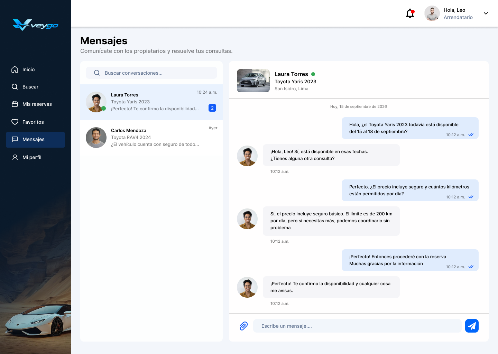


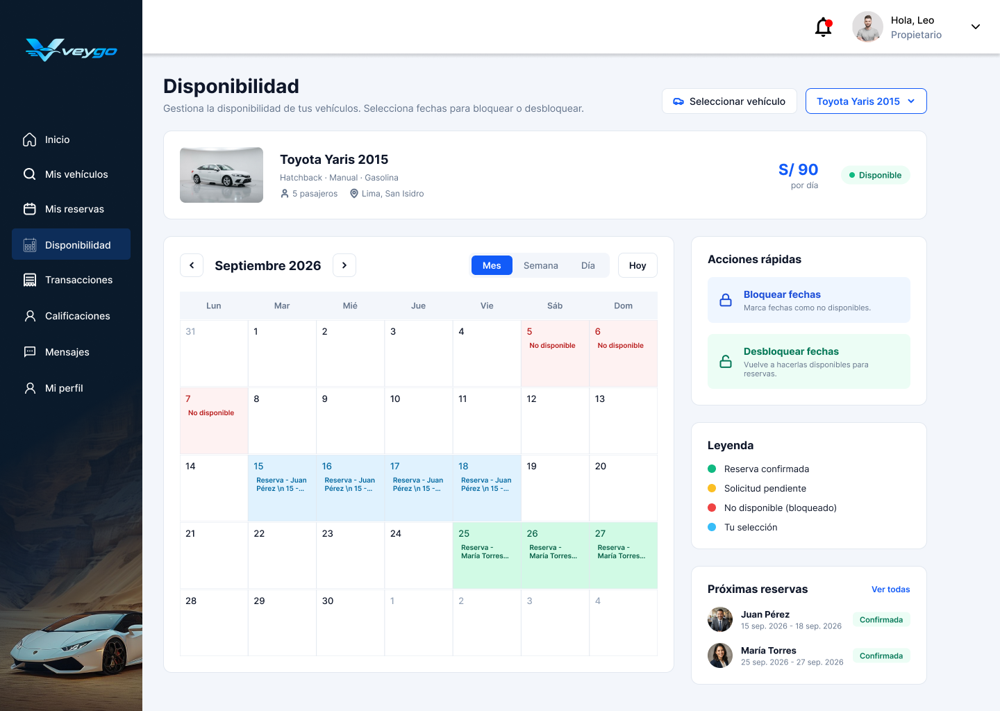

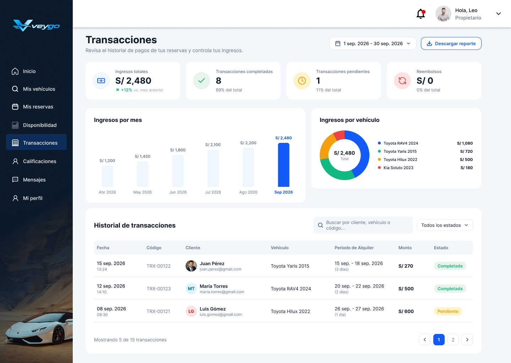

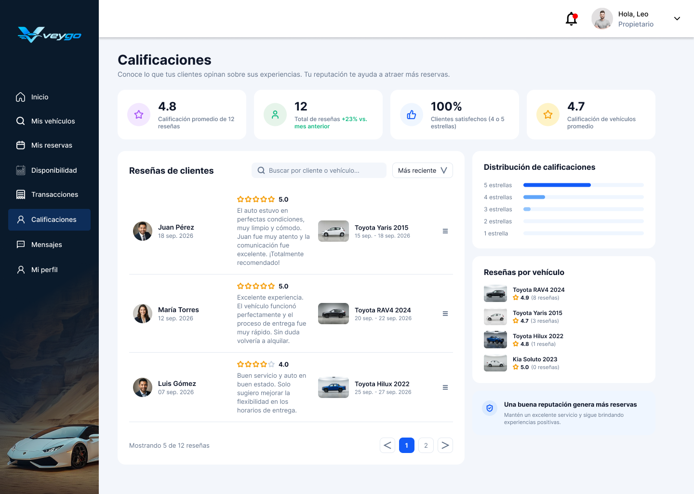


#### 4.4.3. Web Applications User Flow Diagrams

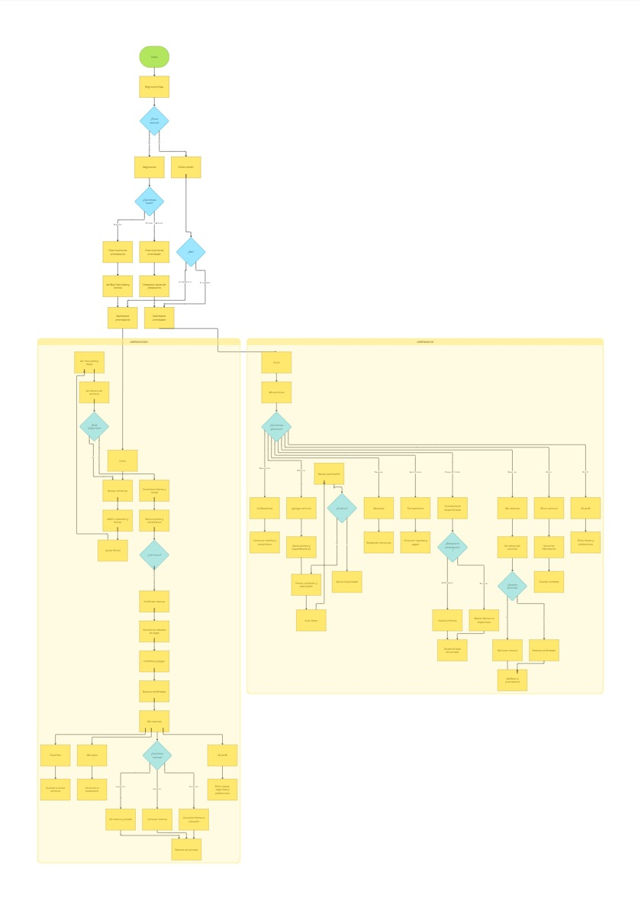

Link: <a href="https://miro.com/welcomeonboard/N1NoQnVob0VXWlViY1NnRHA5K2hWL2FlWko4NXlVaC9IK3Fhek1QOWJ1ZUxZQ05VRi90TTlCbE9NUGhBVXFmUVFPSUhxeUdiVlNGMjEydmZrdG5uaVhRVFVhTG83RFgwTEhTSUN1bWZHR3BDY2V0ZVI3RE5ETXpuaG5tOFhRZnRhWWluRVAxeXRuUUgwWDl3Mk1qRGVRPT0hdjE=?share_link_id=825034209571" style="color: blue;"> https://miro.com/welcomeonboard/N1NoQnVob0VXWlViY1NnRHA5K2hWL2FlWko4NXlVaC9IK3Fhek1QOWJ1ZUxZQ05VRi90TTlCbE9NUGhBVXFmUVFPSUhxeUdiVlNGMjEydmZrdG5uaVhRVFVhTG83RFgwTEhTSUN1bWZHR3BDY2V0ZVI3RE5ETXpuaG5tOFhRZnRhWWluRVAxeXRuUUgwWDl3Mk1qRGVRPT0hdjE=?share_link_id=825034209571 </a>

### 4.5. Web Applications Prototyping

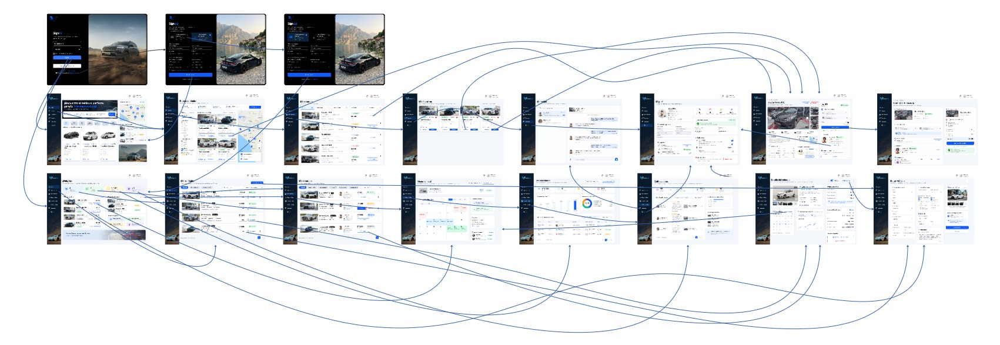

Link: <a href="https://miro.com/welcomeonboard/N1NoQnVob0VXWlViY1NnRHA5K2hWL2FlWko4NXlVaC9IK3Fhek1QOWJ1ZUxZQ05VRi90TTlCbE9NUGhBVXFmUVFPSUhxeUdiVlNGMjEydmZrdG5uaVhRVFVhTG83RFgwTEhTSUN1bWZHR3BDY2V0ZVI3RE5ETXpuaG5tOFhRZnRhWWluRVAxeXRuUUgwWDl3Mk1qRGVRPT0hdjE=?share_link_id=825034209571" style="color: blue;"> https://miro.com/welcomeonboard/N1NoQnVob0VXWlViY1NnRHA5K2hWL2FlWko4NXlVaC9IK3Fhek1QOWJ1ZUxZQ05VRi90TTlCbE9NUGhBVXFmUVFPSUhxeUdiVlNGMjEydmZrdG5uaVhRVFVhTG83RFgwTEhTSUN1bWZHR3BDY2V0ZVI3RE5ETXpuaG5tOFhRZnRhWWluRVAxeXRuUUgwWDl3Mk1qRGVRPT0hdjE=?share_link_id=825034209571 </a>


Link de video: <a href="https://drive.google.com/file/d/1a2MVvUp9paguAafOVfuw7knAl7k0A4na/view?usp=sharing
" style="color: blue;"> https://drive.google.com/file/d/1a2MVvUp9paguAafOVfuw7knAl7k0A4na/view?usp=sharing </a>

### 4.6. Domain-Driven Software Architecture

#### 4.6.1. Software Architecture Context Diagram

A continuación, presentamos el modelo C4 de nuestro software, el cual nos servirá como guía durante el desarrollo, permitiéndonos comprender mejor la arquitectura del sistema y la interacción entre sus diferentes componentes.

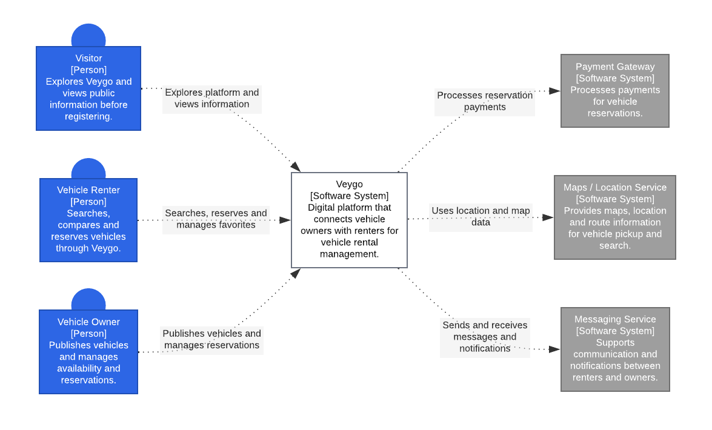

#### 4.6.2. Software Architecture Container Diagrams

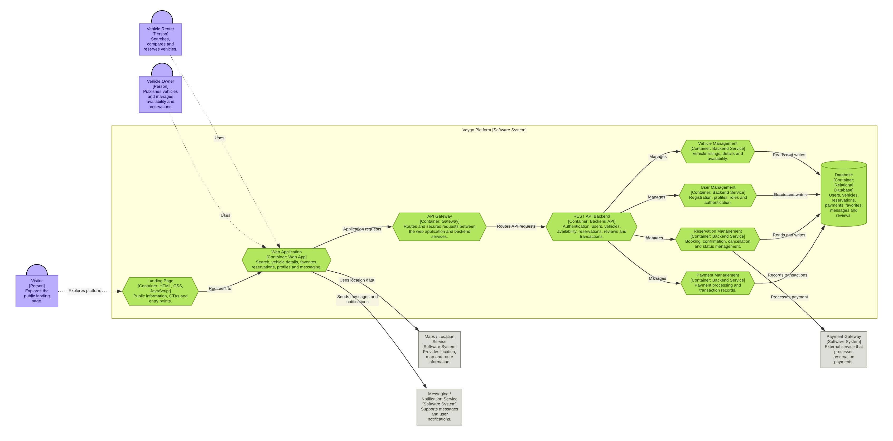


#### 4.6.3. Software Architecture Components Diagrams

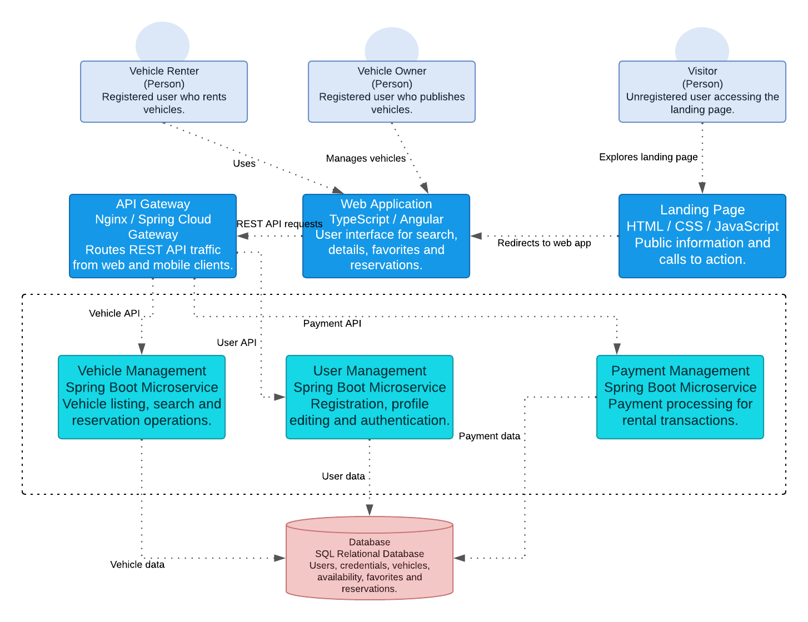


### 4.7. Software Object-Oriented Design

El diseño orientado a objetos de Veygo es un elemento fundamental para el desarrollo del software. El sistema ha sido estructurado de acuerdo con las reglas de negocio de la plataforma, buscando crear componentes claros y organizados que faciliten su implementación, mantenimiento y futuras modificaciones por parte del equipo.

#### 4.7.1. Class Diagrams

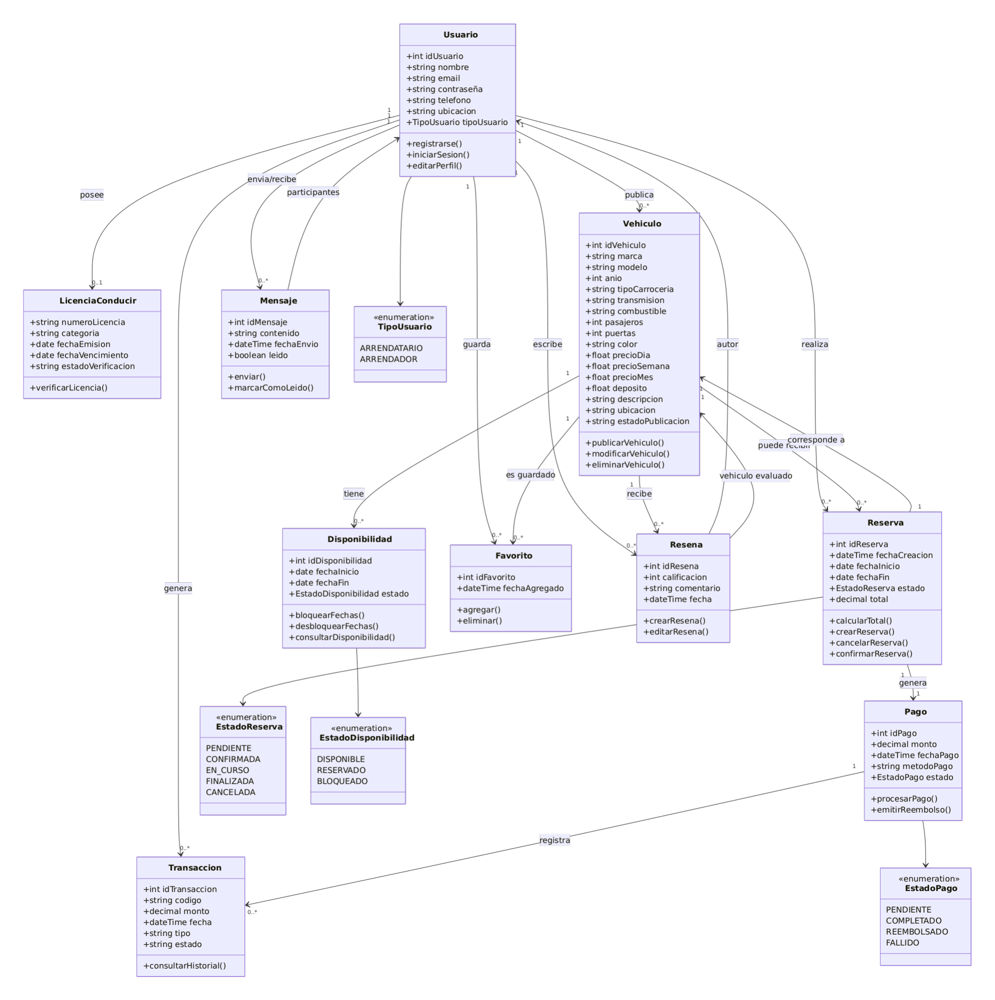

### 4.8. Database Design

Para la persistencia de los datos de la plataforma CareLink, se ha optado por un modelo de base de datos relacional, implementado en MySQL. Esta decisión se basa en la naturaleza estructurada y transaccional de los datos del dominio (perfiles, registros médicos, suscripciones), lo que garantiza la integridad y consistencia de la información.

El diseño del esquema refleja directamente la separación lógica de los Bounded Contexts definidos en la arquitectura, agrupando las tablas por su área de responsabilidad para facilitar el entendimiento y el mantenimiento.

#### 4.8.1. Database Diagram

Antes de revisar el diagrama de base de datos de Veygo, es importante comprender cómo se relacionan las principales entidades del sistema. La base de datos gestiona información de Usuarios, Vehículos, Licencias de Conducir, Disponibilidad, Fotos, Reservas, Favoritos, Mensajes, Reseñas, Pagos y Transacciones. Estas tablas se encuentran relacionadas de acuerdo con las funcionalidades de la plataforma; por ejemplo, un usuario puede registrar vehículos y licencias, publicar su disponibilidad, realizar reservas, guardar vehículos como favoritos y gestionar mensajes y reseñas. Asimismo, las reservas se vinculan con los pagos y sus respectivas transacciones. A continuación, se presenta el diagrama que representa gráficamente estas relaciones.

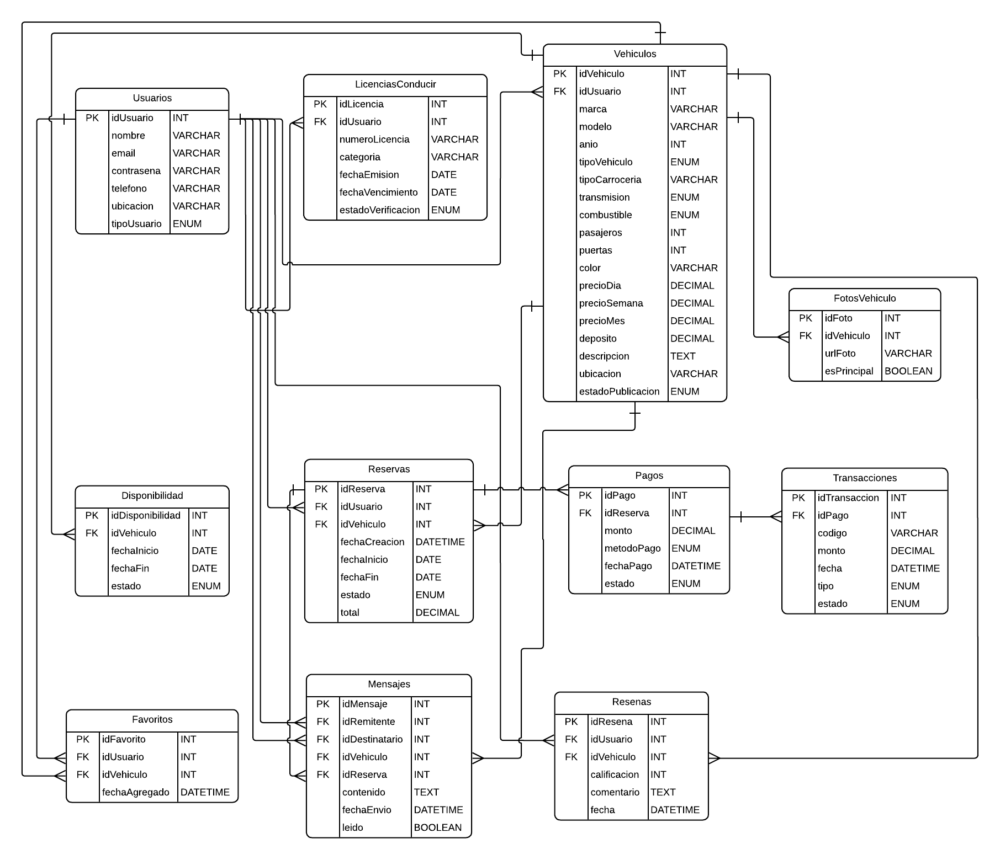


