## Capítulo IV: Product Design

### 4.1. Style Guidelines

#### 4.1.1. General Style Guidelines


### Branding

Veygo busca transmitir **confianza, seguridad, cercanía y modernidad**, utilizando la tecnología para facilitar el alquiler de vehículos. Su identidad visual se basa en el uso del **azul, blanco y tonos claros**, junto con una tipografía moderna e íconos simples relacionados con movilidad y seguridad.

La identidad de marca se fundamenta en:

- **Misión:** Facilitar un alquiler de vehículos seguro y confiable para propietarios y clientes.
- **Visión:** Ser la plataforma de alquiler de vehículos más confiable y segura del Perú, conectando a propietarios y clientes de manera sencilla y transparente.

#### Logo

Buscamos transmitir una imagen **moderna y actual** mediante un diseño minimalista y un logotipo en **tonos azules** que refuerza la identidad tecnológica de Veygo.


#### Typography

Se ha seleccionado **Geist** como tipografía principal de la aplicación, debido a su estilo moderno y buena legibilidad. Su diseño permite ofrecer una experiencia visual clara y cómoda para los usuarios.

El tamaño de la fuente se adapta según el dispositivo, garantizando una correcta visualización tanto en **móviles como en computadoras**.


#### Colors

La paleta de colores está compuesta por **seis tonos principales**, seleccionados para transmitir una apariencia **moderna, profesional y limpia** en las diferentes secciones de la aplicación.

<btn>

**Color Primario:**

- **Azul (#2563EB):** Es el color principal de Veygo y se utiliza en el logotipo, botones, títulos destacados e íconos. Representa confianza, seguridad y tecnología.

**Colores Secundarios:**

- **Azul oscuro (#172554):** Utilizado en títulos y elementos de mayor jerarquía para generar contraste y reforzar la identidad profesional de la marca.
- **Blanco (#FFFFFF):** Empleado como color principal de fondo para mantener una interfaz limpia, clara y fácil de visualizar.
- **Azul muy claro (#F4F7FE):** Utilizado en fondos de secciones y tarjetas para generar separación visual y mantener una apariencia ligera.
- **Negro (#000000):** Utilizado principalmente en textos y elementos que requieren mayor contraste y legibilidad.
- **Verde (#22C55E):** Empleado en elementos relacionados con seguridad, disponibilidad o confirmación, permitiendo destacar información positiva dentro de la interfaz.

### Texto

Los títulos principales utilizan un tono azul como color destacado para reforzar la identidad de Veygo, mientras que los textos de contenido emplean tonos oscuros para facilitar la lectura. La tipografía principal es *Geist*, debido a su estilo moderno y buena legibilidad.

### Botones

Los botones utilizan principalmente el azul de Veygo para destacar las acciones importantes dentro de la Landing Page.

- **Botones principales (CTA):**
  - Fondo: Azul (#2563EB)
  - Texto: Blanco (#FFFFFF)
  - Hover: Se utiliza un tono azul ligeramente más oscuro para indicar la interacción.
  
- **Botones secundarios:**
  - Fondo: Blanco (#FFFFFF)
  - Borde: Azul
  - Texto: Azul
  - Hover: Se aplica el color azul como fondo y blanco en el texto.

### Formularios

Los campos de búsqueda utilizan un diseño limpio y sencillo, con fondos claros y bordes suaves para mantener la estética minimalista de Veygo. Los textos de los campos utilizan tonos grises para diferenciar etiquetas, información de ayuda y datos ingresados.

- **Campos:** Fondo blanco y borde gris claro.
- **Placeholder:** Gris claro.
- **Etiquetas:** Gris oscuro.
- **Iconos:** Azul o gris según su función.
- **Botón de búsqueda:** Azul con texto blanco.

### Íconos y Sistema Visual

- Los íconos utilizan un estilo simple y moderno, principalmente en tonos azules y grises, manteniendo una apariencia uniforme en toda la interfaz.
- Se emplean íconos relacionados con movilidad, búsqueda, seguridad y reservas para facilitar la comprensión de las diferentes funcionalidades.

### Estados de Hover y Feedback

Los elementos interactivos presentan cambios visuales sutiles para indicar al usuario que una acción está disponible o ha sido seleccionada.

- **Botones principales:** El azul se intensifica ligeramente al pasar el cursor.
- **Botones secundarios:** Se puede aplicar un cambio de fondo o borde para indicar la interacción.
- Se utilizan transiciones suaves para mantener una experiencia fluida sin distraer al usuario.

### Accesibilidad

La interfaz utiliza colores con suficiente contraste para facilitar la lectura y comprensión del contenido.

- Los textos oscuros se utilizan principalmente sobre fondos blancos o claros.
- Los botones azules utilizan texto blanco para mantener una adecuada visibilidad.
- Los elementos importantes se diferencian mediante color, tamaño y posición.

### Espaciado y Distribución

El diseño mantiene una distribución ordenada y consistente, utilizando espacios amplios entre secciones, tarjetas y elementos de contenido.

- **Espaciado base:** 8px.
- **Padding de tarjetas:** 24px.
- **Altura de botones:** 40px–48px.
- **Separación entre elementos:** 16px–32px.
- **Bordes:** Redondeados para mantener una apariencia moderna y amigable.

#### 4.1.2. Web Style Guidelines

- **Responsive Design:** La interfaz de Veygo debe adaptarse correctamente a computadoras, tablets y dispositivos móviles, manteniendo una navegación clara y accesible.

- **Consistencia Visual:** Se mantienen los colores, tipografía Geist, estilos de botones, tarjetas e íconos definidos en las guías generales para conservar una identidad visual uniforme.

- **Accesibilidad:** Los colores y tamaños de texto se seleccionan buscando un contraste adecuado y una lectura clara para los usuarios.

- **Estados de Interacción:** Los botones, enlaces e íconos presentan cambios visuales al interactuar con ellos, permitiendo identificar fácilmente los elementos activos.

- **Navegación e Interactividad:** La navegación se mantiene sencilla e intuitiva, facilitando el acceso a las principales secciones y funcionalidades de Veygo.

- **Uso Consistente de Componentes:** Se reutilizan componentes como botones, tarjetas, campos de búsqueda y elementos de navegación para mantener una experiencia uniforme en toda la plataforma.

### 4.2. Information Architecture

#### 4.2.1. Organization Systems

El sistema de organización de **Veygo** busca ofrecer una navegación sencilla y ordenada, permitiendo que los usuarios encuentren rápidamente las funciones relacionadas con el alquiler y la publicación de vehículos. La plataforma está organizada considerando sus dos principales tipos de usuarios: **clientes** y **propietarios**.

Los clientes tienen acceso a funciones orientadas a la búsqueda y alquiler de vehículos, mientras que los propietarios cuentan con herramientas para publicar sus vehículos, administrar su disponibilidad y gestionar las reservas recibidas.

<btn>

El flujo general de la plataforma se organiza de la siguiente manera:

1. **Landing Page:** Presenta Veygo, sus principales beneficios, vehículos disponibles y opciones para registrarse o iniciar sesión.

2. **Registro e Inicio de Sesión:** Permite crear una cuenta o acceder a la plataforma mediante credenciales registradas.

3. **Página Principal:** Punto de acceso a las principales funcionalidades de Veygo según el tipo de usuario.

4. **Búsqueda de Vehículos:** Permite buscar vehículos mediante ubicación, fechas de alquiler y diferentes filtros.

5. **Detalle del Vehículo:** Muestra información del vehículo, características, disponibilidad y datos necesarios antes de realizar una reserva.

6. **Reservas:** Permite al cliente solicitar un vehículo y consultar el estado de sus reservas.

7. **Publicación de Vehículos:** Permite a los propietarios registrar y ofrecer sus automóviles o motocicletas dentro de la plataforma.

8. **Gestión de Disponibilidad:** Permite al propietario administrar mediante un calendario las fechas disponibles de sus vehículos.

9. **Panel del Propietario:** Presenta información relacionada con vehículos activos, reservas y transacciones realizadas.

10. **Calificaciones y Reseñas:** Permite a clientes y propietarios compartir su experiencia después de completar un alquiler.

11. **Perfil:** Permite gestionar la información de la cuenta y los datos relacionados con la verificación del usuario.

#### 4.2.2. Labeling Systems

El sistema de etiquetado de Veygo utiliza nombres simples y directos para facilitar la identificación de cada sección. Los términos empleados mantienen una relación clara con las funciones de la plataforma y permiten una navegación intuitiva para clientes y propietarios.

##### Secciones y contenido de la Landing Page

| **Sección** | **Contenido** |
|-------------|---------------|
| **Inicio** | Presenta Veygo y sus principales beneficios, permitiendo acceder rápidamente a las funciones de la plataforma. |
| **Cómo funciona** | Explica de manera sencilla los pasos para buscar, reservar y alquilar un vehículo. |
| **Vehículos** | Muestra los vehículos disponibles y permite conocer sus principales características. |
| **Confianza** | Presenta las medidas de seguridad, verificación de identidad y mecanismos de reputación de Veygo. |
| **Testimonios** | Muestra las experiencias y opiniones de usuarios de la plataforma. |
| **Iniciar Sesión** | Permite acceder a una cuenta existente. |
| **Registrarme** | Permite crear una nueva cuenta en Veygo. |

##### Secciones y contenido de Veygo

| **Sección** | **Contenido** |
|-------------|---------------|
| **Página Principal** | Punto de acceso a las principales funciones de la plataforma según el tipo de usuario. |
| **Buscar Vehículos** | Permite encontrar vehículos disponibles según ubicación, fechas y preferencias. |
| **Detalle del Vehículo** | Muestra información, características, precio y disponibilidad del vehículo seleccionado. |
| **Reservas** | Permite gestionar las solicitudes y reservas realizadas dentro de la plataforma. |
| **Mis Vehículos** | Permite a los propietarios visualizar y administrar los vehículos que tienen publicados. |
| **Disponibilidad** | Permite gestionar las fechas disponibles de los vehículos mediante un calendario. |
| **Panel del Propietario** | Presenta información sobre vehículos, reservas y transacciones para facilitar la gestión. |
| **Calificaciones y Reseñas** | Permite consultar y realizar valoraciones sobre las experiencias de alquiler. |
| **Perfil** | Permite consultar y administrar la información de la cuenta del usuario. |

#### 4.2.3. SEO Tags and Meta Tags

La **Landing Page** de Veygo busca atraer nuevos usuarios, generar confianza y mejorar su posicionamiento en búsquedas relacionadas con el alquiler de vehículos. Las etiquetas SEO y meta describen la plataforma y sus principales servicios, facilitando que los usuarios encuentren Veygo mediante términos relacionados con alquiler de autos, motos y movilidad.

**Título de la página (Title)**

```html
<title>Veygo – Alquiler de vehículos seguro y confiable</title>

<meta name="description" content="Veygo conecta a propietarios y clientes para alquilar vehículos de forma segura, rápida y confiable en Lima. Encuentra autos y motos disponibles según tus necesidades.">

<meta name="keywords" content="Veygo, alquiler de vehículos, alquiler de autos, alquiler de motos, rentar auto, vehículos en Lima, alquiler seguro, movilidad en Lima">

<meta name="author" content="Equipo Veygo">

```

#### 4.2.4. Searching Systems

Para facilitar la búsqueda de vehículos, **Veygo** incorpora un sistema de búsqueda sencillo que permite a los usuarios encontrar opciones según sus necesidades y preferencias.

- **Búsqueda por ubicación**: Permite encontrar vehículos disponibles en una ciudad o zona determinada.
- **Búsqueda por fechas**: Permite seleccionar la fecha de inicio y devolución para mostrar vehículos disponibles durante el periodo elegido.
- **Filtros de búsqueda**: Permite filtrar los vehículos según características como tipo de vehículo, transmisión, tipo de energía, precio y disponibilidad.
- **Búsqueda por categorías**: Permite explorar vehículos según diferentes necesidades, como trabajo diario, viajes familiares, carga, aventura o vehículos eléctricos.
- **Resultados de búsqueda**: Muestra los vehículos que coinciden con los criterios seleccionados, facilitando la comparación de sus características y precios.

Este sistema permite reducir el tiempo de búsqueda y ayuda a los usuarios a encontrar un vehículo que se adapte mejor a sus necesidades.

#### 4.2.5. Navigation Systems

La navegación en **Veygo** está diseñada para que los usuarios puedan desplazarse de manera sencilla entre las principales secciones de la plataforma. Se utiliza una barra de navegación principal, accesos directos y una estructura organizada según las funciones disponibles para clientes y propietarios.

##### **Estructura de Navegación en la Landing Page**

| **Sección** | **Descripción** |
|-------------|-----------------|
| **Inicio** | Presenta Veygo y su propuesta de valor, destacando sus principales beneficios. |
| **Cómo funciona** | Explica los pasos necesarios para buscar y alquilar un vehículo. |
| **Vehículos** | Permite explorar los vehículos disponibles y conocer sus características. |
| **Confianza** | Presenta las medidas de seguridad, verificación y reputación de la plataforma. |
| **Testimonios** | Muestra las experiencias de usuarios que han utilizado Veygo. |
| **Iniciar Sesión** | Permite acceder a una cuenta existente. |
| **Registrarme** | Permite crear una nueva cuenta en la plataforma. |

##### **Estructura de Navegación en Veygo**

| **Sección** | **Descripción** |
|-------------|-----------------|
| **Página Principal** | Punto de acceso a las principales funcionalidades según el tipo de usuario. |
| **Buscar Vehículos** | Permite encontrar vehículos mediante ubicación, fechas y filtros. |
| **Detalle del Vehículo** | Presenta las características, precio y disponibilidad del vehículo seleccionado. |
| **Reservas** | Permite consultar y gestionar las reservas realizadas. |
| **Mis Vehículos** | Permite a los propietarios administrar los vehículos publicados. |
| **Disponibilidad** | Permite gestionar las fechas disponibles de cada vehículo. |
| **Panel del Propietario** | Muestra información sobre vehículos, reservas y transacciones. |
| **Calificaciones y Reseñas** | Permite consultar y registrar valoraciones sobre las experiencias de alquiler. |
| **Perfil** | Permite gestionar la información de la cuenta del usuario. |

---

#### **Accesibilidad y navegación intuitiva**

**Veygo** utiliza una navegación sencilla y organizada, con accesos directos a las funciones principales para reducir el número de pasos necesarios. La estructura y los nombres de las secciones permiten que clientes y propietarios identifiquen fácilmente las opciones disponibles según sus necesidades.

### 4.3. Landing Page UI Design

#### 4.3.1. Landing Page Wireframe

Estos wireframes permiten visualizar de manera detallada la estructura propuesta para la página de aterrizaje. A través de ellos, se pueden identificar sus principales elementos, funcionalidades y la forma en que los usuarios interactuarán y navegarán por el sitio.

 

#### 4.3.2. Landing Page Mock-up

Los siguientes mockups representan una visión más cercana a la landing Page de Veygo:

 

### 4.4. Web Applications UX/UI Design

#### 4.4.1. Web Applications Wireframes

Los wireframes que se presentan a continuación representan la estructura visual y las principales funcionalidades de **Veygo**, una plataforma digital orientada a facilitar el alquiler y la gestión de vehículos, conectando de manera eficiente a arrendatarios y arrendadores. Las interfaces han sido diseñadas buscando proporcionar una experiencia de usuario intuitiva, clara y accesible para ambos tipos de usuarios.

Cada pantalla ha sido planteada para facilitar tareas como la búsqueda y reserva de vehículos, la gestión de publicaciones y disponibilidad, el seguimiento de reservas, la administración de vehículos y la comunicación entre los usuarios. Asimismo, los wireframes permiten visualizar cómo se organiza la información y cómo los usuarios interactuarán con las diferentes funcionalidades de la plataforma.

A través de estas representaciones, se puede comprender la distribución de los elementos en cada sección, las herramientas disponibles y los principales recorridos de navegación dentro de **Veygo**. De esta manera, el diseño busca contribuir a una experiencia de alquiler de vehículos más organizada, sencilla y eficiente para todos los usuarios de la plataforma.


#### 4.4.2. Web Applications Wireflow Diagrams


#### 4.4.2. Web Applications Mock-ups

Los mockups que se presentan a continuación muestran una representación detallada de la apariencia visual final de Veygo, nuestra plataforma digital orientada a facilitar el alquiler de vehículos y conectar de manera eficiente a arrendatarios y arrendadores. Cada interfaz ha sido diseñada cuidadosamente para ofrecer una experiencia moderna, intuitiva y fácil de utilizar, considerando las necesidades específicas de ambos tipos de usuarios.

Estas propuestas visuales reflejan cómo será la experiencia final dentro de la plataforma, mostrando la distribución de los contenidos, los elementos de interacción y las principales funcionalidades disponibles. Asimismo, permiten visualizar de manera más precisa la navegación y el funcionamiento de Veygo, desde la búsqueda y reserva de vehículos por parte de los arrendatarios hasta la publicación, gestión de vehículos y administración de reservas por parte de los arrendadores.

En conjunto, los mockups permiten apreciar la propuesta visual de Veygo y cómo el diseño planteado busca brindar una experiencia de alquiler de vehículos clara, organizada y eficiente para los distintos usuarios de la plataforma.


#### 4.4.3. Web Applications User Flow Diagrams


Link: <a href="https://miro.com/welcomeonboard/N1NoQnVob0VXWlViY1NnRHA5K2hWL2FlWko4NXlVaC9IK3Fhek1QOWJ1ZUxZQ05VRi90TTlCbE9NUGhBVXFmUVFPSUhxeUdiVlNGMjEydmZrdG5uaVhRVFVhTG83RFgwTEhTSUN1bWZHR3BDY2V0ZVI3RE5ETXpuaG5tOFhRZnRhWWluRVAxeXRuUUgwWDl3Mk1qRGVRPT0hdjE=?share_link_id=825034209571" style="color: blue;"> https://miro.com/welcomeonboard/N1NoQnVob0VXWlViY1NnRHA5K2hWL2FlWko4NXlVaC9IK3Fhek1QOWJ1ZUxZQ05VRi90TTlCbE9NUGhBVXFmUVFPSUhxeUdiVlNGMjEydmZrdG5uaVhRVFVhTG83RFgwTEhTSUN1bWZHR3BDY2V0ZVI3RE5ETXpuaG5tOFhRZnRhWWluRVAxeXRuUUgwWDl3Mk1qRGVRPT0hdjE=?share_link_id=825034209571 </a>

### 4.5. Web Applications Prototyping


Link: <a href="https://miro.com/welcomeonboard/N1NoQnVob0VXWlViY1NnRHA5K2hWL2FlWko4NXlVaC9IK3Fhek1QOWJ1ZUxZQ05VRi90TTlCbE9NUGhBVXFmUVFPSUhxeUdiVlNGMjEydmZrdG5uaVhRVFVhTG83RFgwTEhTSUN1bWZHR3BDY2V0ZVI3RE5ETXpuaG5tOFhRZnRhWWluRVAxeXRuUUgwWDl3Mk1qRGVRPT0hdjE=?share_link_id=825034209571" style="color: blue;"> https://miro.com/welcomeonboard/N1NoQnVob0VXWlViY1NnRHA5K2hWL2FlWko4NXlVaC9IK3Fhek1QOWJ1ZUxZQ05VRi90TTlCbE9NUGhBVXFmUVFPSUhxeUdiVlNGMjEydmZrdG5uaVhRVFVhTG83RFgwTEhTSUN1bWZHR3BDY2V0ZVI3RE5ETXpuaG5tOFhRZnRhWWluRVAxeXRuUUgwWDl3Mk1qRGVRPT0hdjE=?share_link_id=825034209571 </a>


Link de video: <a href="https://drive.google.com/file/d/1a2MVvUp9paguAafOVfuw7knAl7k0A4na/view?usp=sharing
" style="color: blue;"> https://drive.google.com/file/d/1a2MVvUp9paguAafOVfuw7knAl7k0A4na/view?usp=sharing </a>

### 4.6. Domain-Driven Software Architecture

#### 4.6.1. Design-Level EventStorming

A partir de los resultados del Big Picture EventStorming presentado en la sección 2.4, el equipo realizó una sesión de Design-Level EventStorming con el objetivo de profundizar en el modelado del dominio de Veygo desde la perspectiva de Domain-Driven Design. Mientras que el Big Picture permitió obtener una visión general del proceso de alquiler de vehículos entre propietarios y arrendatarios, en esta etapa se analizó cada proceso con mayor nivel de detalle para identificar los **Commands**, **Actors**, **Aggregates**, **Policies**, **Read Models** y **External Systems** que intervienen, hasta llegar a la definición de los **Bounded Contexts** de la solución.

La sesión se realizó de forma remota en **Miro** el día **05/10/2026**, con una duración aproximada de **1 hora y 30 minutos**, y contó con la participación de todos los integrantes del equipo Zyntra. Se siguió la guía de referencia de Design-Level EventStorming (https://bit.ly/dles-guide), priorizando los procesos núcleo del negocio: la publicación de vehículos y el ciclo de vida de una reserva.

Link del tablero: <a href="https://miro.com/welcomeonboard/N1NoQnVob0VXWlViY1NnRHA5K2hWL2FlWko4NXlVaC9IK3Fhek1QOWJ1ZUxZQ05VRi90TTlCbE9NUGhBVXFmUVFPSUhxeUdiVlNGMjEydmZrdG5uaVhRVFVhTG83RFgwTEhTSUN1bWZHR282TW53OTIwYmlaeDF0bGR3cHQxRFN0R2lncW1vRmFBVnlLcVJzTmdFdlNRPT0hdjE=?share_link_id=980875429092" style="color: blue;">[LINK DE MIRO]</a>

##### Notación utilizada

Para mantener una lectura uniforme del tablero se utilizó la notación estándar de EventStorming. Los nombres de los elementos se escribieron en inglés, de acuerdo con el Ubiquitous Language definido en la sección 2.5.

| Color | Elemento | Descripción | Ejemplo en Veygo |
|---|---|---|---|
| Naranja | **Domain Event** | Hecho relevante del negocio que ya ocurrió, redactado en pasado. | `BookingRequested` |
| Azul | **Command** | Acción o intención que provoca un evento. | `RequestBooking` |
| Amarillo (pequeño) | **Actor** | Persona o rol que ejecuta el command. | Renter, Owner |
| Amarillo (grande) | **Aggregate** | Entidad que recibe el command, valida sus reglas y emite el evento. | `Booking` |
| Lila | **Policy** | Regla reactiva del tipo "cuando ocurre X, entonces se ejecuta Y". | Cuando se confirma una reserva, se bloquean las fechas del vehículo. |
| Verde | **Read Model** | Información que el actor consulta para tomar una decisión (Query). | Calendario de disponibilidad del vehículo |
| Rosado | **External System** | Sistema externo con el que interactúa la solución. | Pasarela de pagos, servicio de mapas |
| Rojo | **Hotspot** | Problema, duda o riesgo identificado en el proceso. | Solicitudes simultáneas para un mismo vehículo |
E:\Documentos2026\Aplic.Web\RP\report\Zyntra\assets\img\f0.png


##### Paso 1: Depuración de los eventos del Big Picture

En primer lugar, se retomaron los eventos identificados en el Big Picture EventStorming y se depuraron: se eliminaron los eventos duplicados, se unificaron los nombres de acuerdo con el Ubiquitous Language y se redactaron todos en tiempo pasado. Luego, los eventos se ordenaron cronológicamente dentro de cada proceso del negocio.

| Proceso | Domain Events |
|---|---|
| Registro y verificación | `UserRegistered`, `IdentityVerified`, `DriverLicenseVerified`, `ProfileUpdated` |
| Publicación de vehículos | `VehicleRegistered`, `VehiclePhotosUploaded`, `VehiclePublished`, `VehicleUnpublished`, `RentalRateUpdated` |
| Disponibilidad | `DatesBlocked`, `DatesUnblocked` |
| Búsqueda y selección | `VehicleAddedToFavorites`, `VehicleRemovedFromFavorites` |
| Reserva | `BookingRequested`, `BookingConfirmed`, `BookingRejected`, `BookingCancelled` |
| Ejecución del alquiler | `VehiclePickedUp`, `VehicleReturned`, `VehicleConditionReported` |
| Pago | `PaymentProcessed`, `PaymentFailed`, `RefundIssued`, `OwnerPayoutRegistered` |
| Reputación | `ReviewPublished`, `VehicleRatingUpdated`, `OwnerRatingUpdated` |
| Comunicación | `ConversationStarted`, `MessageSent`, `NotificationSent` |


##### Paso 2: Identificación de Commands y Actors

Para cada evento se identificó el command que lo origina y el actor que lo ejecuta. En los casos en los que el evento no es provocado por una persona, sino por una regla del sistema, el command se asoció a una policy (paso 4).

| Actor | Command | Domain Event |
|---|---|---|
| Renter / Owner | `SignUp` | `UserRegistered` |
| Renter / Owner | `VerifyIdentity` | `IdentityVerified` |
| Renter | `RegisterDriverLicense` | `DriverLicenseVerified` |
| Owner | `RegisterVehicle` | `VehicleRegistered` |
| Owner | `PublishVehicle` / `UnpublishVehicle` | `VehiclePublished` / `VehicleUnpublished` |
| Owner | `BlockDates` / `UnblockDates` | `DatesBlocked` / `DatesUnblocked` |
| Renter | `AddVehicleToFavorites` | `VehicleAddedToFavorites` |
| Renter | `RequestBooking` | `BookingRequested` |
| Owner | `ConfirmBooking` / `RejectBooking` | `BookingConfirmed` / `BookingRejected` |
| Renter / Owner | `CancelBooking` | `BookingCancelled` |
| Owner | `RegisterPickup` | `VehiclePickedUp` |
| Owner | `RegisterReturn` | `VehicleReturned` |
| Renter | `PublishReview` | `ReviewPublished` |
| Renter / Owner | `SendMessage` | `MessageSent` |


##### Paso 3: Identificación de Aggregates y reglas de negocio

A continuación, se identificaron los aggregates responsables de recibir cada command, validar las reglas de negocio (invariantes) y emitir los eventos correspondientes.

| Aggregate | Commands que recibe | Reglas de negocio (invariantes) |
|---|---|---|
| `User` | `SignUp`, `VerifyIdentity`, `RegisterDriverLicense` | El correo electrónico es único. Un Renter solo puede reservar si su licencia de conducir está verificada y vigente. |
| `Vehicle` | `RegisterVehicle`, `PublishVehicle`, `UnpublishVehicle`, `UpdateRentalRate` | Solo el Owner del vehículo puede modificarlo. Un vehículo solo puede publicarse si tiene fotos, tarifa, ubicación y seguro vigente. |
| `VehicleAvailability` | `BlockDates`, `UnblockDates` | No se pueden bloquear fechas que ya tienen una reserva confirmada. |
| `Booking` | `RequestBooking`, `ConfirmBooking`, `RejectBooking`, `CancelBooking`, `RegisterPickup`, `RegisterReturn` | El periodo de alquiler no puede cruzarse con otra reserva confirmada ni con fechas bloqueadas. Un Renter no puede reservar su propio vehículo. Solo se puede confirmar o rechazar una reserva pendiente. |
| `Payment` | `ProcessPayment`, `IssueRefund` | El monto debe coincidir con el total de la reserva. Solo se reembolsa una reserva cancelada según las condiciones de cancelación. |
| `Review` | `PublishReview` | Solo se puede calificar un alquiler completado, y una sola vez por reserva. |
| `Conversation` | `StartConversation`, `SendMessage` | Solo participan el Owner y el Renter relacionados con el vehículo o la reserva. |


##### Paso 4: Identificación de Policies

Luego, se identificaron las policies que conectan los procesos entre sí, es decir, las reacciones automáticas del sistema ante un evento.

| Cuando ocurre... | Entonces se ejecuta... |
|---|---|
| `BookingRequested` | Notificar al Owner que tiene una nueva solicitud (`SendNotification`). |
| `BookingConfirmed` | Bloquear las fechas del periodo en la disponibilidad del vehículo y procesar el pago (`ProcessPayment`). |
| `BookingRejected` / `BookingCancelled` | Liberar las fechas, emitir el reembolso si corresponde (`IssueRefund`) y notificar a la otra parte. |
| `PaymentFailed` | Cancelar la reserva y notificar al Renter. |
| `VehicleReturned` | Registrar el ingreso del Owner (`RegisterOwnerPayout`) y habilitar la calificación del alquiler. |
| `ReviewPublished` | Recalcular la calificación del vehículo y del Owner. |
| `MessageSent` | Notificar al destinatario del mensaje. |


##### Paso 5: Identificación de Read Models y External Systems

Se identificó la información que cada actor necesita consultar antes de ejecutar un command (Queries), así como los sistemas externos con los que interactúa la solución.

| Read Model (Query) | Actor | Uso |
|---|---|---|
| Resultados de búsqueda de vehículos (`SearchVehicles`) | Renter | Filtrar por ubicación, fechas, tipo, precio y calificación antes de reservar. |
| Detalle del vehículo (`GetVehicleById`) | Renter | Revisar características, tarifa, ubicación y reputación del Owner. |
| Calendario de disponibilidad (`GetVehicleAvailability`) | Renter / Owner | Verificar fechas libres, reservadas y bloqueadas. |
| Solicitudes de reserva (`GetOwnerBookings`) | Owner | Decidir si confirma o rechaza una solicitud. |
| Mis reservas (`GetRenterBookings`) | Renter | Seguir el estado de sus reservas. |
| Historial de transacciones (`GetOwnerTransactions`) | Owner | Revisar los ingresos por periodo y por vehículo. |
| Reseñas del vehículo (`GetVehicleReviews`) | Renter / Owner | Conocer la reputación del vehículo y del Owner. |

| External System | Uso |
|---|---|
| Pasarela de pagos | Procesar los pagos de las reservas y los reembolsos. |
| Servicio de mapas (OpenStreetMap) | Mostrar la ubicación de los vehículos y calcular su cercanía. |
| Servicio de verificación de identidad | Validar el documento de identidad y la licencia de conducir. |


##### Paso 6: Revisión de los hotspots del Big Picture

Los hotspots identificados en el Big Picture EventStorming se revisaron a la luz del nuevo modelo, y se tomó una decisión de diseño para cada uno.

| Hotspot | Decisión de diseño |
|---|---|
| Disponibilidad desactualizada de los vehículos | El aggregate `VehicleAvailability` se actualiza mediante policies cada vez que una reserva se confirma, se rechaza o se cancela. |
| Retrasos en la verificación de identidad | La verificación se delega a un External System y se valida como invariante del aggregate `User` antes de permitir una reserva. |
| Solicitudes simultáneas de un mismo vehículo | El aggregate `Booking` valida que el periodo no se cruce con otra reserva confirmada al momento de confirmarla. |
| Coordinación del punto de entrega | El Owner y el Renter coordinan mediante el contexto de Communication, y la entrega se registra con `RegisterPickup`. |
| Diferencias en el estado del vehículo tras el alquiler | Al registrar la devolución (`RegisterReturn`) se emite `VehicleConditionReported` con el estado del vehículo. |


##### Paso 7: Definición de los Bounded Contexts

Finalmente, los aggregates se agruparon según su responsabilidad y su lenguaje, lo que dio lugar a los Bounded Contexts de Veygo. Cada uno se contrastó con los sub-dominios habituales de una plataforma SaaS orientada a servicios.

| Bounded Context | Tipo | Sub-dominio de referencia | Responsabilidad |
|---|---|---|---|
| **IAM** | Generic | Identity and Access Management | Registro, inicio de sesión, roles (Owner, Renter) y verificación de identidad. |
| **Profiles** | Supporting | Profiles and Preferences Management | Datos personales, licencia de conducir y preferencias del usuario. |
| **Fleet** | Core | Resource and Asset Management | Registro y publicación de vehículos, tarifas y disponibilidad. |
| **Booking** | Core | Service Design and Planning / Service Execution and Monitoring | Ciclo de vida de la reserva: solicitud, confirmación, entrega, devolución y cancelación. |
| **Payment** | Supporting | Subscriptions and Payment Management | Pagos de reservas, reembolsos e ingresos del Owner. |
| **Reputation** | Supporting | Loyalty and Engagement | Reseñas y calificaciones de vehículos y propietarios. |
| **Engagement** | Supporting | Loyalty and Engagement | Vehículos favoritos del Renter. |
| **Communication** | Supporting | Service Execution and Monitoring | Conversaciones y mensajes entre Owner y Renter. |
| **Notification** | Supporting | Service Execution and Monitoring | Avisos generados a partir de los eventos del dominio. |
| **Dashboard** | Supporting | Dashboard and Analytics | Métricas de reservas, ingresos y calificación para el Owner. |


##### Flujo principal modelado: reserva de un vehículo

El siguiente flujo resume cómo se conectan los elementos del modelo en el proceso núcleo de Veygo:

1. El **Renter** consulta el read model *Resultados de búsqueda* y el *Calendario de disponibilidad*.
2. El **Renter** ejecuta `RequestBooking` sobre el aggregate `Booking`, que valida que el periodo esté libre y emite `BookingRequested`.
3. La policy de notificación avisa al **Owner**, quien consulta *Solicitudes de reserva* y ejecuta `ConfirmBooking`.
4. El aggregate `Booking` emite `BookingConfirmed`. Las policies bloquean las fechas en `VehicleAvailability` y ejecutan `ProcessPayment` contra la pasarela de pagos.
5. En la fecha de inicio, el **Owner** registra `RegisterPickup` (`VehiclePickedUp`). Al finalizar, registra `RegisterReturn` (`VehicleReturned`).
6. La policy de cierre registra el ingreso del Owner y habilita al **Renter** para ejecutar `PublishReview`, que actualiza la reputación del vehículo y del Owner.


##### Resultado de la sesión

Como resultado del Design-Level EventStorming, el equipo obtuvo un modelo detallado del dominio de Veygo. Este modelo sirve como base para los diagramas de arquitectura (C4 Model), el diagrama de clases y el diseño de la base de datos presentados en las siguientes secciones.

| Bounded Context | Aggregates | Commands | Domain Events | Queries |
|---|---|---|---|---|
| IAM | `User` | `SignUp`, `SignIn`, `VerifyIdentity` | `UserRegistered`, `IdentityVerified` | `GetUserById` |
| Profiles | `Profile` | `UpdateProfile`, `RegisterDriverLicense`, `UpdatePreferences` | `ProfileUpdated`, `DriverLicenseVerified` | `GetProfileByUserId` |
| Fleet | `Vehicle`, `VehicleAvailability` | `RegisterVehicle`, `PublishVehicle`, `UnpublishVehicle`, `BlockDates`, `UnblockDates` | `VehicleRegistered`, `VehiclePublished`, `DatesBlocked` | `SearchVehicles`, `GetVehicleById`, `GetVehicleAvailability` |
| Booking | `Booking` | `RequestBooking`, `ConfirmBooking`, `RejectBooking`, `CancelBooking`, `RegisterPickup`, `RegisterReturn` | `BookingRequested`, `BookingConfirmed`, `BookingRejected`, `BookingCancelled`, `VehiclePickedUp`, `VehicleReturned` | `GetRenterBookings`, `GetOwnerBookings` |
| Payment | `Payment`, `Transaction` | `ProcessPayment`, `IssueRefund`, `RegisterOwnerPayout` | `PaymentProcessed`, `PaymentFailed`, `RefundIssued` | `GetOwnerTransactions` |
| Reputation | `Review` | `PublishReview` | `ReviewPublished`, `VehicleRatingUpdated` | `GetVehicleReviews`, `GetOwnerReviews` |
| Engagement | `Favorite` | `AddVehicleToFavorites`, `RemoveVehicleFromFavorites` | `VehicleAddedToFavorites` | `GetRenterFavorites` |
| Communication | `Conversation` | `StartConversation`, `SendMessage` | `ConversationStarted`, `MessageSent` | `GetUserConversations` |
| Notification | `Notification` | `SendNotification`, `MarkNotificationAsRead` | `NotificationSent` | `GetUserNotifications` |
| Dashboard | — (read model) | — | — | `GetOwnerDashboard` |


#### 4.6.2. Software Architecture Context Diagram

El Software Architecture Context Diagram corresponde al primer nivel del C4 Model y presenta a Veygo como una caja negra, mostrando quiénes la utilizan y con qué sistemas externos interactúa. Este diagrama permite comprender el alcance de la solución sin entrar en detalles técnicos y sirve como punto de partida para los diagramas de contenedores y componentes presentados en las siguientes secciones. El diagrama fue elaborado con Structurizr DSL.


En el centro del diagrama se encuentra el sistema **Veygo**, la plataforma peer-to-peer de alquiler de vehículos que conecta a propietarios con arrendatarios en Lima. A su alrededor se ubican los actores y sistemas con los que interactúa:

| Elemento | Tipo | Relación con Veygo |
|---|---|---|
| **Visitor** | Person | Explora la Landing Page para conocer la propuesta de Veygo y se registra como Renter u Owner. |
| **Renter** | Person | Busca vehículos cercanos, solicita reservas (bookings), realiza el pago y califica el alquiler. |
| **Owner** | Person | Publica sus vehículos, gestiona su disponibilidad y confirma o rechaza las reservas recibidas. |
| **Payment Gateway** | External System | Procesa los pagos de las reservas y los reembolsos en caso de cancelación. |
| **Map Service (OpenStreetMap)** | External System | Provee los mapas y la ubicación de los vehículos para la búsqueda por cercanía y el punto de entrega. |
| **Identity Verification Service** | External System | Valida el documento de identidad y la licencia de conducir antes de permitir una reserva. |

Los sistemas externos corresponden a los External Systems identificados en el Design-Level EventStorming (sección 4.6.1). La mensajería entre propietarios y arrendatarios y las notificaciones no se consideran sistemas externos, ya que forman parte de los bounded contexts Communication y Notification de la propia solución.

#### 4.6.3. Software Architecture Container Diagrams

El Software Architecture Container Diagram corresponde al segundo nivel del C4 Model y descompone el sistema Veygo en sus contenedores, es decir, en las unidades que se despliegan de forma independiente. El diagrama muestra la responsabilidad de cada contenedor, las tecnologías seleccionadas y la forma en que se comunican entre sí y con los sistemas externos. Fue elaborado con Structurizr DSL.


| Container | Tecnología | Responsabilidad |
|---|---|---|
| **Landing Page** | HTML5, CSS3, JavaScript | Presenta la propuesta de valor de Veygo y dirige a los visitantes al registro como Renter u Owner. |
| **Web Application** | Vue, JavaScript, PrimeVue | Single-page application que se ejecuta en el navegador. Permite al Renter buscar y reservar vehículos, y al Owner gestionar su flota, disponibilidad, reservas e ingresos. |
| **RESTful API** | ASP.NET Core, C#, Entity Framework Core | Expone las capacidades del negocio organizadas por bounded contexts (IAM, Fleet, Booking, Payment, Reputation, Communication y Notification) y se documenta con OpenAPI (Swagger). |
| **Database** | MySQL Server | Almacena la información de usuarios, perfiles, vehículos, disponibilidad, reservas, pagos, reseñas, conversaciones y notificaciones. |

La comunicación entre los contenedores se realiza de la siguiente manera:

- El **Visitor** accede a la **Landing Page**, desde la cual es redirigido a la **Web Application** para registrarse o iniciar sesión.
- El **Renter** y el **Owner** interactúan con la **Web Application**, que consume la **RESTful API** mediante peticiones HTTPS con formato JSON.
- La **Web Application** obtiene los mapas y la ubicación de los vehículos directamente del **Map Service (OpenStreetMap)**.
- La **RESTful API** persiste la información en la **Database** a través de Entity Framework Core, y se integra con el **Payment Gateway** para los pagos y reembolsos, y con el **Identity Verification Service** para validar documentos y licencias de conducir.

Los módulos de negocio de la RESTful API no se representan como contenedores, ya que forman parte de una misma unidad de despliegue. Su descomposición en bounded contexts y capas se detalla en los Component Diagrams de la siguiente sección.

#### 4.6.4. Software Architecture Components Diagrams

Los Software Architecture Component Diagrams corresponden al tercer nivel del C4 Model y descomponen cada contenedor de Veygo en sus componentes principales, mostrando sus responsabilidades, sus detalles de implementación y tecnología, y la forma en que interactúan. Se presentan los diagramas de los contenedores que concentran la lógica de la solución: la **Web Application** y la **RESTful API**. La Landing Page no se descompone porque es una página estática, y la Database no contiene componentes de software. Los diagramas fueron elaborados con Structurizr DSL.

En ambos contenedores se aplicaron los siguientes patrones de arquitectura:

| Patrón | Cómo se refleja en los diagramas |
|---|---|
| **Domain-Driven Design (Bounded Contexts)** | Los componentes se agrupan por los bounded contexts identificados en el Design-Level EventStorming (sección 4.6.1): IAM, Profiles, Fleet, Booking, Payment, Reputation, Engagement, Communication, Notification y Dashboard. |
| **Layered Architecture** | Cada bounded context se organiza en las capas **Interfaces**, **Application**, **Domain** e **Infrastructure**, diferenciadas por color en los diagramas de la RESTful API. |
| **CQRS** | Las operaciones que modifican el estado se atienden en los **Command Services** y las consultas en los **Query Services**. |
| **Repository y Unit of Work** | Los **Repositories** encapsulan el acceso a datos con Entity Framework Core, y el **Unit of Work** confirma los cambios de cada command en una sola transacción. |
| **Domain Events (Observer)** | Las policies del EventStorming se implementan como eventos de dominio que publican los Command Services y atienden los **Event Handlers** de otros contextos. Por ejemplo, `BookingConfirmed` bloquea fechas en Fleet, procesa el pago en Payment y genera una notificación. |
| **Assembler** | Los Controllers transforman los resources de la API en commands y queries, y los aggregates en resources de respuesta. |

##### Web Application Component Diagram

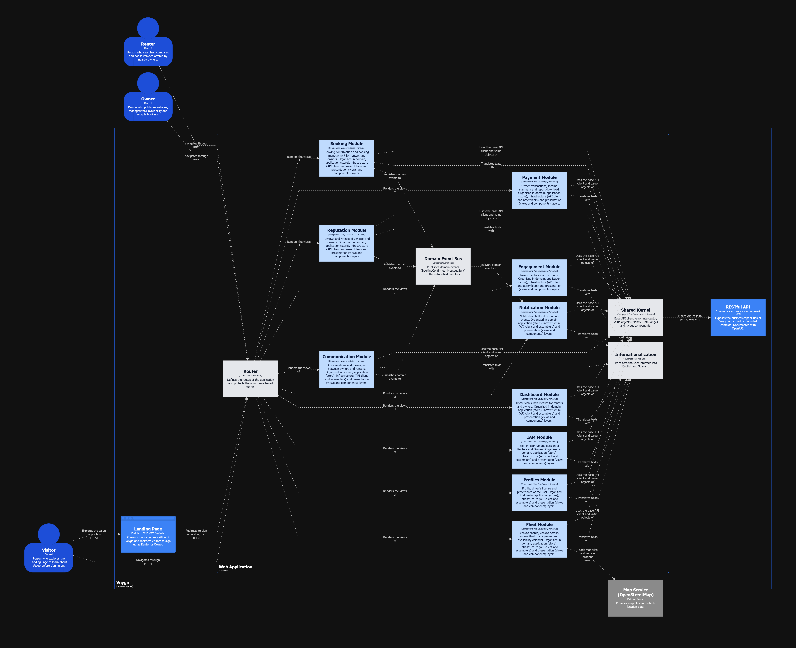

La Web Application, desarrollada con Vue, JavaScript y PrimeVue, se organiza en un módulo por bounded context. Cada módulo contiene las capas domain (entidades y value objects), application (store), infrastructure (API client y assemblers) y presentation (views y components).

| Componente | Tecnología | Responsabilidad |
|---|---|---|
| **Router** | Vue Router | Define las rutas de la aplicación y las protege según el rol del usuario (Renter u Owner). |
| **Internationalization** | vue-i18n | Traduce la interfaz al inglés (idioma por defecto) y al español. |
| **Shared Kernel** | JavaScript, Axios, PrimeVue | Contiene el cliente base de la API con su interceptor de errores, los value objects compartidos y los componentes de layout. Es el único componente que se comunica con la RESTful API. |
| **Domain Event Bus** | JavaScript | Publica los eventos de dominio de la interfaz para que el módulo de notificaciones reaccione a ellos. |
| **IAM, Profiles, Fleet, Booking, Payment, Reputation, Engagement, Communication, Notification y Dashboard Modules** | Vue, JavaScript, PrimeVue | Implementan las vistas y casos de uso de cada bounded context. El módulo Fleet obtiene además los mapas del Map Service (OpenStreetMap). |

##### RESTful API Component Diagrams

La RESTful API, desarrollada con ASP.NET Core, C# y Entity Framework Core, se presenta en un diagrama de componentes compartidos y un diagrama por bounded context, para que cada uno se pueda leer con claridad.

**Componentes compartidos**

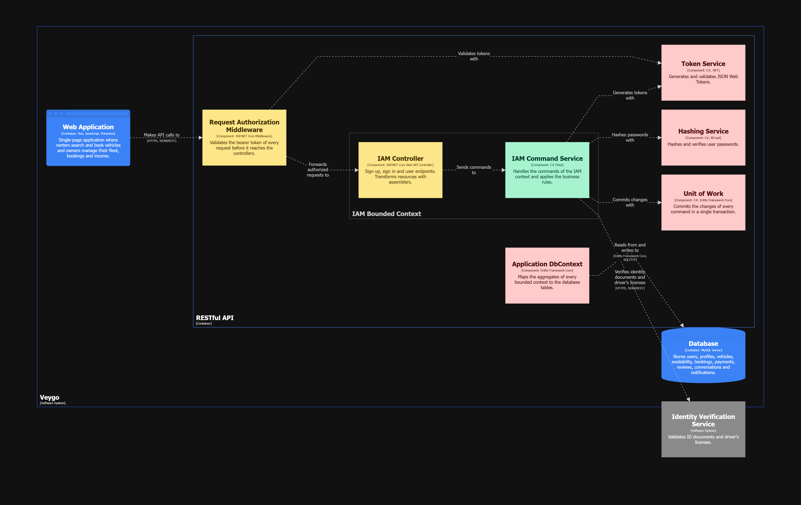

| Componente | Capa | Tecnología | Responsabilidad |
|---|---|---|---|
| **Request Authorization Middleware** | Interfaces | ASP.NET Core Middleware | Valida el token de cada petición antes de que llegue a los controllers. |
| **Token Service** | Infrastructure | C#, JWT | Genera y valida los JSON Web Tokens. |
| **Hashing Service** | Infrastructure | C#, BCrypt | Cifra y verifica las contraseñas de los usuarios. |
| **Unit of Work** | Infrastructure | C#, Entity Framework Core | Confirma los cambios de cada command en una sola transacción. |
| **Application DbContext** | Infrastructure | Entity Framework Core | Mapea los aggregates de todos los bounded contexts a las tablas de la base de datos. |

Cada bounded context de la API contiene los siguientes componentes:

| Componente | Capa | Tecnología | Responsabilidad |
|---|---|---|---|
| **Controller** | Interfaces | ASP.NET Core Web API Controller | Expone los endpoints REST del contexto y transforma los resources mediante assemblers. |
| **Command Service** | Application | C# Class | Atiende los commands del contexto y aplica las reglas de negocio. |
| **Query Service** | Application | C# Class | Atiende las consultas del contexto. |
| **Event Handler** | Application | C# Class | Reacciona a eventos de dominio de otros contextos (solo en Fleet, Payment y Notification). |
| **Domain Model** | Domain | C# Classes | Contiene los aggregates, entities, value objects, eventos de dominio e interfaces de repositorio. |
| **Repository** | Infrastructure | C#, Entity Framework Core | Implementa las interfaces de repositorio del dominio. |

**IAM Bounded Context**

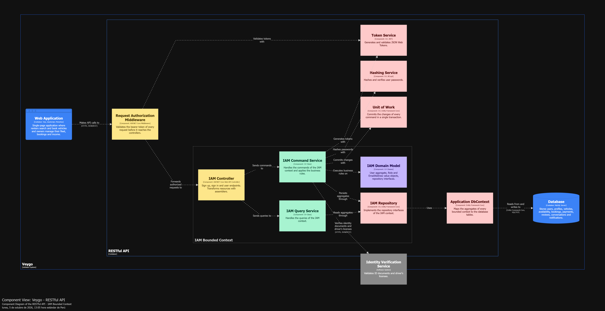

Gestiona el registro, el inicio de sesión y la verificación de identidad. El IAM Command Service usa el Token Service y el Hashing Service, y valida los documentos con el Identity Verification Service.

**Profiles Bounded Context**

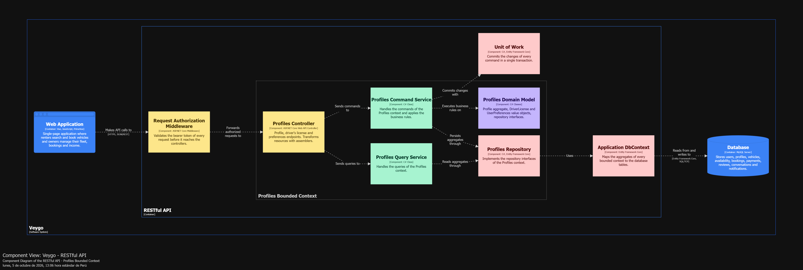

Gestiona los datos personales, la licencia de conducir y las preferencias del usuario.

**Fleet Bounded Context**

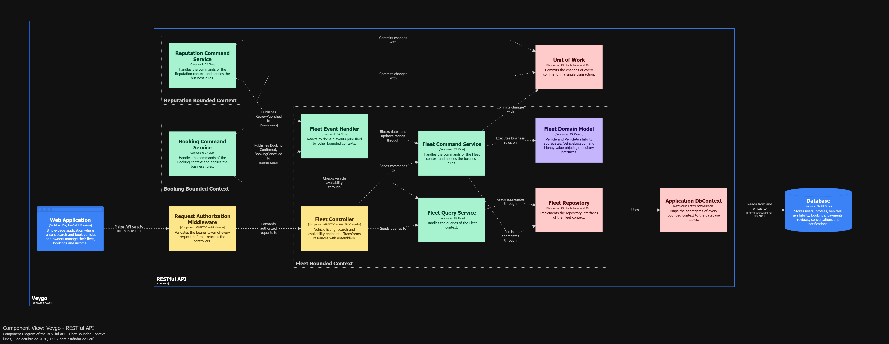

Gestiona el registro, la publicación y la disponibilidad de los vehículos. Su Event Handler bloquea o libera fechas ante los eventos de Booking y actualiza la calificación del vehículo ante `ReviewPublished`.

**Booking Bounded Context**

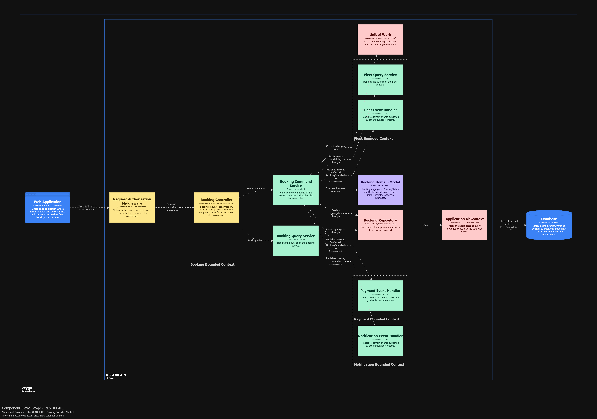

Gestiona el ciclo de vida de la reserva. Antes de aceptar una solicitud, consulta la disponibilidad del vehículo en Fleet, y al confirmar o cancelar una reserva publica eventos de dominio hacia Fleet, Payment y Notification.

**Payment Bounded Context**

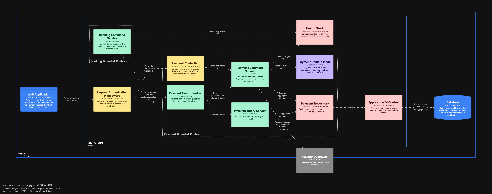

Gestiona los pagos, los reembolsos y las transacciones del Owner. Su Event Handler procesa el pago al confirmarse una reserva y el reembolso al cancelarse, a través del Payment Gateway.

**Reputation Bounded Context**

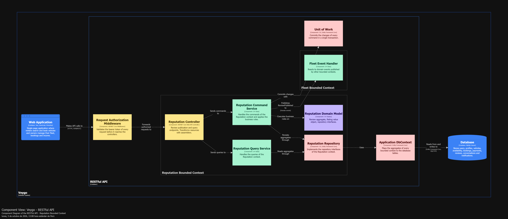

Gestiona las reseñas y calificaciones, y publica `ReviewPublished` para que Fleet actualice la calificación del vehículo.

**Engagement Bounded Context**

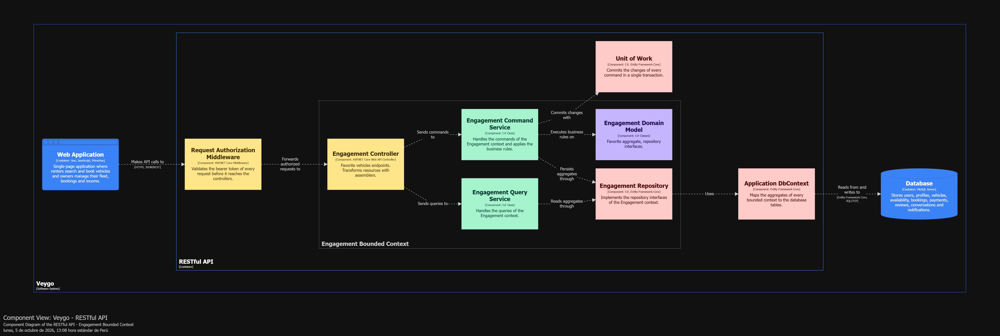

Gestiona los vehículos favoritos del Renter.

**Communication Bounded Context**

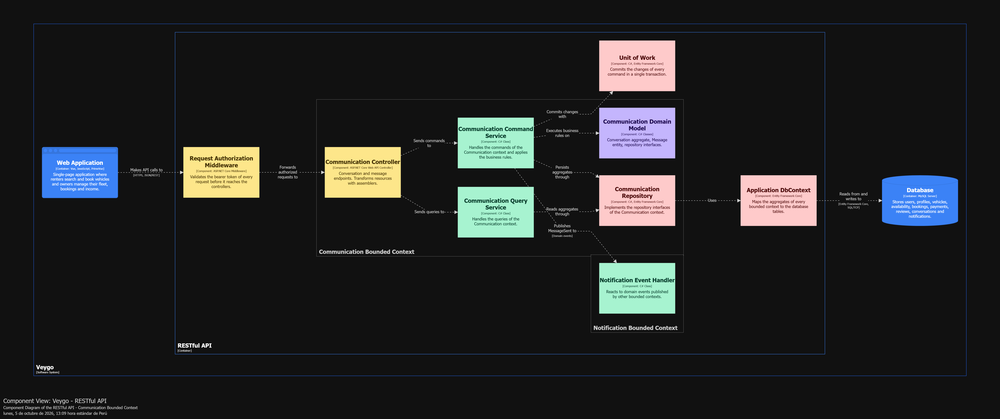

Gestiona las conversaciones y los mensajes entre Owner y Renter, y publica `MessageSent` para notificar al destinatario.

**Notification Bounded Context**

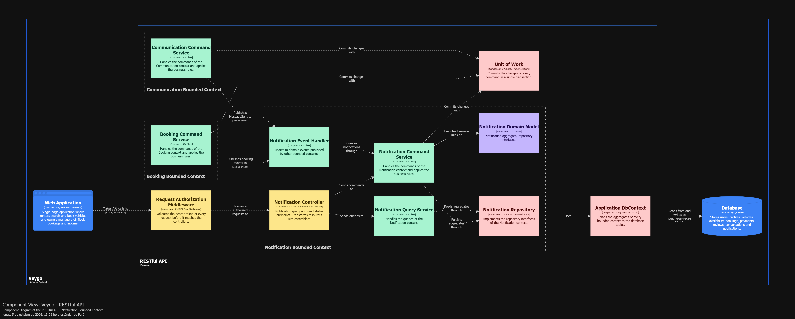

Genera las notificaciones de los usuarios a partir de los eventos de dominio de Booking y Communication.

**Dashboard Bounded Context**

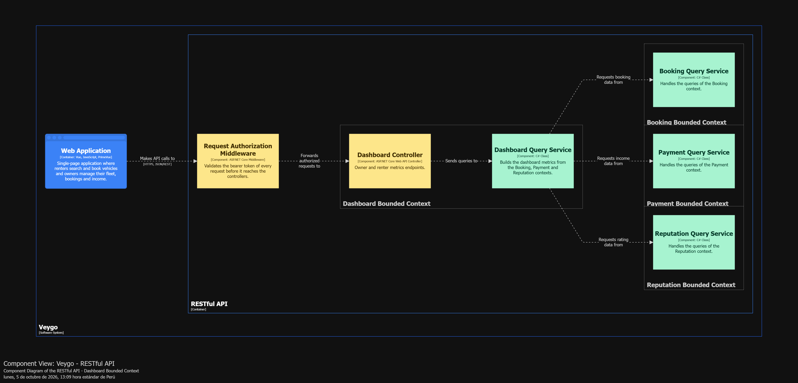

Construye las métricas del Owner y del Renter consultando los Query Services de Booking, Payment y Reputation, sin almacenar información propia.


### 4.7. Software Object-Oriented Design

### 4.7. Software Object-Oriented Design

En esta sección se presenta el diseño orientado a objetos de Veygo con mayor nivel de detalle sobre la implementación de los componentes de cada bounded context. Los diagramas parten del modelo obtenido en el Design-Level EventStorming (sección 4.6.1) y de los Component Diagrams de la RESTful API (sección 4.6.4), por lo que mantienen los mismos nombres de aggregates, commands, eventos y servicios.

Las principales características consideradas en los diagramas son:

- **Nomenclatura en inglés**, de acuerdo con el Ubiquitous Language (sección 2.5) y las convenciones de codificación del proyecto.
- **Tactical Design de Domain-Driven Design**: cada clase indica su rol mediante un estereotipo: `<<Aggregate Root>>`, `<<Entity>>`, `<<Value Object>>`, `<<Domain Event>>`, `<<Specification>>`, `<<enumeration>>` e `<<interface>>`.
- **Encapsulamiento**: los atributos son privados (`-`) y solo se modifican mediante métodos públicos (`+`) que validan las reglas de negocio. Los métodos internos de validación son privados (`-`) y los métodos para las clases derivadas son protegidos (`#`).
- **Patrones de diseño**: Repository (interfaces `I...Repository` que extienden `IBaseRepository<TEntity>`), Unit of Work, CQRS (interfaces `I...CommandService` e `I...QueryService`), Factory Method (`Booking.Request`), Specification (`VehicleSearchCriteria`), Domain Events (Observer) y Facade como Anti-Corruption Layer entre bounded contexts (`IFleetContextFacade`).
- **Relaciones** con nombre, dirección y multiplicidad. Se utiliza composición (rombo relleno) para los value objects y entidades que forman parte de un aggregate, herencia para las clases base y dependencia (línea punteada) para los eventos que publica cada aggregate.

Los diagramas fueron elaborados con Mermaid como Diagram-as-Code.

#### 4.7.1. Class Diagrams

Se presenta un Class Diagram de UML para la RESTful API por cada bounded context, además del Shared Kernel que contiene las clases base reutilizadas por todos los contextos. El bounded context Dashboard no tiene modelo de dominio propio, ya que construye sus métricas consultando los Query Services de Booking, Payment y Reputation.

##### Shared Kernel

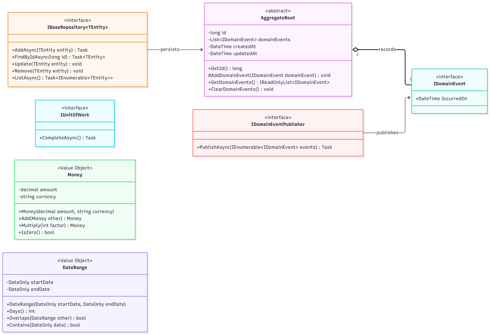

Contiene la clase abstracta `AggregateRoot`, que registra los eventos de dominio de cada aggregate mediante el método protegido `AddDomainEvent`; las interfaces `IBaseRepository<TEntity>`, `IUnitOfWork` e `IDomainEventPublisher`; y los value objects compartidos `Money` y `DateRange`.

##### IAM Bounded Context

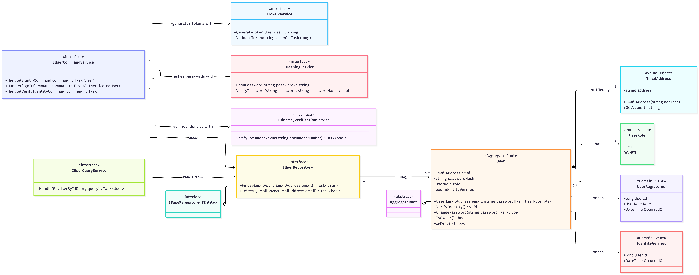

El aggregate `User` se identifica por el value object `EmailAddress` y tiene un `UserRole` (Renter u Owner). El `IUserCommandService` utiliza las interfaces `ITokenService`, `IHashingService` e `IIdentityVerificationService`, cuyas implementaciones pertenecen a la capa de infraestructura.

##### Profiles Bounded Context

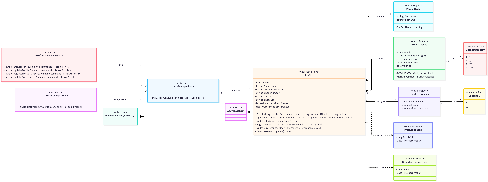

El aggregate `Profile` agrupa los value objects `PersonName`, `DriverLicense` y `UserPreferences`. El método `CanBook` verifica que la licencia de conducir esté verificada y vigente antes de permitir una reserva.

##### Fleet Bounded Context


Contiene dos aggregates. `Vehicle` gestiona la publicación del vehículo, su tarifa diaria (`Money`), su ubicación (`VehicleLocation`) y sus fotos (`VehiclePhoto`). `VehicleAvailability` gestiona los periodos bloqueados (`BlockedPeriod`), ya sea por una reserva o por decisión del Owner. La búsqueda se modela con el patrón Specification mediante `VehicleSearchCriteria`.

##### Booking Bounded Context

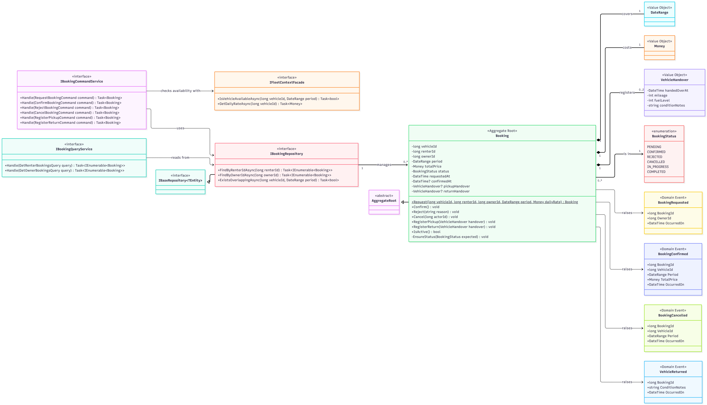

El aggregate `Booking` se crea con el Factory Method estático `Request` y controla su ciclo de vida mediante `BookingStatus`. Cada transición (`Confirm`, `Reject`, `Cancel`, `RegisterPickup`, `RegisterReturn`) valida el estado actual con el método privado `EnsureStatus` y publica el evento de dominio correspondiente. Para no depender del modelo de Fleet, el `IBookingCommandService` consulta la disponibilidad a través de la fachada `IFleetContextFacade`.

##### Payment Bounded Context

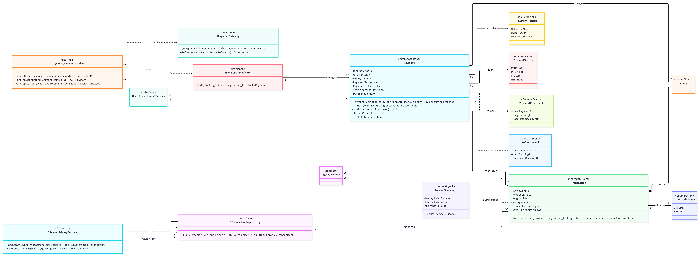

El aggregate `Payment` registra el cobro de una reserva y su posible reembolso, y genera los `Transaction` que conforman los ingresos del Owner. La integración con el sistema externo se abstrae en la interfaz `IPaymentGateway`, y el value object `IncomeSummary` resume los ingresos de un periodo.

##### Reputation Bounded Context

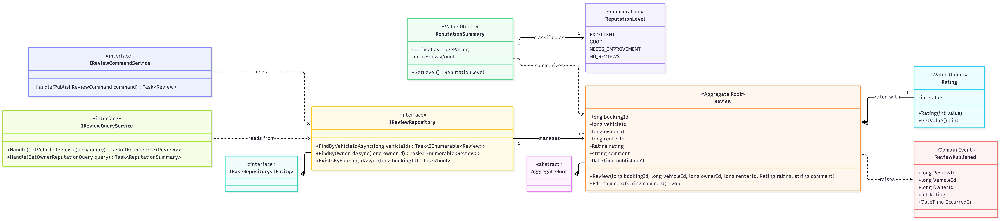

El aggregate `Review` contiene el value object `Rating`, que valida que la calificación esté entre 1 y 5. El value object `ReputationSummary` calcula el `ReputationLevel` del vehículo o del Owner.

##### Engagement Bounded Context

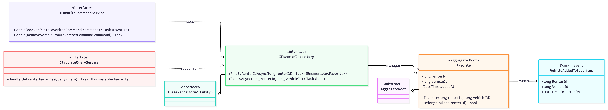

El aggregate `Favorite` relaciona a un Renter con un vehículo guardado como favorito.

##### Communication Bounded Context

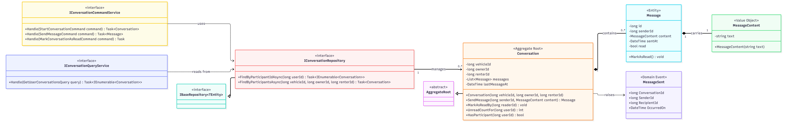

El aggregate `Conversation` contiene los `Message` intercambiados entre el Owner y el Renter de un vehículo, y publica el evento `MessageSent` al enviarse un mensaje.

##### Notification Bounded Context


El aggregate `Notification` se crea a partir de los eventos de dominio de otros contextos. Las clases `BookingEventsHandler` y `MessageSentHandler` implementan la interfaz `IDomainEventHandler<TEvent>` y utilizan el `INotificationCommandService` para generar las notificaciones.


### 4.8. Database Design

Para la persistencia de la información de Veygo se eligió una base de datos relacional implementada en **MySQL Server**, a la que la RESTful API accede mediante **Entity Framework Core**. Esta decisión responde a la naturaleza estructurada y transaccional del dominio: reservas que no deben cruzarse, pagos asociados a cada reserva y reseñas únicas por alquiler. Estas reglas requieren integridad referencial y consistencia en la información.

Las principales características consideradas en el diseño son:

- **Organización por bounded context**: las tablas se agrupan según los bounded contexts definidos en el Design-Level EventStorming (sección 4.6.1) y corresponden a los aggregates y entidades de los Class Diagrams (sección 4.7.1).
- **Nomenclatura en inglés**: nombres de tablas en plural y columnas en `snake_case`, de acuerdo con las convenciones del proyecto.
- **Claves primarias** `id` de tipo `BIGINT AUTO_INCREMENT` en todas las tablas, y **claves foráneas** con el formato `<entidad>_id`.
- **Constraints**: `NOT NULL` en los campos obligatorios, `UNIQUE` para los valores que no pueden repetirse (por ejemplo, `email`, `plate` o una sola reseña por reserva), `CHECK` para las reglas de negocio simples (calificación entre 1 y 5, fecha de fin posterior a la fecha de inicio) y `ENUM` para los estados y tipos definidos en el dominio.
- **Value Objects como columnas**: los value objects del dominio (`Money`, `DateRange`, `VehicleLocation`, `DriverLicense`, `UserPreferences`) se almacenan como columnas de la tabla de su aggregate mediante owned entities de Entity Framework Core. Por ejemplo, `Money` se guarda como `daily_rate_amount` y `daily_rate_currency`.
- **Columnas de auditoría** `created_at` y `updated_at` en las tablas de los aggregates.

Los diagramas fueron elaborados con Mermaid como Diagram-as-Code.

#### 4.8.1. Database Diagrams

Se presenta un Database Diagram por cada bounded context. En cada diagrama, las tablas que pertenecen a otro bounded context se muestran solo con su clave primaria, para evidenciar las relaciones sin repetir su estructura completa. Al final se incluye un diagrama general con las claves de todas las tablas.

##### IAM Bounded Context

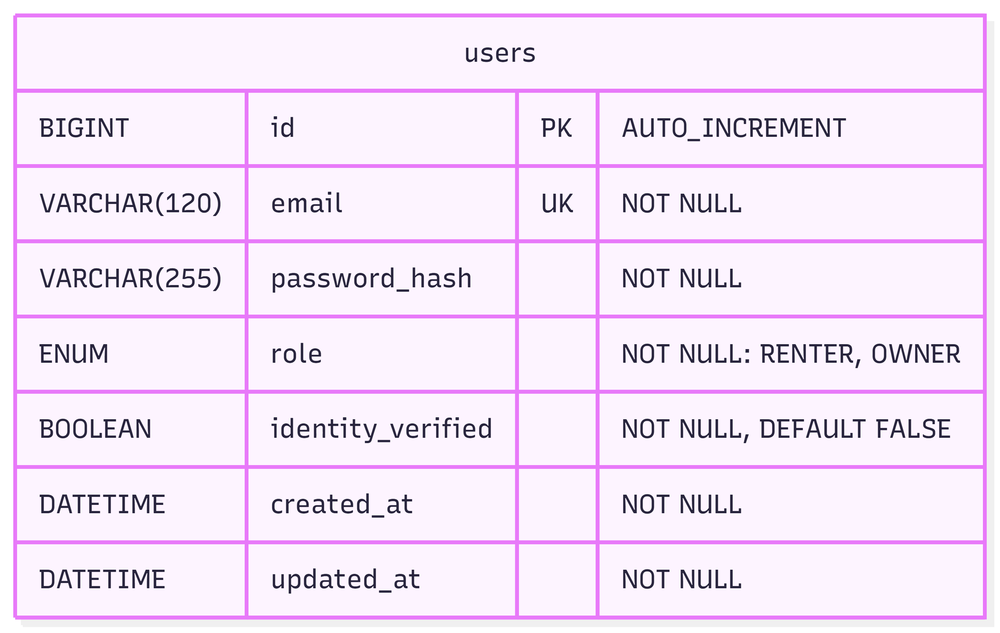

La tabla `users` almacena las credenciales y el rol de cada usuario. El correo electrónico es único y la contraseña se guarda cifrada en `password_hash`.

##### Profiles Bounded Context

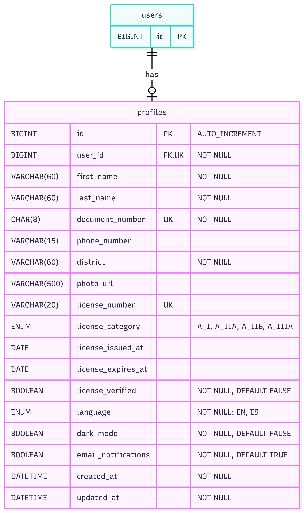

La tabla `profiles` tiene una relación uno a uno con `users` (`user_id` es único) y almacena los datos personales, la licencia de conducir y las preferencias del usuario. El número de documento y el de licencia son únicos.

##### Fleet Bounded Context

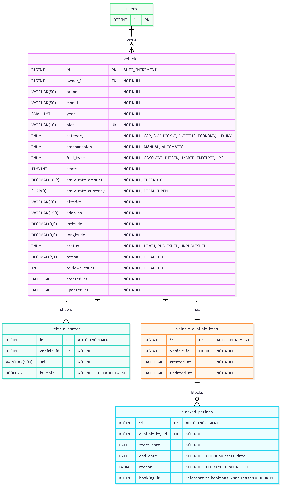

La tabla `vehicles` pertenece a un Owner (`owner_id`) y tiene una placa única. Sus fotos se almacenan en `vehicle_photos`. La disponibilidad se gestiona en `vehicle_availabilities` (una por vehículo) y en `blocked_periods`, que registra los periodos bloqueados por una reserva o por decisión del Owner.

##### Booking Bounded Context

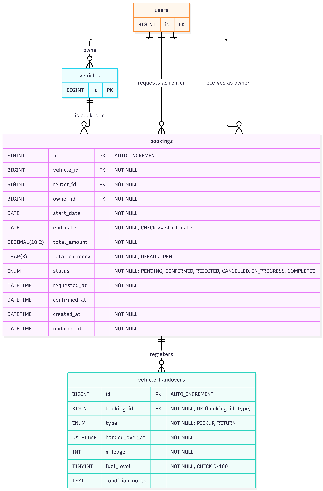

La tabla `bookings` relaciona un vehículo con su Renter y su Owner, almacena el periodo de alquiler y el total, y controla el estado de la reserva. La tabla `vehicle_handovers` registra la entrega y la devolución del vehículo, con una sola fila por tipo y reserva.

##### Payment Bounded Context

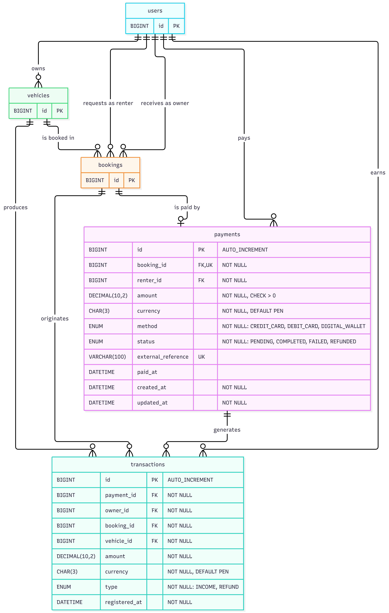

La tabla `payments` registra un único pago por reserva y su referencia en la pasarela de pagos. La tabla `transactions` almacena los ingresos y reembolsos del Owner por vehículo y reserva, y sirve de base para el reporte de transacciones.

##### Reputation Bounded Context

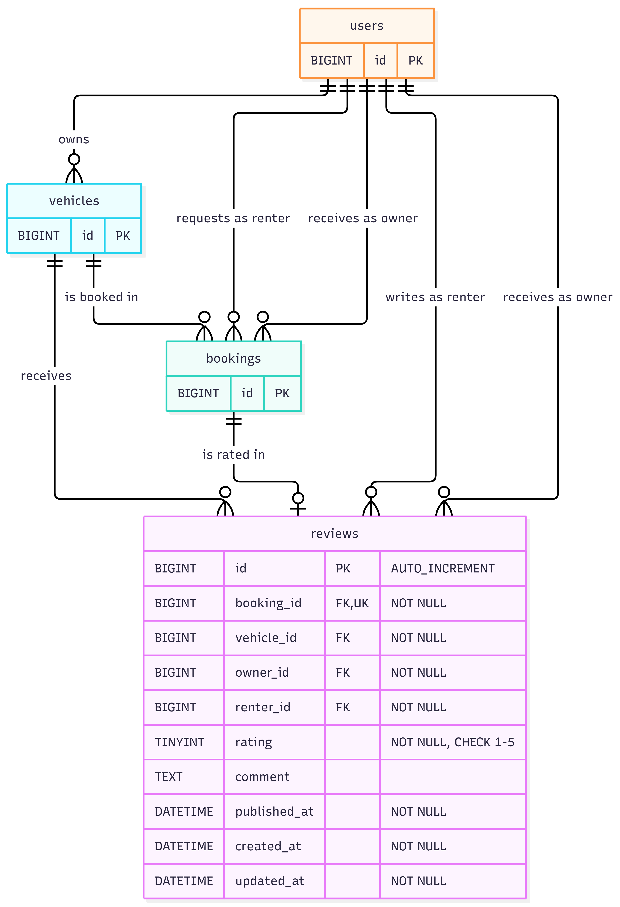

La tabla `reviews` permite una sola reseña por reserva (`booking_id` es único) y restringe la calificación a valores entre 1 y 5.

##### Engagement Bounded Context

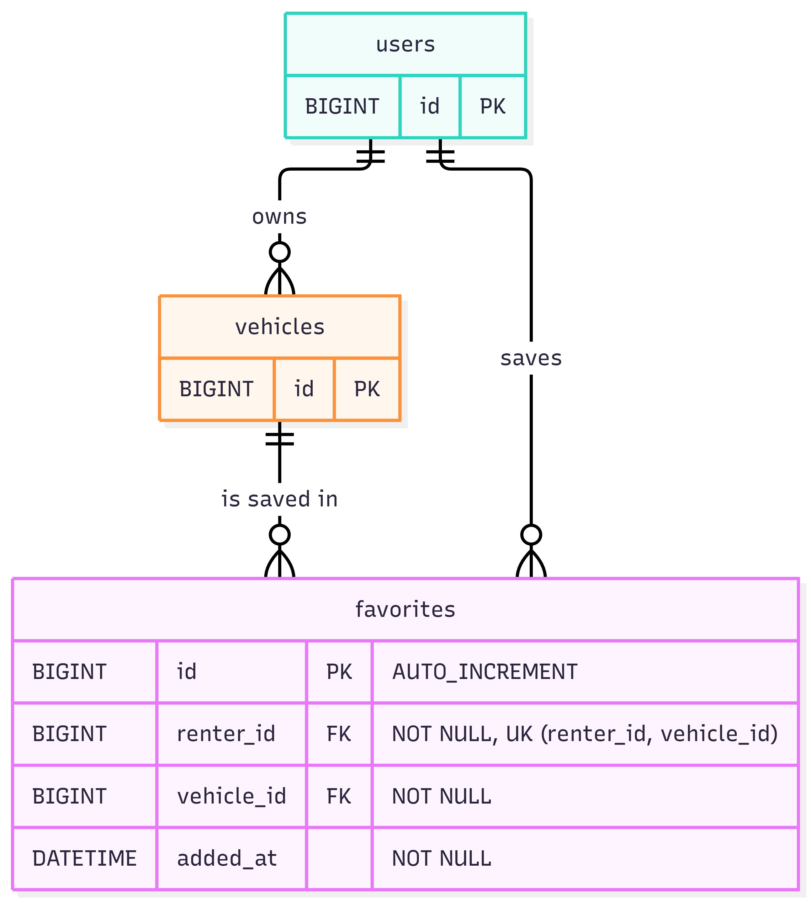

La tabla `favorites` relaciona un Renter con un vehículo, sin permitir duplicados para el mismo par `(renter_id, vehicle_id)`.

##### Communication Bounded Context

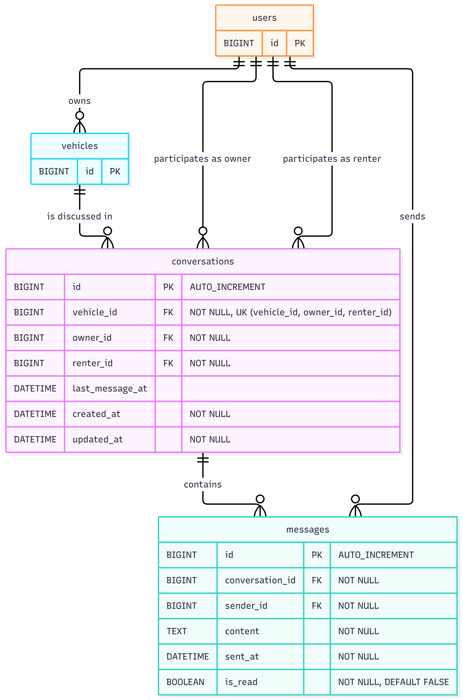

La tabla `conversations` agrupa los mensajes entre el Owner y el Renter de un vehículo, con una sola conversación por combinación de vehículo y participantes. La tabla `messages` almacena el contenido, el remitente y el estado de lectura.

##### Notification Bounded Context

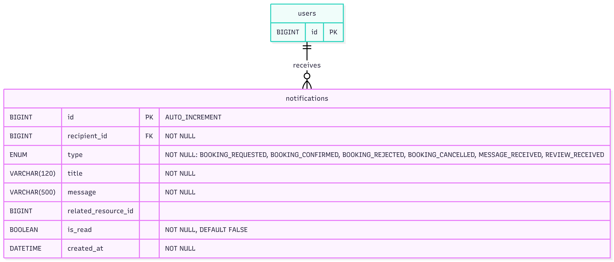

La tabla `notifications` almacena los avisos generados a partir de los eventos de dominio, con su tipo, el recurso relacionado y el estado de lectura.

##### Diagrama general

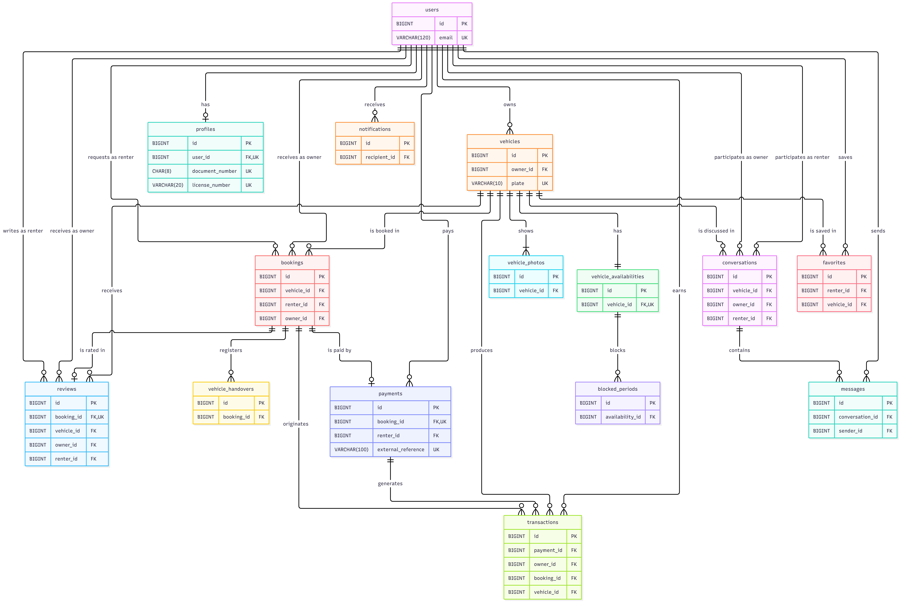

El diagrama general muestra las claves primarias, foráneas y únicas de las 17 tablas de Veygo, y evidencia cómo se relacionan los bounded contexts a nivel de persistencia.
