# Capítulo V: Product Implementation, Validation & Deployment.

## 5.1. Software Configuration Management.

Software Configuration Management (SCM), es un conjunto de actividades y procesos que tiene como objetivo organizar y supervisar los cambios que se realizan en el software durante su desarrollo, usaremos esto para garantizar que nuestro producto se mantenga consistente, funcional y confiable, a medida que evoluciona con el tiempo. 

### 5.1.1. Software Development Environment Configuration.

En esta sección pasamos a referenciar los productos de software que usamos como equipo para colaborar en la realización de este proyecto, considerando actividades como Project Management, Requirement Management, Product UX/UI Design, Software Development, Software Testing y Software Documentation.


<h4>Project Management: </h4>

Los productos de software que usamos aquí, nos ayudó como equipo a gestionar tareas, tiempos, recursos y comunicación.

- **Whatsapp:** Es una aplicación de mensajería ampliamente utilizada para la comunicación rápida y eficaz. Permite a los usuarios compartir mensajes de texto, fotos, videos, enlaces, videollamadas y documentos. Usamos sus funciones para mantenernos en contacto a través de un grupo privado donde coordinamos avances, compartimos archivos y enlaces. Además, establecíamos fechas límite y organizamos el cumplimiento de metas mediante una comunicación constante, lo que permitió un mejor seguimiento del progreso del equipo.

- **Discord:** Es una aplicación de mensajería que permite comunicarse mediante canales de voz y texto. La utilizamos para realizar reuniones cortas y aclarar dudas en tiempo real mediante llamadas de voz. También aprovechamos su función de recordatorios y notificaciones para mantener un control adecuado del tiempo y asegurar el cumplimiento de las tareas asignadas.

<h4>Requirement Management:</h4>

Las herramientas que vamos a especificar ahora, nos ayudaron a documentar, rastrear y verificar que cada requisito está implementado correctamente.

- **Git:** Es un sistema de control de versiones que se utiliza para rastrear los cambios en el código fuente durante el desarrollo de software. Permite a los desarrolladores trabajar en el mismo proyecto simultáneamente, facilitando la colaboración al permitirles crear, fusionar y gestionar diferentes versiones del código de manera eficiente. Funciona tomando instantáneas de los archivos cada vez que se confirma un cambio, almacenando un historial completo y seguro de todas las modificaciones. Lo usamos para registrar los cambios realizados del código dentro de github.

<h4>Product UX/UI Design: </h4>

Acá usamos una herramienta que nos permite diseñar pantallas, prototipos interactivos y flujos de navegación.

- **Figma:** Es una plataforma de diseño de interfaces que permite crear prototipos interactivos de forma colaborativa. Con esta herramienta diseñamos las pantallas de nuestro producto, tanto en su versión desktop como mobile, asegurando una experiencia de usuario clara, moderna y funcional. Además, nos permitió trabajar en equipo en tiempo real y compartir avances con facilidad.

<h4>Software Development:</h4>

Esta es la etapa donde vamos a especificar las herramientas que usamos para programar.

- **Visual Studio Code:** Es un editor de código fuente desarrollado por Microsoft que soporta múltiples lenguajes de programación. Lo empleamos para desarrollar el código del proyecto utilizando tecnologías como HTML y CSS.

- **GitHub:** Es una plataforma de alojamiento de repositorios basada en Git, que permite gestionar versiones del código y colaborar entre desarrolladores de manera organizada. La empleamos para almacenar nuestro proyecto en un repositorio remoto, realizar control de versiones y sincronizar los cambios realizados por cada integrante del equipo. Además, facilitó la revisión de código, la creación de ramas de desarrollo y la integración continua del producto.

<h4>Software Testing:</h4>

La herramienta que usamos para verificar que nuestro prototipo se vea correctamente.

- **Chrome:** Utilizamos el navegador Chrome para realizar las pruebas de visualización y comportamiento del prototipo, verificando su correcto funcionamiento en distintos tamaños de pantalla y su compatibilidad con los lenguajes de desarrollo implementados (HTML y CSS).

<h4>Software Documentation:</h4>

La herramienta especificada acá, nos permitió organizar, escribir y compartir la información del proyecto

- **.MD:** Un archivo con la extensión .md es un archivo de texto plano que utiliza el lenguaje de marcado Markdown, diseñado para ser legible y fácil de escribir. Usamos esta extensión para guardar documentación dentro del código.

### 5.1.2. Source Code Management. 

Para la gestión del código fuente del proyecto, el equipo utilizará Git como sistema de control de versiones distribuido, y GitHub como plataforma central de colaboración. Esto permitirá mantener un historial completo de los cambios realizados, facilitar el trabajo colaborativo entre los integrantes del equipo y asegurar la trazabilidad de todas las versiones del software.

<h4>Repositorios en Github</h4>

**Landing Page:** Repositorio público para la página de presentación del producto
https://github.com/1ASI0729-2620-4399-G3-Veygo/landing-Page

**Acceptance Test:** Repositorio en el que se encuentran los archivos (.feature) en formato Gherkin.
https://github.com/1ASI0729-2620-4399-G3-Veygo/Veygo-AcceptanceTests

<h4>Implementación de Gitflow</h4>
El equipo adoptará el modelo de ramificación GitFlow, propuesto por Vincent Driessen, como flujo de trabajo estándar para el control de versiones.

<h4>Ramas principales</h4>

_main_: Contiene el código estable y listo para producción. Cada commit en esta rama representa una versión liberada del proyecto.
_develop_: Contiene el código con las últimas funcionalidades integradas, en preparación para la siguiente versión estable.  Es la base sobre la que se crean nuevas ramas de características (features).

<h4>Ramas de soporte</h4>
Además de las dos ramas principales, se implementarán las siguientes ramas temporales:

- Feature branches: Su propósito será desarrollar nuevas funcionalidades o mejoras.
- Release branches: Es para denominar una nueva versión estable del proyecto.
- Hotfix branches: Aca corregiremos errores críticos detectados en producción.

<h4>Semantic Versioning</h4>

_Aplicaremos Semantic Versioning 2.0.0_ para etiquetar las versiones del proyecto, con este formato:
**MAJOR.MINOR.PATCH**, siendo “MAJOR” un cambio incompatible con versiones anteriores, “MINOR” un agregado de nuevas funcionalidades y “PATCH” una corrección o mejoras sin afectar su compatibilidad.

- Ejemplo: v1.0.0 (primera versión), v1,1,0 (funcionalidad agregada) y v1.1.1 (corrección menor).

<h4>Conventional Commits</h4>

A partir de la segunda actualización (porque la primera llevará el nombre de “base”), los mensajes commit seguirán la especificación Conventional Commits, con el formato:  **tipo(especificación):descripción**
los tipos podrian ser: **feat** (nueva funcionalidad), **fix** (corrección de una parte del código), **docs**(cambios en la documentación), **style**(ajuste de formato), **refactor**(cambios en el codigo que no modifiquen la apariencia ni el comportamiento), **test** (modificación de prueba) y **chore** (tareas de mantenimiento o configuración)

- Ejemplo: feat(formulario): se agrego una validación al correo electrónico, fix(navbar): se corrigio error en la alineación, docs(README):se actualizo instrucciones.

<h4>Flujo general de trabajo</h4>

- Cada integrante clona el repositorio y crea su propia rama feature/ para trabajar en una nueva tarea.
- Cuando termina, se realiza un merge hacia develop mediante pull request.
Una vez integradas todas las funcionalidades planificadas, se crea una rama release/ para pruebas finales.
- Si la versión es aprobada, se fusiona a main, se etiqueta con su número de versión y se elimina la rama release/.
- En caso de detectar errores en producción, se genera una rama hotfix/ para resolverlos rápidamente.

### 5.1.3. Source Code Style Guide & Conventions. 

En esta sección se detallan las convenciones de estilo y las estructuras empleadas en el desarrollo del sitio web, abarcando los lenguajes HTML, CSS, JavaScript y Gherkin. Estas normas fueron adoptadas con el propósito de mantener un código limpio, organizado y fácilmente mantenible por todos los integrantes del equipo.

<h4> Convenciones HTML </h4>

- **Estructura semántica:** se utilizan etiquetas semánticas de HTML5 (`header`, `nav`, `main`, `section`, `article`, `footer`) en lugar de `div` genéricos, de modo que cada bloque de la página refleje su función dentro del documento.
- **Indentación:** 4 espacios por nivel de anidamiento, sin uso de tabulaciones.
- **Nomenclatura de atributos `id` y `class`:**
  - Los `id` se escriben en `camelCase` (`searchForm`, `formMessage`, `languageBtn`), ya que se utilizan como ganchos (*hooks*) para el JavaScript.
  - Las `class` se escriben en `kebab-case` (`segment-card`, `hero-copy`, `btn-primary`), siguiendo un patrón similar a BEM para variantes (`segment-card.owner` como modificador de `segment-card`).
- **Comentarios de sección:** cada bloque principal de la landing (`HERO`, `SEGMENTOS`, `CATEGORÍAS`, `TESTIMONIOS`, `CTA FINAL`, `FOOTER`) se delimita con un comentario HTML en mayúsculas, lo que facilita la navegación dentro del archivo:
```html
  <!-- HERO -->
  <section class="hero section" id="inicio">
    ...
  </section>
```
- **Espaciado entre bloques:** se deja una línea en blanco entre elementos hijos y dos líneas en blanco entre secciones distintas, priorizando la legibilidad sobre la compacidad del archivo.
- **Anclas de navegación:** los enlaces internos usan fragmentos (`#inicio`, `#buscar`, `#registro`) que coinciden exactamente con el `id` de la sección referenciada.
- **Internacionalización (i18n):** todo texto visible que deba traducirse incorpora un atributo `data-i18n` (o su variante) con una clave descriptiva en `snake_case`, que es resuelta en tiempo de ejecución por `script.js`:
  - `data-i18n` → contenido de texto plano.
  - `data-i18n-html` → contenido que admite HTML embebido (p. ej. saltos de línea o `span` con estilos).
  - `data-i18n-placeholder` → atributo `placeholder` de un `input`.
  - `data-i18n-aria` → atributo `aria-label`, para mantener la accesibilidad también traducida.
- **Accesibilidad:** toda etiqueta `img` incluye un atributo `alt` descriptivo; los controles interactivos que no tienen texto visible (como el botón de flecha `arrow-btn`) llevan `aria-label` mediante `data-i18n-aria`.

<h4> Convenciones CSS </h4>

- **Variables globales:** los colores, sombras y valores reutilizables se centralizan como propiedades personalizadas dentro de `:root`, con nombres en `kebab-case` prefijados con `--` (`--blue`, `--blue-dark`, `--muted`, `--shadow`). Esto evita valores "mágicos" repetidos y facilita el mantenimiento de la identidad visual de Veygo.
```css
  :root{
    --blue:#1464f4;
    --blue-dark:#0e1b45;
    --text:#17213d;
    --shadow:0 8px 28px rgba(22,39,76,.08);
  }
```
- **Reset base:** al inicio del archivo se normalizan márgenes, rellenos y `box-sizing` con un selector universal (`*{box-sizing:border-box;margin:0;padding:0}`), garantizando un comportamiento consistente entre navegadores.
- **Nomenclatura de clases:** `kebab-case` en todos los selectores (`.hero-copy`, `.segment-card`, `.final-cta-image`), evitando IDs para aplicar estilos (los `id` se reservan exclusivamente para JavaScript).
- **Estilo de escritura de reglas:** se combinan dos formatos según la complejidad del componente:
  - **Compacto en una sola línea** para reglas simples o utilitarias (`.brand{display:flex;align-items:center;gap:7px;...}`), priorizando la densidad del archivo.
  - **Expandido en múltiples líneas** para componentes con más propiedades o que requieren mayor claridad visual (`.process-item`, `.final-cta`), separando propiedades relacionadas con líneas en blanco.
- **Enfoque responsive:** el diseño es *desktop-first*; las adaptaciones a pantallas menores se definen con `@media (max-width: 900px)` y `@media (max-width: 600px)`, agrupando todas las reglas de un mismo breakpoint en un solo bloque al final de la hoja de estilos.
- **Medidas fluidas:** los anchos de sección se calculan con funciones modernas de CSS (`width:min(1400px,calc(100% - 80px))`) para adaptarse tanto a pantallas grandes como pequeñas sin necesidad de múltiples reglas fijas.
- **Comentarios:** se usan comentarios breves en mayúsculas para marcar subsecciones dentro de bloques largos (p. ej. `/* REDES */`, `/* PARTE INFERIOR */` dentro del `footer`).

<h4> Convenciones JavaScript </h4>

- **Organización por archivos:** la lógica de interacción se separa de los datos de traducción. `script.js` contiene únicamente comportamiento (eventos, validaciones, scroll), mientras que `language/es.js` y `language/en.js` exponen diccionarios de traducción como constantes globales (`translationsES`, `translationsEN`), cargados antes de `script.js` en el HTML.
- **Nomenclatura de variables y funciones:** `camelCase` para variables y funciones (`languageBtn`, `currentLanguage`, `cambiarIdioma`); las funciones con impacto directo en la interfaz se nombran en español, en línea con el resto del código orientado a negocio.
- **Diccionarios de traducción:** las claves de `translationsES` / `translationsEN` se agrupan por sección de la landing y se preceden de un comentario en mayúsculas (`// NAVBAR`, `// HERO`, `// SEGMENTOS`), replicando el mismo criterio de organización usado en el HTML y el CSS:
```javascript
  const translationsES = {

      // NAVBAR
      nav_home: "Inicio",
      nav_login: "Iniciar sesión",

      // HERO
      hero_badge: "✦ La nueva era de movilidad en Lima Metropolitana",
      hero_title: 'Encuentra el vehículo<br>que necesitas.',
  };
```
- **Selección de elementos del DOM:** se privilegia `document.getElementById` para elementos únicos referenciados por `id` (formularios, botones, contenedores) y `document.querySelectorAll` para colecciones de elementos que comparten una `class` o un atributo `data-*` (`.segment-card`, `[data-i18n]`).
- **Manejo de eventos:** los listeners se agregan con `addEventListener`, usando funciones flecha para callbacks cortos; cuando el evento no debe propagarse a manejadores externos (p. ej. el menú de idioma), se invoca explícitamente `event.stopPropagation()`.
- **Persistencia simple:** las preferencias del usuario que deben sobrevivir a un recargo de página (idioma seleccionado) se guardan en `localStorage` bajo una clave con prefijo del proyecto (`veygoLanguage`), evitando colisiones con otras claves genéricas.
- **Validaciones de formulario:** se realizan en el cliente antes de cualquier envío, mostrando el mensaje de error o éxito en un contenedor dedicado (`#formMessage`) en lugar de usar `alert()`, salvo en acciones de demostración explícitamente marcadas como tales.

<h4> Convenciones Gherkin </h4>

- **Organización de archivos:** cada historia de usuario se traduce en un archivo `.feature` independiente, nombrado con el patrón `USxx_titulo-de-la-historia.feature` (por ejemplo, `US15_publicacion_de_nuevo_vehiculo.feature`), lo que permite ubicar rápidamente el escenario correspondiente a cada historia.
- **Etiquetado (`tags`):** todo `Feature` incluye etiquetas `@USxx` y `@EP-xx` en la línea superior, para poder filtrar la ejecución de pruebas por historia individual o por épica completa (`cucumber --tags "@EP-07"`).
- **Estructura del encabezado:** cada `Feature` describe el objetivo de negocio siguiendo el formato "Como / quiero / para", manteniendo la trazabilidad directa con la historia de usuario original.
```gherkin
  @US17 @EP-07
  Feature: Solicitud de Reserva
    Como cliente
    quiero enviar una solicitud de alquiler
    para iniciar el proceso sin canales informales
```
- **Nomenclatura de escenarios:** los `Scenario` se nombran de forma breve y descriptiva en español, evitando ambigüedad (`Solicitud válida`, `Conflicto de fechas`).
- **Redacción de pasos:** cada paso `Given/When/Then` se redacta en tercera persona y en tiempo presente, distinguiendo dos niveles de lenguaje según el tipo de historia:
  - **Escenarios orientados a usuario final:** lenguaje de negocio, sin detalles técnicos (`Given vehículo disponible en las fechas seleccionadas`).
  - **Escenarios orientados a backend/API:** lenguaje técnico explícito, incluyendo verbo HTTP, ruta y código de respuesta esperado (`Given POST /bookings con fechas disponibles`, `Then el servidor retorna 201 con estado "pending"`).
- **Indentación:** 2 espacios para el encabezado del `Feature`, y 4 espacios para los `Scenario` y sus pasos `Given/When/Then`, manteniendo una jerarquía visual consistente en todo el archivo.
- **Separación de escenarios:** se deja una línea en blanco entre cada `Scenario` dentro de un mismo `Feature`, para facilitar la lectura cuando existen múltiples casos (éxito y error) por historia.

### 5.1.4. Software Deployment Configuration. 

En esta sección, daremos el paso a paso para realizar el deploy de nuestra página dentro de github.

<h4>Deploy con GitHub Pages: </h4>

Primero, nos ubicamos en el repositorio de GitHub de nuestro proyecto “landing-Page”  y nos dirigimos a los ajustes, ubicado en la parte superior en la barra horizontal.

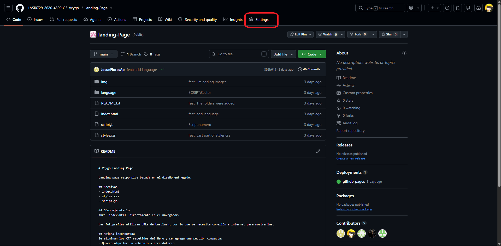

Dentro de ajustes, nos dirigimos a la opción “Pages”  ubicada en la parte izquierda en un menú vertical.

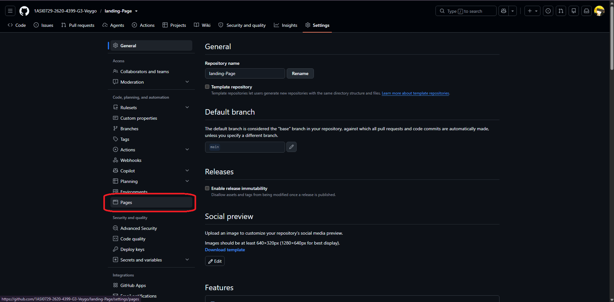

Dentro, buscaras la sección “Branch”  donde encontraras un boton, el cual tiene por defecto “None”, entonces, seleccionamos el botón desplegable y eliges la opción “main”, posteriormente presionamos el botón “save”, para guardar los cambios y tenga efecto. 

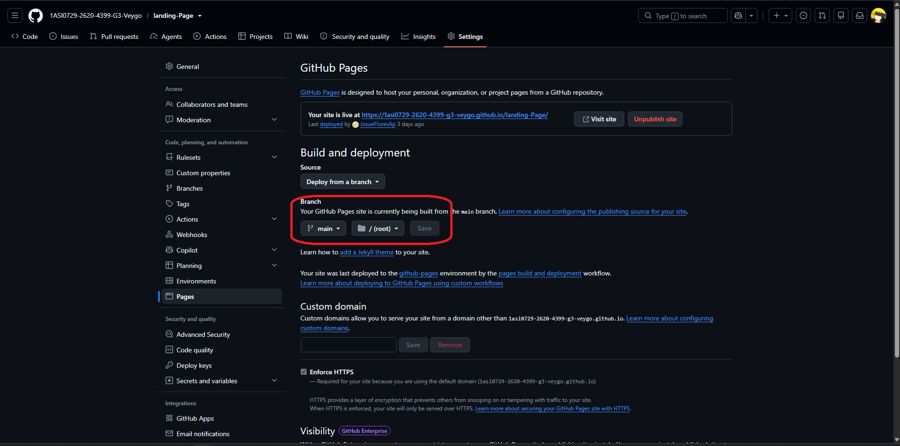

Finalmente, tendrás que refrescar la página

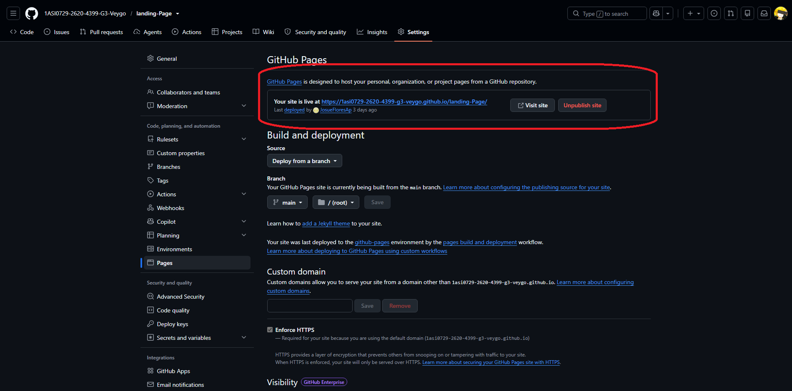

Y con esto, podrás visualizar el link para visitar la página: https://1asi0729-2620-4399-g3-veygo.github.io/landing-Page/


## 5.2. Landing Page, Services & Applications Implementation. 

### 5.2.1. Sprint 1

Para este primer Sprint, el equipo estableció como objetivo principal la implementación y despliegue de la primera versión de la Landing Page del sistema Zyntra.

| ID   | User Story| Epic| Priority |SP |
| :-- | :-- | :-- | :-- | :-- |
| US08 | Navegación Principal y Selector de Idioma| EP-01 | High| 3  |
| US09 | Buscador Rápido de Vehículos| EP-01 | High| 3  |
| US10 | Exploración por Categorías de Propósito| EP-01 | Medium   | 2  |
| US11 | Visualización de Vehículos Destacados| EP-01 | Medium   | 3  |
| US12 | Redirección a Registro según Rol| EP-01 | Medium   | 2  |
| US22 | Sección de Confianza y Seguridad| EP-01 | Medium   | 2  |
| US23 | Sección de Preguntas Frecuentes| EP-01 | Low| 2  |
| US24 | Suscripción a Novedades| EP-01 | Low| 1  |
| US34 | Endpoint de Contenido Optimizado para Landing Page| EP-01 | Medium   | 3  |
| US35 | Endpoint de Recursos de Internacionalización (i18n)| EP-01 | High     | 3  |
| US36 | Endpoint de Registro de Eventos de Conversión| EP-01 | Medium   | 2  |
| | | |**Total Story Points**| **26** |

#### 5.2.1.1. Sprint Planning 1

| Campo | Detalle |
|---|---|
| **Sprint #** | Sprint 1 |
| **Fecha** | 2026-09-09 |
| **Hora** | 05:49 PM |
| **Lugar** | Reunión virtual vía Google Meet |
| **Preparado por** | Josue Antonio Flores Apaico|
| **Asistentes** |Josue Antonio Flores Apaico, Fabrizio Hamet Cano Ortiz, Marlon Alessandro Flores Siguas, Ivonne Beatriz Ibañez Torres y Eddo Su Caletti|
| **Resumen del Review del Sprint 0** | Durante la fase previa (Sprint 0), el equipo definió el backlog completo del producto (36 historias de usuario distribuidas en 9 épicas), redactó los criterios de aceptación en formato Gherkin para cada historia, y desarrolló una primera versión funcional de la landing page (HTML/CSS/JS) con selector de idioma ES/EN, buscador rápido y las secciones principales de valor. Sin embargo, esta versión aún no había sido validada formalmente contra los criterios de aceptación definidos ni conectada a los endpoints de backend planificados. |
| **Resumen de la Retrospectiva del Sprint 0** | El equipo identificó que, si bien se avanzó rápido en la construcción visual de la landing page, faltó verificar que cada sección cumpliera con los criterios de aceptación (Gherkin) de las historias de la épica EP-01, y que el contenido aún no estaba conectado a los endpoints de backend previstos (contenido cacheado, i18n, analítica de conversión). Se acordó que el Sprint 1 se enfocaría exclusivamente en cerrar esa brecha para la landing page antes de avanzar a otros módulos del sistema. |
| **Objetivo del Sprint 1** | Nuestro enfoque está en validar y perfeccionar la primera versión pública de la landing page de Veygo contra sus criterios de aceptación, y conectarla a sus dos endpoints de backend de soporte (contenido cacheado de landing e internacionalización) para que la experiencia sea completamente dinámica en lugar de estática. Consideramos que se entrega un producto listo para demo cuando un visitante puede abrir la landing page, cambiar instantáneamente entre español e inglés, realizar una búsqueda rápida de vehículos, explorar categorías y vehículos destacados, y ser redirigido al flujo de registro correcto (cliente o propietario) — todo esto validado contra los escenarios Gherkin de las historias US08 a US12, US22 a US24 y US34 a US36. Esto se confirmará mediante pruebas manuales end-to-end directamente sobre la URL desplegada de la landing page, verificadas contra los criterios de aceptación definidos en los archivos `.feature` correspondientes. |
| **Velocity del Sprint N** | 30 |
| **Suma de Story Points** | 27 |

#### 5.2.1.2. Aspect Leaders and Collaborators

| Team Member | GitHub Username | Aspecto 1 (Estructura HTML — `index.html`) | Aspecto 2 (Estilos — `styles.css`) | Aspecto 3 (Interactividad — `script.js`) | Aspecto 4 (i18n Español — `es.js`) | Aspecto 5 (i18n Inglés — `en.js`) |
|---|---|---|---|---|---|---|
| **Flores Apaico, Josué Antonio** | **JosueFloresAp** | **L** | C | C | C | C |
| **Su Caletti, Eddo** | **Asalreon520** | C | **L** | C | C | C |
| **Ibañez Torres, Ivonne Beatriz** | **MarlonLasarte** | C | C | **L** | C | C |
| **Cano Ortiz, Fabrizio Hamet** | **Fabrizioco01**| C | C | C | **L** | C |
| **Flores Siguas, Marlon Alessandro** | **MarlonFS965** | C | C | C | C | **L** |

_(Nota: L = Leader, C = Collaborator)_

#### 5.2.1.3. Sprint Backlog 1

El objetivo principal de este Sprint fue implementar y desplegar la primera versión de la Landing Page del sistema Zyntra.

A continuación, se presenta una captura de pantalla del estado actual de nuestro tablero de control para el Sprint 1:

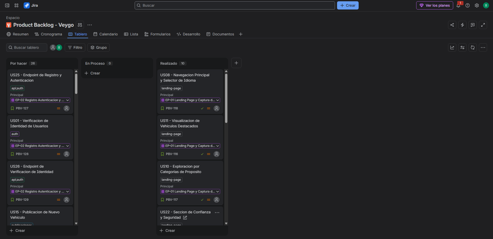

Enlace del Jira: https://ivonneibanez.atlassian.net/jira/software/projects/PBV/boards/3?filter=&groupBy=none

| User Story ID | Título | Description (Task) | Estimation | Assigned To | Status |
|---|---|---|---|---|---|
| **US08** | Navegación Principal y Selector de Idioma | Implementación de la estructura en HTML (navbar y menú de idioma) | 2 hr | Josué | DONE |
| | | Implementación de diseño en CSS (navbar y dropdown de idioma) | 1 hr | Eddo | DONE |
| | | Implementación de la lógica del selector de idioma en JS | 2 hr | Ivonne | DONE |
| | | Implementación del diccionario de traducciones ES | 1 hr | Fabrizio | DONE |
| | | Implementación del diccionario de traducciones EN | 1 hr | Marlon | DONE |
| | | Revisión de funcionalidad y bugs | 1 hr | Josué | DONE |
| **US09** | Buscador Rápido de Vehículos | Implementación de la estructura en HTML (formulario de búsqueda) | 2 hr | Josué | DONE |
| | | Implementación de diseño en CSS (search-box) | 1 hr | Eddo | DONE |
| | | Implementación de la validación del formulario en JS | 2 hr | Ivonne | DONE |
| | | Traducción de textos del buscador (ES) | 0.5 hr | Fabrizio | DONE |
| | | Traducción de textos del buscador (EN) | 0.5 hr | Marlon | DONE |
| | | Revisión de funcionalidad y bugs | 1 hr | Eddo | DONE |
| **US10** | Exploración por Categorías de Propósito | Implementación de la estructura en HTML (category-grid) | 1 hr | Josué | DONE |
| | | Implementación de diseño en CSS (category-card) | 1 hr | Eddo | DONE |
| | | Traducción de categorías (ES) | 0.5 hr | Fabrizio | DONE |
| | | Traducción de categorías (EN) | 0.5 hr | Marlon | DONE |
| | | Revisión de funcionalidad y bugs | 1 hr | Ivonne | DONE |
| **US11** | Visualización de Vehículos Destacados | Implementación de la estructura en HTML (vehicle-grid) | 2 hr | Josué | DONE |
| | | Implementación de diseño en CSS (vehicle-card) | 1 hr | Eddo | DONE |
| | | Traducción de textos de vehículos (ES) | 0.5 hr | Fabrizio | DONE |
| | | Traducción de textos de vehículos (EN) | 0.5 hr | Marlon | DONE |
| | | Revisión de funcionalidad y bugs | 1 hr | Josué | DONE |
| **US12** | Redirección a Registro según Rol | Implementación de la estructura en HTML (segment-card) | 1 hr | Josué | DONE |
| | | Implementación de diseño en CSS (segment-card) | 1 hr | Eddo | DONE |
| | | Implementación de la lógica de redirección en JS | 1 hr | Ivonne | DONE |
| | | Revisión de funcionalidad y bugs | 1 hr | Eddo | DONE |
| **US22** | Sección de Confianza y Seguridad | Implementación de la estructura en HTML (trust-grid) | 1 hr | Josué | DONE |
| | | Implementación de diseño en CSS (trust-grid) | 1 hr | Eddo | DONE |
| | | Traducción de textos de confianza (ES) | 0.5 hr | Fabrizio | DONE |
| | | Traducción de textos de confianza (EN) | 0.5 hr | Marlon | DONE |
| | | Revisión de funcionalidad y bugs | 1 hr | Ivonne | DONE |
| **US23** | Sección de Preguntas Frecuentes | Implementación de la estructura en HTML (acordeón de FAQ) | 2 hr | Josué | TO DO |
| | | Implementación de diseño en CSS (acordeón de FAQ) | 1 hr | Eddo | TO DO |
| | | Implementación de la lógica de apertura/cierre en JS | 1 hr | Ivonne | TO DO |
| | | Traducción de preguntas frecuentes (ES) | 1 hr | Fabrizio | TO DO |
| | | Traducción de preguntas frecuentes (EN) | 1 hr | Marlon | TO DO |
| **US24** | Suscripción a Novedades | Implementación de la estructura en HTML (formulario de suscripción) | 1 hr | Josué | TO DO |
| | | Implementación de diseño en CSS (formulario de suscripción) | 1 hr | Eddo | TO DO |
| | | Implementación de la validación de correo en JS | 1 hr | Ivonne | TO DO |
| | | Traducción de textos (ES) | 0.5 hr | Fabrizio | TO DO |
| | | Traducción de textos (EN) | 0.5 hr | Marlon | TO DO |

#### 5.2.1.4. Development Evidence for Sprint Review. 

El equipo trabajó de manera coordinada durante el desarrollo del proyecto, asignando tareas específicas a cada integrante de acuerdo con el flujo de trabajo establecido.

Posteriormente, cada miembro registró y subió sus avances al repositorio de GitHub, donde fueron revisados para su posterior integración en la rama `develop`.

Una vez finalizadas todas las tareas, el propietario del repositorio realizó la fusión de la rama `develop` con la rama `main`, permitiendo así habilitar la visualización de la landing page mediante GitHub Pages.

A continuación, se presentan los nombres de usuario de los integrantes del equipo, junto con algunos de los commits realizados por cada miembro:


| Repository | Branch | Commit Id | Commit Message | Commited by | Committed on (Date) |
|---|---|---|---|---|---|
|Landing-Page | main | 892b6456be9fbf25045372cc1dd3f12c3de51f19 | feat: add language | Josue Flores | 14/09/2026 |
|Landing-Page | main | 9b33ba0c6232d000fe2d1c756e20e8879847b953 | Script:GetElementByID |Ivonne Ibañez| 14/09/2026 |
|Landing-Page | main | f62792236b5f7651fc0c9132ae7f0b537848225a | ffeat(i18n): add Spanish testimonials and CTA translations | Marlon Flores | 14/09/2026 |
|Landing-Page | main | b0d22e7a162063e73c698e171a939e3932d460db | feat(i18n): add Spanish navbar and hero translations | Fabrizio Cano| 14/09/2026 |
|Landing-Page | main | b93de97144fe1ff04e0df6252eca680601b9b268 | feat: Last part of styles.css|Eddo Su| 14/09/2026 |

Enlace de historial de commits: https://github.com/1ASI0729-2620-4399-G3-Veygo/landing-Page/commits/main/?before=892b6456be9fbf25045372cc1dd3f12c3de51f19+35

#### 5.2.1.5. Execution Evidence for Sprint Review

Al término del Sprint 1, el equipo logró implementar y desplegar satisfactoriamente la primera versión de la Landing Page del sistema Veygo. La página se encuentra disponible públicamente mediante GitHub Pages.

Link de la página: https://1asi0729-2620-4399-g3-veygo.github.io/landing-Page/

<h4>Navbar, Hero y estadísticas</h4>

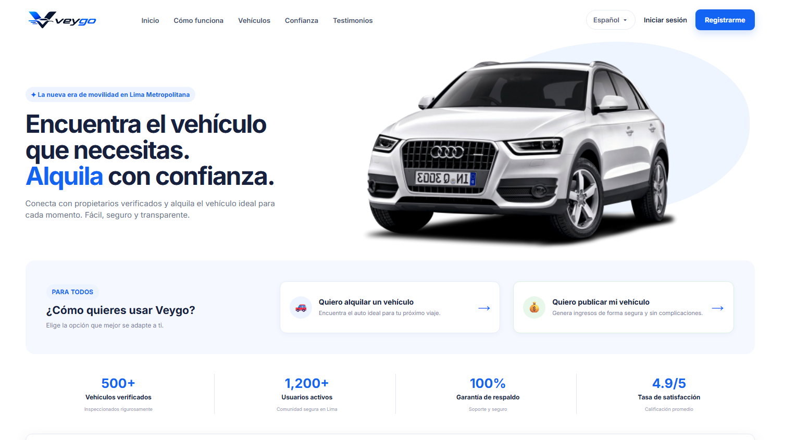

Barra de navegación con selector de idioma, hero principal ("Encuentra el vehículo que necesitas. Alquila con confianza.") con visual del vehículo, tarjetas de segmentación de usuarios (alquilar / publicar vehículo) y la banda de estadísticas de impacto (500+ vehículos, 1,200+ usuarios, 100% garantía, 4.9/5 satisfacción).

<h4>Buscador de vehículos y categorías</h4>

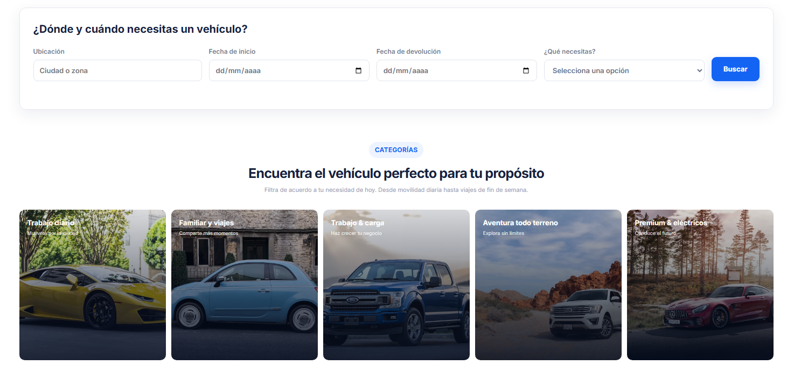

Formulario "¿Dónde y cuándo necesitas un vehículo?" con campos de ubicación, fechas y necesidad, seguido de la sección de categorías con las 5 tarjetas filtrables (Trabajo diario, Familiar y viajes, Trabajo & carga, Aventura todo terreno, Premium & eléctricos), cada una con imagen representativa.

<h4>Proceso operativo y vehículos destacados</h4>

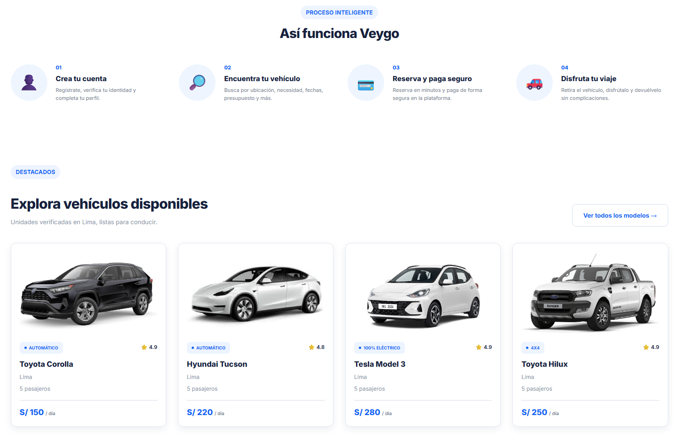

Sección "Así funciona Veygo" con el flujo de 4 pasos (crear cuenta, encontrar vehículo, reservar y pagar, disfrutar el viaje), seguida del grid de vehículos destacados con imagen, tipo de transmisión, calificación, ubicación, capacidad de pasajeros y precio por día.

<h4>Confianza y testimonios</h4>

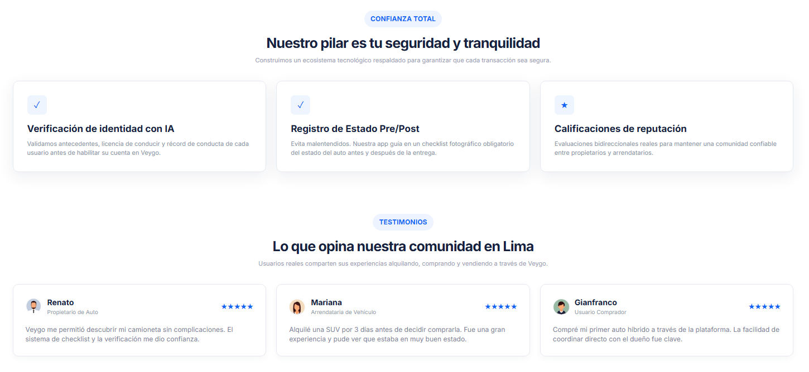

Sección de Confianza con los tres pilares de seguridad (verificación de identidad con IA, registro de estado pre/post, calificaciones de reputación) y la sección de Testimonios con las tres reseñas de la comunidad (Renato, Mariana, Gianfranco), cada una con foto, rol y calificación de 5 estrellas.

<h4>CTA final y footer</h4>

Llamado a la acción de cierre ("¿Listo para vivir la movilidad del futuro en Lima?") con botones de registro gratuito y soporte por WhatsApp, junto con el footer completo: enlaces de navegación, soporte, redes sociales y datos de respaldo de Veygo S.A.C.

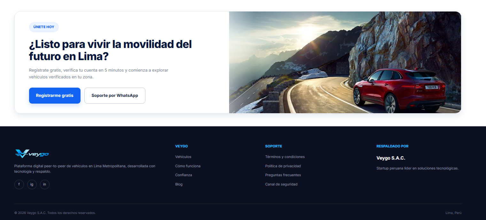

#### 5.2.1.6. Services Documentation Evidence for Sprint Review

Durante el Sprint 1, el alcance de implementación se limitó exclusivamente al Landing Page estático. No se desarrollaron ni desplegaron Web Services (RESTful API) en esta iteración, por lo que no aplica documentación de endpoints para este Sprint. La documentación de servicios web se incorporará a partir del Sprint 2, conforme a lo planificado en el Product Backlog.

#### 5.2.1.7. Software Deployment Evidence for Sprint Review

Durante el Sprint 1, el alcance de la implementación y los objetivos definidos en el Sprint Backlog se centraron exclusivamente en el desarrollo de la Landing Page de Veygo. En esta etapa inicial, el equipo priorizó la creación de una interfaz principal que permitiera presentar de manera clara la propuesta de valor de la plataforma —conectar a propietarios y arrendatarios de vehículos en Lima Metropolitana de forma segura y transparente—, así como sus principales funcionalidades, a través de secciones como el Hero, la segmentación de usuarios, el buscador de vehículos, las categorías, el proceso operativo, los vehículos destacados, la Confianza y los Testimonios.

El trabajo realizado incluyó el diseño visual, la estructuración del contenido y la organización de las secciones clave de la Landing Page, asegurando una experiencia intuitiva, atractiva y alineada con las necesidades identificadas en las fases previas de investigación. Asimismo, se buscó que la página cumpliera con criterios básicos de usabilidad, coherencia visual y comunicación efectiva —reforzados con el soporte bilingüe español/inglés y el diseño responsive— facilitando que cualquier usuario comprenda rápidamente el propósito del sistema y los dos flujos principales del negocio: alquilar un vehículo o publicar el propio.

Cabe resaltar que, debido a la naturaleza introductoria de este Sprint, no se contempló el desarrollo de otras funcionalidades adicionales del sistema, como la conexión con el backend, el flujo completo de autenticación o el procesamiento real de reservas y pagos. El enfoque estuvo completamente orientado a establecer una base sólida a través de la Landing Page, la cual servirá como punto de partida para futuras iteraciones del proyecto. Las siguientes etapas del desarrollo, donde se abordarán nuevas funcionalidades y componentes del sistema —como la integración con el backend, el registro e inicio de sesión funcionales y la gestión real de vehículos y reservas—, se encuentran planificadas para los próximos Sprints, en los cuales se continuará ampliando progresivamente el alcance del producto.

#### 5.2.1.8. Team Collaboration Insights during Sprint

Durante este Sprint, el equipo concentró sus actividades de implementación y colaboración en el desarrollo de la Landing Page. Para garantizar un trabajo ordenado y con trazabilidad, se utilizó Git como sistema de control de versiones sobre un repositorio público alojado en GitHub, bajo la organización 1ASI0729-2620-4399-G3-Veygo.

A continuación, se presentan las capturas de los analíticos de GitHub que evidencian la participación, los commits y los additions de todos los miembros del equipo durante este Sprint:

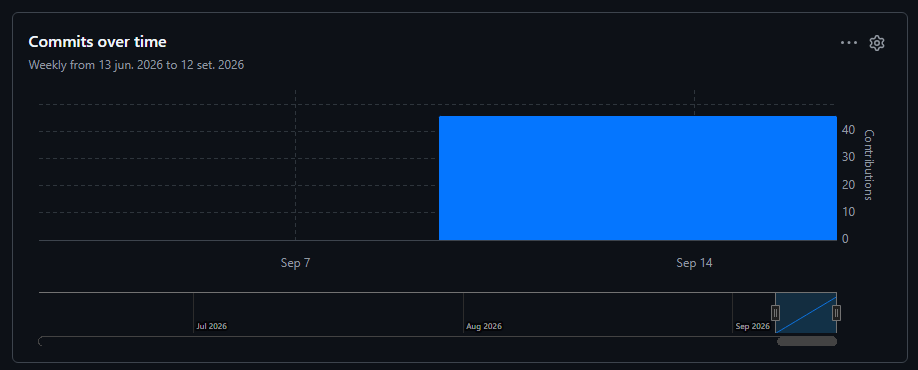

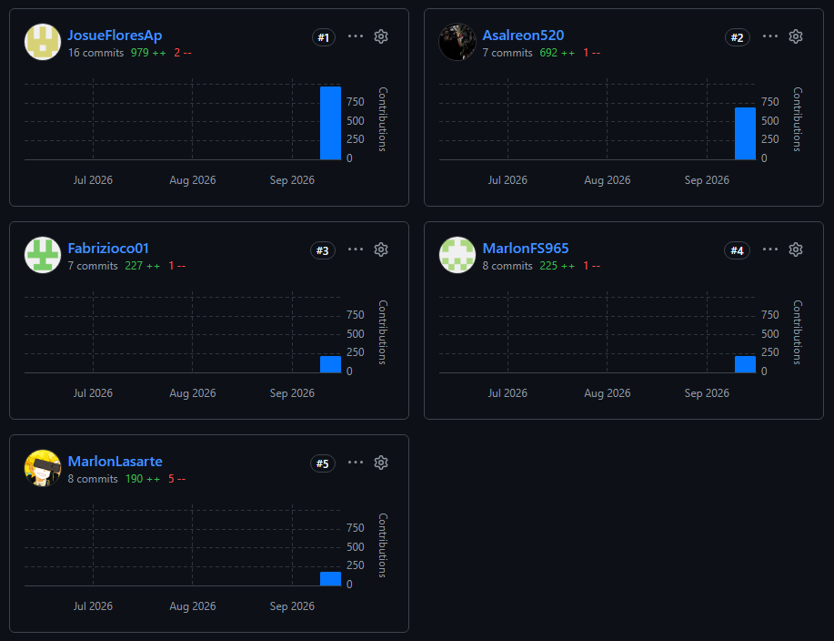

